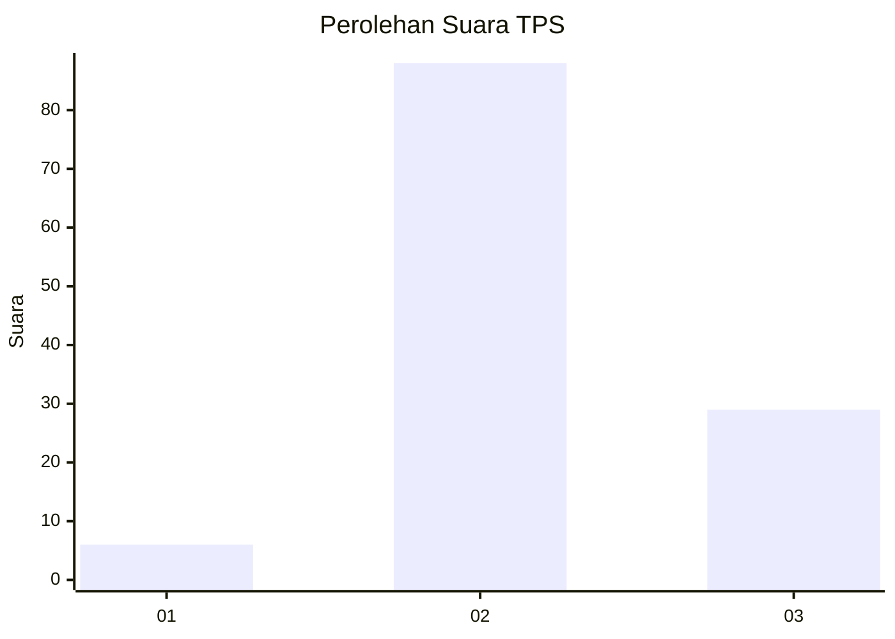
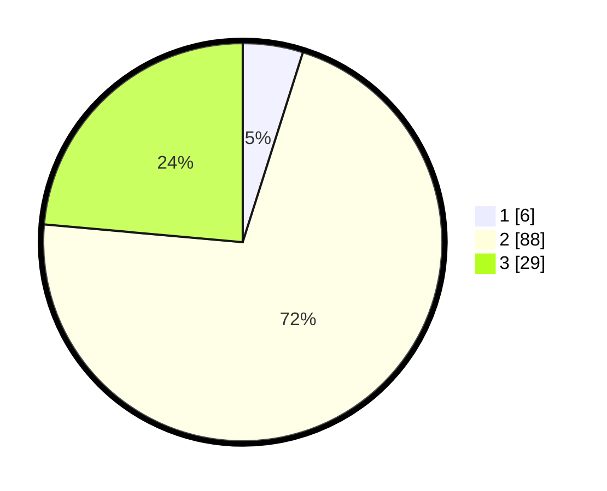

# Hasil

## Grafik

## Tabel

| No. | Nama Paslon    | Suara | Suara (raw) | Persentase |
|:--- |:-------------- | -----:| -----------:| ----------:|
| 1   | ANIES MUHAIMIN | 6     | [6][p-1]    | 4,88       |
| 2   | PRABOWO GIBRAN | 88    | [88][p-2]   | 71,54      |
| 3   | GANJAR MAHFUD  | 29    | [29][p-3]   | 23,58      |

[p-1]: https://github.com/gigit-pemilu/pemilu-2024/blob/main/pilpres/hitung-suara/sub/12-sumatera-utara/sub/07-deli-serdang/sub/21-patumbak/sub/2006-marindal-i/sub/014-tps/sub/paslon-1.txt
[p-2]: https://github.com/gigit-pemilu/pemilu-2024/blob/main/pilpres/hitung-suara/sub/12-sumatera-utara/sub/07-deli-serdang/sub/21-patumbak/sub/2006-marindal-i/sub/014-tps/sub/paslon-2.txt
[p-3]: https://github.com/gigit-pemilu/pemilu-2024/blob/main/pilpres/hitung-suara/sub/12-sumatera-utara/sub/07-deli-serdang/sub/21-patumbak/sub/2006-marindal-i/sub/014-tps/sub/paslon-3.txt

## Foto C Plano

https://sirekap-obj-formc.kpu.go.id/8162/pemilu/ppwp/12/07/21/20/06/1207212006014-20240214-233056--9e8149ed-5456-4c12-a1b1-88e9562fa735.jpg

https://sirekap-obj-formc.kpu.go.id/8162/pemilu/ppwp/12/07/21/20/06/1207212006014-20240214-233337--5bf61388-fa09-4890-93bf-c4d2877a5db7.jpg

https://sirekap-obj-formc.kpu.go.id/8162/pemilu/ppwp/12/07/21/20/06/1207212006014-20240214-233604--84f647af-0624-4ca8-83d7-5c20e07edec3.jpg

## Metadata

| Key        | Value               |
| ---------- | ------------------- |
| Time Stamp | 2024-02-25 18:00:00 |

