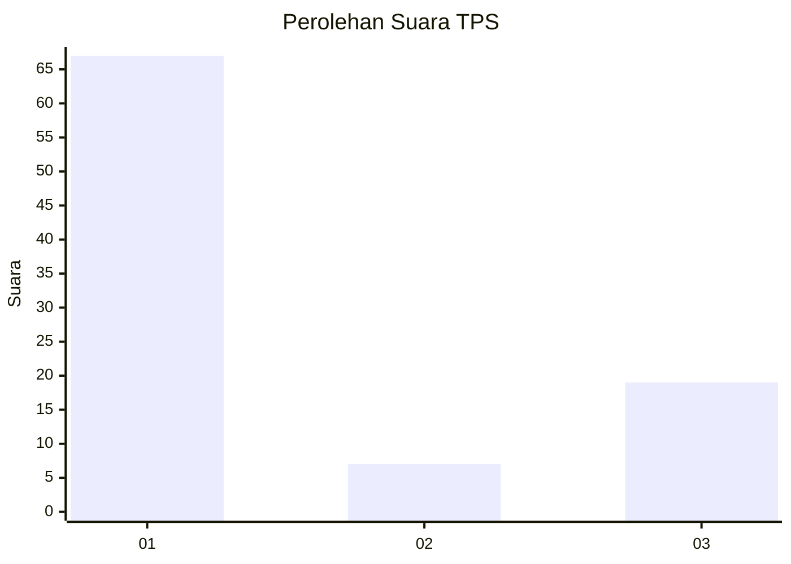
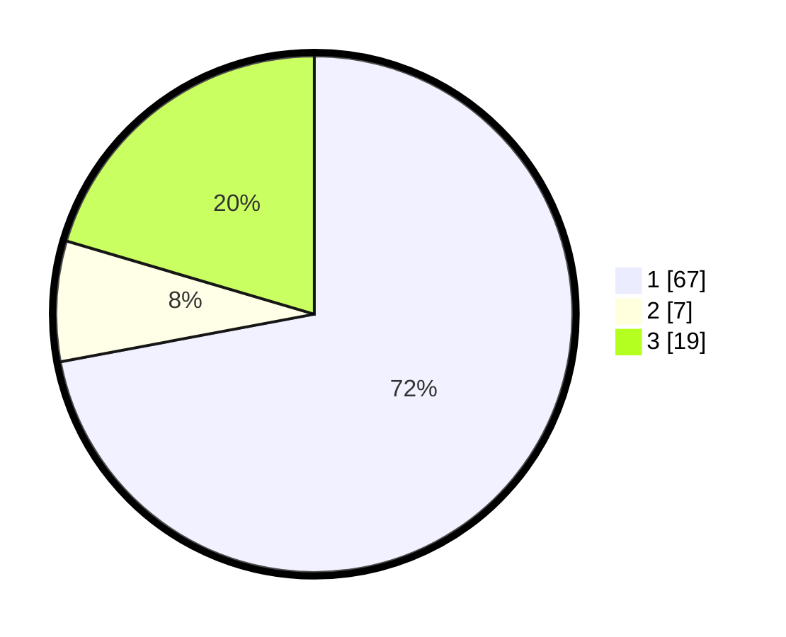

# Hasil

## Grafik

## Tabel

| No. | Nama Paslon    | Suara | Suara (raw) | Persentase |
|:--- |:-------------- | -----:| -----------:| ----------:|
| 1   | ANIES MUHAIMIN | 67    | [67][p-1]   | 72,04      |
| 2   | PRABOWO GIBRAN | 7     | [7][p-2]    | 7,53       |
| 3   | GANJAR MAHFUD  | 19    | [19][p-3]   | 20,43      |

[p-1]: https://github.com/gigit-pemilu/pemilu-2024/blob/main/pilpres/hitung-suara/sub/12-sumatera-utara/sub/07-deli-serdang/sub/21-patumbak/sub/2006-marindal-i/sub/070-tps/sub/paslon-1.txt
[p-2]: https://github.com/gigit-pemilu/pemilu-2024/blob/main/pilpres/hitung-suara/sub/12-sumatera-utara/sub/07-deli-serdang/sub/21-patumbak/sub/2006-marindal-i/sub/070-tps/sub/paslon-2.txt
[p-3]: https://github.com/gigit-pemilu/pemilu-2024/blob/main/pilpres/hitung-suara/sub/12-sumatera-utara/sub/07-deli-serdang/sub/21-patumbak/sub/2006-marindal-i/sub/070-tps/sub/paslon-3.txt

## Foto C Plano

https://sirekap-obj-formc.kpu.go.id/2b81/pemilu/ppwp/12/07/21/20/06/1207212006070-20240214-195151--58973068-10c3-4f42-97c9-9fea53ec732e.jpg

https://sirekap-obj-formc.kpu.go.id/2b81/pemilu/ppwp/12/07/21/20/06/1207212006070-20240214-195317--2055f035-2f18-4e7a-a7d8-8761c6458d58.jpg

https://sirekap-obj-formc.kpu.go.id/2b81/pemilu/ppwp/12/07/21/20/06/1207212006070-20240214-195407--743070c1-b07f-4eff-9065-f3a339952fee.jpg

## Metadata

| Key        | Value               |
| ---------- | ------------------- |
| Time Stamp | 2024-02-25 12:00:00 |

