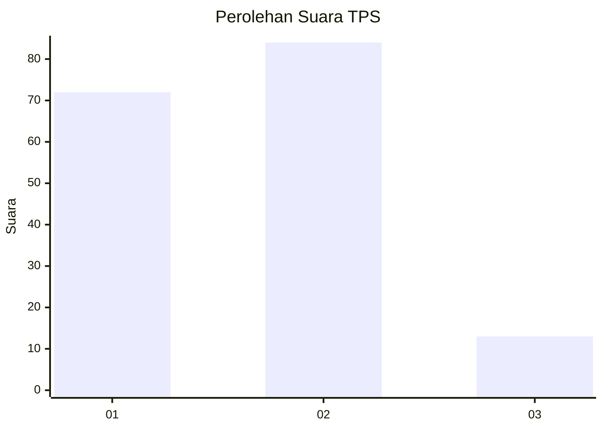
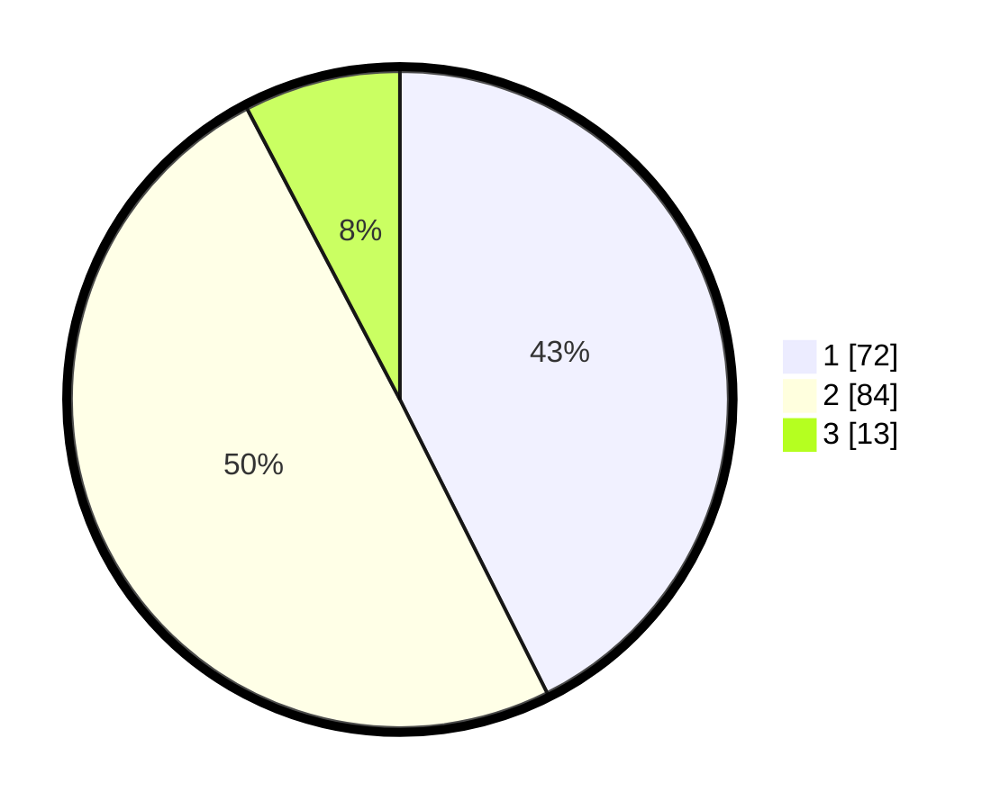

# Hasil

## Grafik

## Tabel

| No. | Nama Paslon    | Suara | Suara (raw) | Persentase |
|:--- |:-------------- | -----:| -----------:| ----------:|
| 1   | ANIES MUHAIMIN | 72    | [72][p-1]   | 42,60      |
| 2   | PRABOWO GIBRAN | 84    | [84][p-2]   | 49,70      |
| 3   | GANJAR MAHFUD  | 13    | [13][p-3]   | 7,69       |

[p-1]: https://github.com/gigit-pemilu/pemilu-2024/blob/main/pilpres/hitung-suara/sub/12-sumatera-utara/sub/07-deli-serdang/sub/22-deli-tua/sub/1004-deli-tua/sub/011-tps/sub/paslon-1.txt
[p-2]: https://github.com/gigit-pemilu/pemilu-2024/blob/main/pilpres/hitung-suara/sub/12-sumatera-utara/sub/07-deli-serdang/sub/22-deli-tua/sub/1004-deli-tua/sub/011-tps/sub/paslon-2.txt
[p-3]: https://github.com/gigit-pemilu/pemilu-2024/blob/main/pilpres/hitung-suara/sub/12-sumatera-utara/sub/07-deli-serdang/sub/22-deli-tua/sub/1004-deli-tua/sub/011-tps/sub/paslon-3.txt

## Foto C Plano

https://sirekap-obj-formc.kpu.go.id/3d4d/pemilu/ppwp/12/07/22/10/04/1207221004011-20240214-210916--1ba7a9ce-bcf3-4aa5-ba99-e9271d365d09.jpg

https://sirekap-obj-formc.kpu.go.id/3d4d/pemilu/ppwp/12/07/22/10/04/1207221004011-20240214-211037--e9e5a46b-d9ea-477b-8103-3f1a75ae5555.jpg

https://sirekap-obj-formc.kpu.go.id/3d4d/pemilu/ppwp/12/07/22/10/04/1207221004011-20240214-211115--7e105938-54c1-45f2-b887-922726ecdb0f.jpg

## Metadata

| Key        | Value               |
| ---------- | ------------------- |
| Time Stamp | 2024-02-25 16:00:00 |

