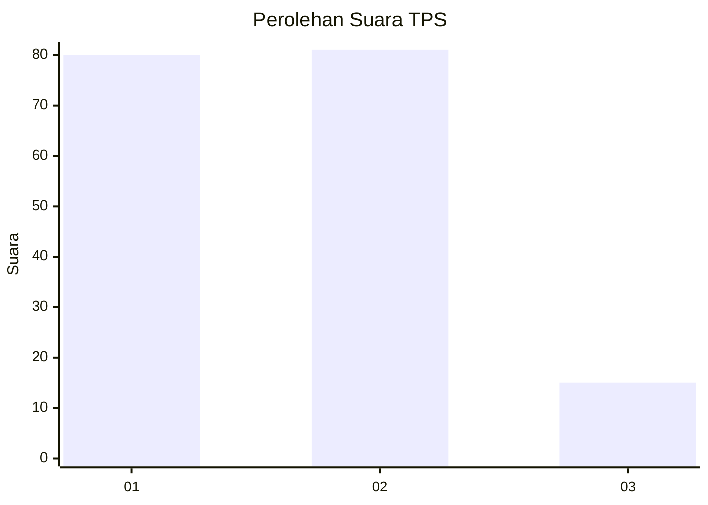
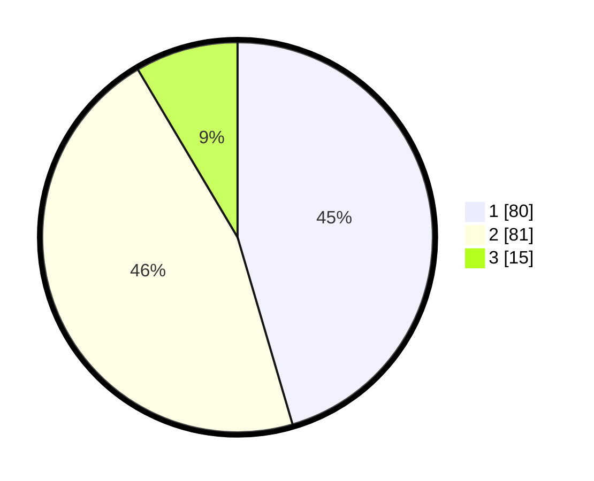

# Hasil

## Grafik

## Tabel

| No. | Nama Paslon    | Suara | Suara (raw) | Persentase |
|:--- |:-------------- | -----:| -----------:| ----------:|
| 1   | ANIES MUHAIMIN | 80    | [80][p-1]   | 45,45      |
| 2   | PRABOWO GIBRAN | 81    | [81][p-2]   | 46,02      |
| 3   | GANJAR MAHFUD  | 15    | [15][p-3]   | 8,52       |

[p-1]: https://github.com/gigit-pemilu/pemilu-2024/blob/main/pilpres/hitung-suara/sub/12-sumatera-utara/sub/07-deli-serdang/sub/22-deli-tua/sub/1004-deli-tua/sub/016-tps/sub/paslon-1.txt
[p-2]: https://github.com/gigit-pemilu/pemilu-2024/blob/main/pilpres/hitung-suara/sub/12-sumatera-utara/sub/07-deli-serdang/sub/22-deli-tua/sub/1004-deli-tua/sub/016-tps/sub/paslon-2.txt
[p-3]: https://github.com/gigit-pemilu/pemilu-2024/blob/main/pilpres/hitung-suara/sub/12-sumatera-utara/sub/07-deli-serdang/sub/22-deli-tua/sub/1004-deli-tua/sub/016-tps/sub/paslon-3.txt

## Foto C Plano

https://sirekap-obj-formc.kpu.go.id/efb1/pemilu/ppwp/12/07/22/10/04/1207221004016-20240214-222316--d6e85e53-50e8-4428-a533-23e9cee320a7.jpg

https://sirekap-obj-formc.kpu.go.id/efb1/pemilu/ppwp/12/07/22/10/04/1207221004016-20240214-222434--87b8403b-8091-45a3-af46-42e5b40e2b96.jpg

https://sirekap-obj-formc.kpu.go.id/efb1/pemilu/ppwp/12/07/22/10/04/1207221004016-20240214-222647--d661e72b-dfad-458b-be34-cf605141b848.jpg

## Metadata

| Key        | Value               |
| ---------- | ------------------- |
| Time Stamp | 2024-02-25 13:00:00 |

