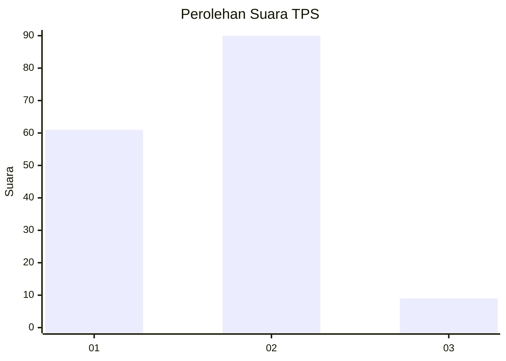
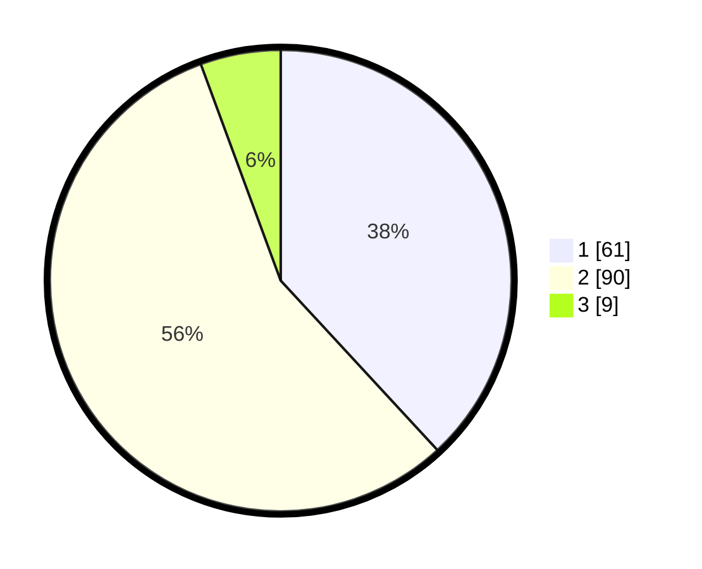

# Hasil

## Grafik

## Tabel

| No. | Nama Paslon    | Suara | Suara (raw) | Persentase |
|:--- |:-------------- | -----:| -----------:| ----------:|
| 1   | ANIES MUHAIMIN | 61    | [61][p-1]   | 38,13      |
| 2   | PRABOWO GIBRAN | 90    | [90][p-2]   | 56,25      |
| 3   | GANJAR MAHFUD  | 9     | [9][p-3]    | 5,63       |

[p-1]: https://github.com/gigit-pemilu/pemilu-2024/blob/main/pilpres/hitung-suara/sub/12-sumatera-utara/sub/07-deli-serdang/sub/22-deli-tua/sub/2001-kedai-durian/sub/009-tps/sub/paslon-1.txt
[p-2]: https://github.com/gigit-pemilu/pemilu-2024/blob/main/pilpres/hitung-suara/sub/12-sumatera-utara/sub/07-deli-serdang/sub/22-deli-tua/sub/2001-kedai-durian/sub/009-tps/sub/paslon-2.txt
[p-3]: https://github.com/gigit-pemilu/pemilu-2024/blob/main/pilpres/hitung-suara/sub/12-sumatera-utara/sub/07-deli-serdang/sub/22-deli-tua/sub/2001-kedai-durian/sub/009-tps/sub/paslon-3.txt

## Foto C Plano

https://sirekap-obj-formc.kpu.go.id/b878/pemilu/ppwp/12/07/22/20/01/1207222001009-20240214-233136--3daefd97-5ea3-4ddd-972f-827bb602d7ae.jpg

https://sirekap-obj-formc.kpu.go.id/b878/pemilu/ppwp/12/07/22/20/01/1207222001009-20240214-233138--ef245f76-ede8-4822-87ef-6c9e78d37bec.jpg

https://sirekap-obj-formc.kpu.go.id/b878/pemilu/ppwp/12/07/22/20/01/1207222001009-20240214-233139--7de8e9bd-ca2a-4bc1-9b1e-61317478ce40.jpg

## Metadata

| Key        | Value               |
| ---------- | ------------------- |
| Time Stamp | 2024-02-24 22:31:28 |

