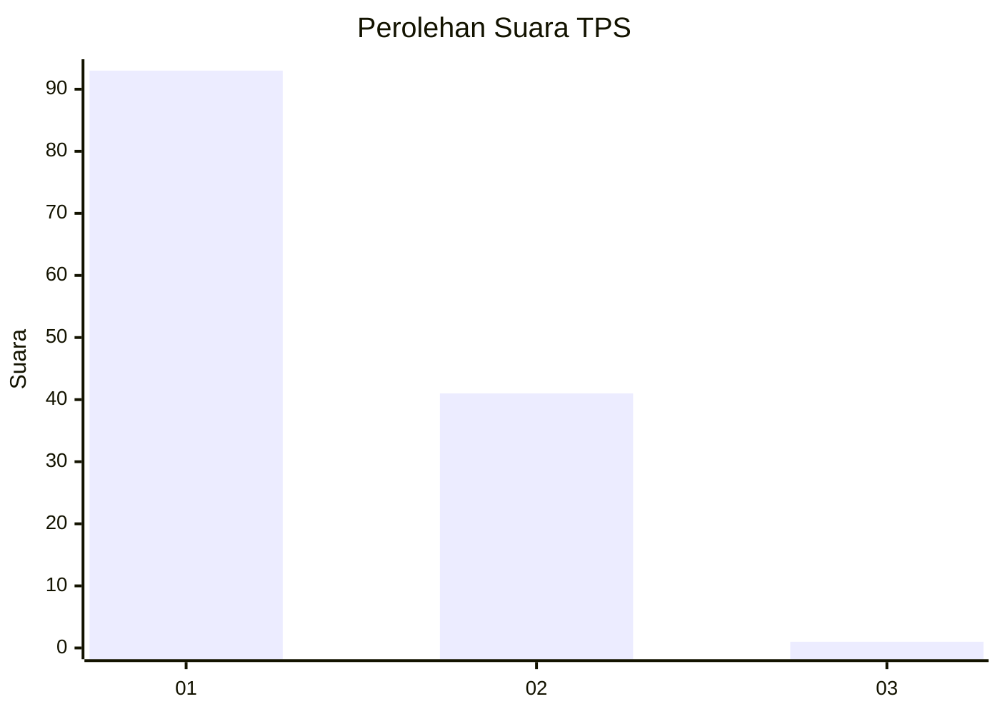
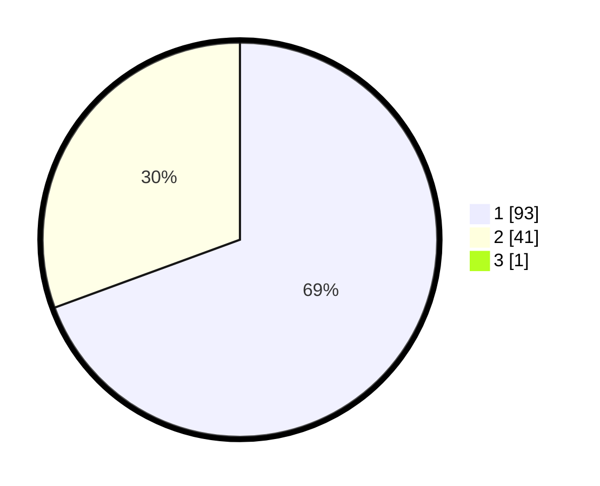

# Hasil

## Grafik

## Tabel

| No. | Nama Paslon    | Suara | Suara (raw) | Persentase |
|:--- |:-------------- | -----:| -----------:| ----------:|
| 1   | ANIES MUHAIMIN | 93    | [93][p-1]   | 68,89      |
| 2   | PRABOWO GIBRAN | 41    | [41][p-2]   | 30,37      |
| 3   | GANJAR MAHFUD  | 1     | [1][p-3]    | 0,74       |

[p-1]: https://github.com/gigit-pemilu/pemilu-2024-12-sumatera-utara/blob/main/pilpres/hitung-suara/sub/12-sumatera-utara/sub/07-deli-serdang/sub/22-deli-tua/sub/2002-suka-makmur/sub/028-tps/sub/paslon-1.txt
[p-2]: https://github.com/gigit-pemilu/pemilu-2024-12-sumatera-utara/blob/main/pilpres/hitung-suara/sub/12-sumatera-utara/sub/07-deli-serdang/sub/22-deli-tua/sub/2002-suka-makmur/sub/028-tps/sub/paslon-2.txt
[p-3]: https://github.com/gigit-pemilu/pemilu-2024-12-sumatera-utara/blob/main/pilpres/hitung-suara/sub/12-sumatera-utara/sub/07-deli-serdang/sub/22-deli-tua/sub/2002-suka-makmur/sub/028-tps/sub/paslon-3.txt

## Foto C Plano

https://sirekap-obj-formc.kpu.go.id/d7d9/pemilu/ppwp/12/07/22/20/02/1207222002028-20240214-141223--3baf2433-58a6-439b-b424-faf4fa6f9efb.jpg

https://sirekap-obj-formc.kpu.go.id/d7d9/pemilu/ppwp/12/07/22/20/02/1207222002028-20240214-141558--6628777e-8acb-48b7-bfe4-9006d2aa6150.jpg

https://sirekap-obj-formc.kpu.go.id/d7d9/pemilu/ppwp/12/07/22/20/02/1207222002028-20240214-141645--2ef48709-a77d-41c0-af74-d449703c945b.jpg

## Metadata

| Key        | Value               |
| ---------- | ------------------- |
| Time Stamp | 2024-02-24 22:31:28 |

