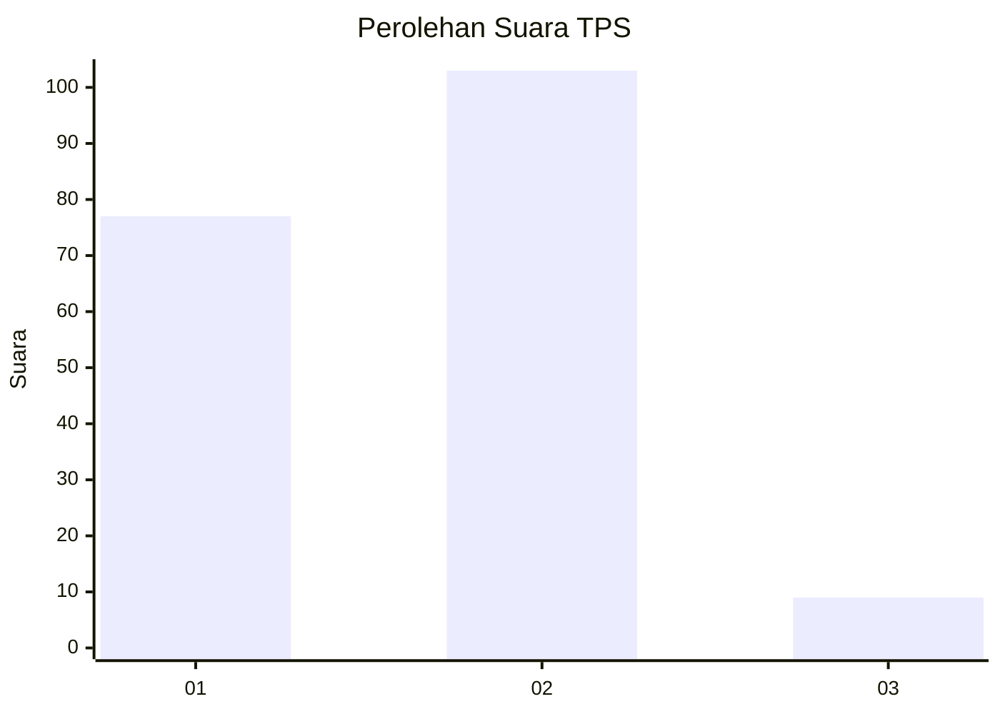
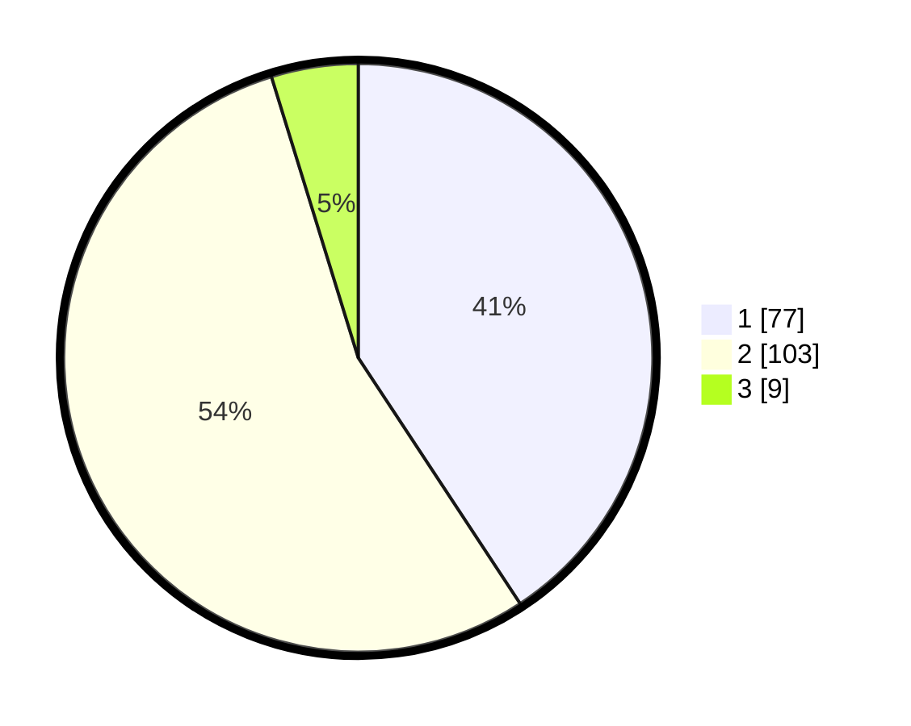

# Hasil

## Grafik

## Tabel

| No. | Nama Paslon    | Suara | Suara (raw) | Persentase |
|:--- |:-------------- | -----:| -----------:| ----------:|
| 1   | ANIES MUHAIMIN | 77    | [77][p-1]   | 40,74      |
| 2   | PRABOWO GIBRAN | 103   | [103][p-2]  | 54,50      |
| 3   | GANJAR MAHFUD  | 9     | [9][p-3]    | 4,76       |

[p-1]: https://github.com/gigit-pemilu/pemilu-2024/blob/main/pilpres/hitung-suara/sub/12-sumatera-utara/sub/07-deli-serdang/sub/23-sunggal/sub/2001-sei-semayang/sub/005-tps/sub/paslon-1.txt
[p-2]: https://github.com/gigit-pemilu/pemilu-2024/blob/main/pilpres/hitung-suara/sub/12-sumatera-utara/sub/07-deli-serdang/sub/23-sunggal/sub/2001-sei-semayang/sub/005-tps/sub/paslon-2.txt
[p-3]: https://github.com/gigit-pemilu/pemilu-2024/blob/main/pilpres/hitung-suara/sub/12-sumatera-utara/sub/07-deli-serdang/sub/23-sunggal/sub/2001-sei-semayang/sub/005-tps/sub/paslon-3.txt

## Foto C Plano

https://sirekap-obj-formc.kpu.go.id/f941/pemilu/ppwp/12/07/23/20/01/1207232001005-20240215-002157--bf4ccad5-5e99-4d86-8a87-905630a6e29e.jpg

https://sirekap-obj-formc.kpu.go.id/f941/pemilu/ppwp/12/07/23/20/01/1207232001005-20240214-200837--74263386-75dc-4825-b8a2-c2ef651aaa71.jpg

https://sirekap-obj-formc.kpu.go.id/f941/pemilu/ppwp/12/07/23/20/01/1207232001005-20240215-002257--27a8ce62-acb2-43ba-8913-8852d944c9dd.jpg

## Metadata

| Key        | Value               |
| ---------- | ------------------- |
| Time Stamp | 2024-02-16 01:30:27 |

