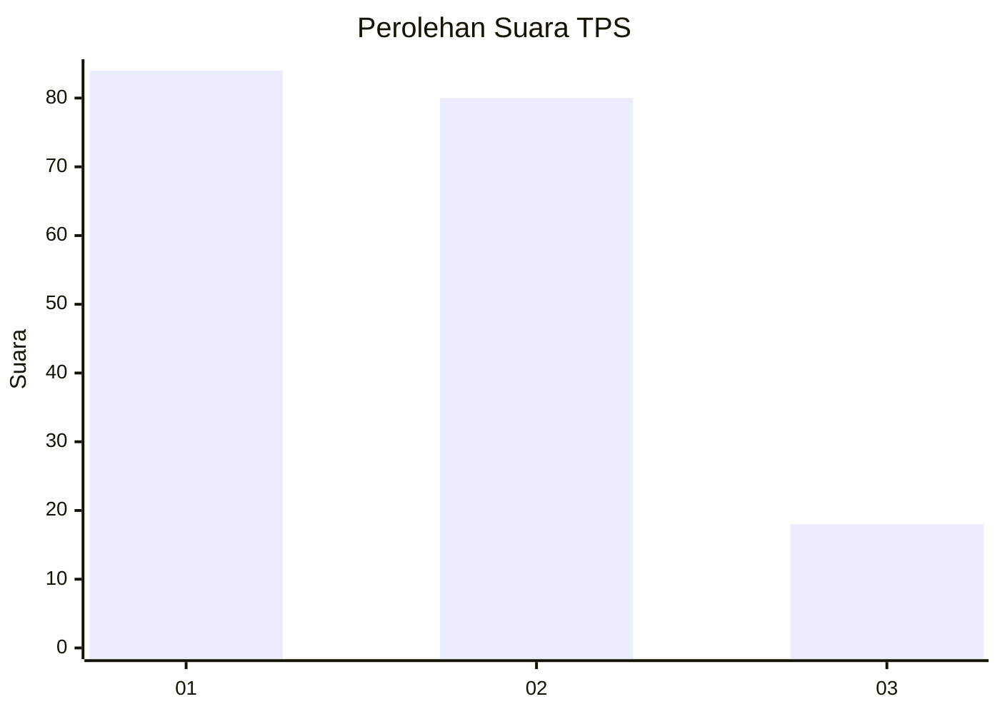
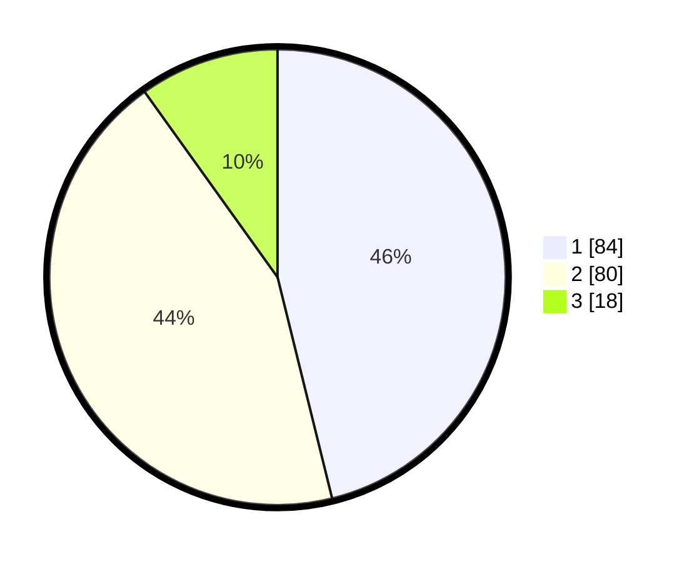

# Hasil

## Grafik

## Tabel

| No. | Nama Paslon    | Suara | Suara (raw) | Persentase |
|:--- |:-------------- | -----:| -----------:| ----------:|
| 1   | ANIES MUHAIMIN | 84    | [84][p-1]   | 46,15      |
| 2   | PRABOWO GIBRAN | 80    | [80][p-2]   | 43,96      |
| 3   | GANJAR MAHFUD  | 18    | [18][p-3]   | 9,89       |

[p-1]: https://github.com/gigit-pemilu/pemilu-2024/blob/main/pilpres/hitung-suara/sub/12-sumatera-utara/sub/07-deli-serdang/sub/23-sunggal/sub/2001-sei-semayang/sub/014-tps/sub/paslon-1.txt
[p-2]: https://github.com/gigit-pemilu/pemilu-2024/blob/main/pilpres/hitung-suara/sub/12-sumatera-utara/sub/07-deli-serdang/sub/23-sunggal/sub/2001-sei-semayang/sub/014-tps/sub/paslon-2.txt
[p-3]: https://github.com/gigit-pemilu/pemilu-2024/blob/main/pilpres/hitung-suara/sub/12-sumatera-utara/sub/07-deli-serdang/sub/23-sunggal/sub/2001-sei-semayang/sub/014-tps/sub/paslon-3.txt

## Foto C Plano

https://sirekap-obj-formc.kpu.go.id/b5e8/pemilu/ppwp/12/07/23/20/01/1207232001014-20240215-022344--496a9e5b-d9ea-4eb3-8157-28927077d1e6.jpg

https://sirekap-obj-formc.kpu.go.id/b5e8/pemilu/ppwp/12/07/23/20/01/1207232001014-20240215-022352--c6217b51-b79e-414b-828e-706b9fbaddf0.jpg

https://sirekap-obj-formc.kpu.go.id/b5e8/pemilu/ppwp/12/07/23/20/01/1207232001014-20240215-022401--7c7d6600-b606-4c0c-b780-d92a8066873d.jpg

## Metadata

| Key        | Value               |
| ---------- | ------------------- |
| Time Stamp | 2024-02-24 23:00:00 |

