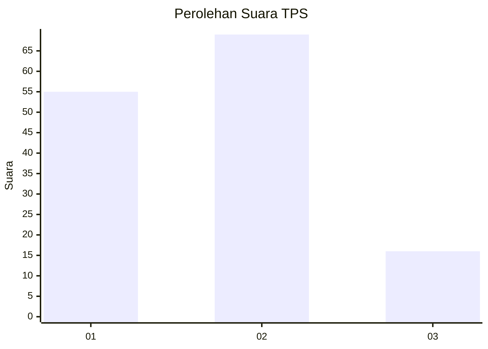
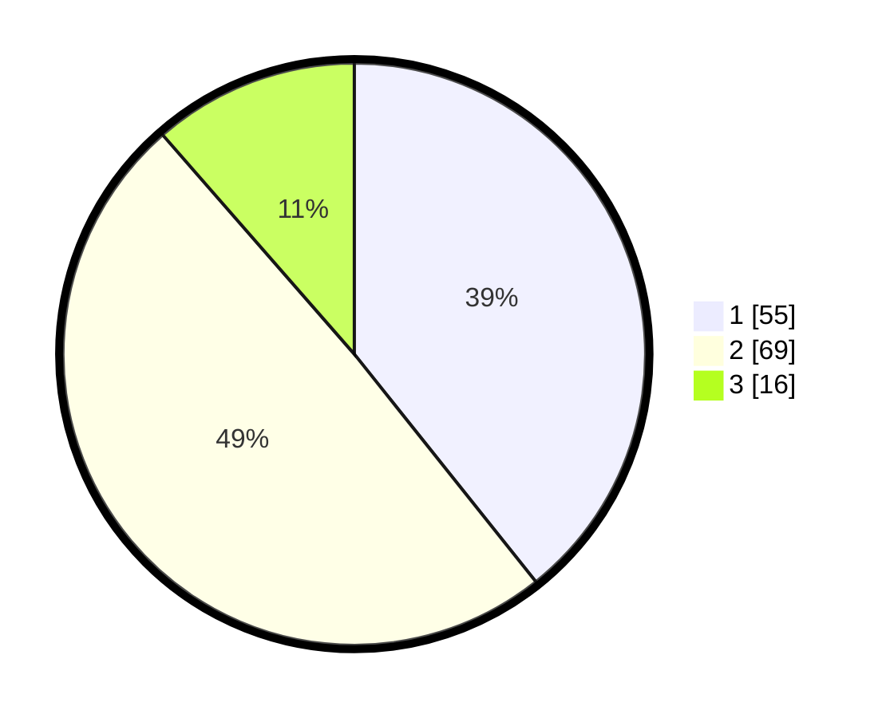

# Hasil

## Grafik

## Tabel

| No. | Nama Paslon    | Suara | Suara (raw) | Persentase |
|:--- |:-------------- | -----:| -----------:| ----------:|
| 1   | ANIES MUHAIMIN | 55    | [55][p-1]   | 39,29      |
| 2   | PRABOWO GIBRAN | 69    | [69][p-2]   | 49,29      |
| 3   | GANJAR MAHFUD  | 16    | [16][p-3]   | 11,43      |

[p-1]: https://github.com/gigit-pemilu/pemilu-2024/blob/main/pilpres/hitung-suara/sub/12-sumatera-utara/sub/07-deli-serdang/sub/23-sunggal/sub/2001-sei-semayang/sub/015-tps/sub/paslon-1.txt
[p-2]: https://github.com/gigit-pemilu/pemilu-2024/blob/main/pilpres/hitung-suara/sub/12-sumatera-utara/sub/07-deli-serdang/sub/23-sunggal/sub/2001-sei-semayang/sub/015-tps/sub/paslon-2.txt
[p-3]: https://github.com/gigit-pemilu/pemilu-2024/blob/main/pilpres/hitung-suara/sub/12-sumatera-utara/sub/07-deli-serdang/sub/23-sunggal/sub/2001-sei-semayang/sub/015-tps/sub/paslon-3.txt

## Foto C Plano

https://sirekap-obj-formc.kpu.go.id/1dde/pemilu/ppwp/12/07/23/20/01/1207232001015-20240215-125817--91c6bb46-7664-4ae5-bf91-91cbbed85e0b.jpg

https://sirekap-obj-formc.kpu.go.id/1dde/pemilu/ppwp/12/07/23/20/01/1207232001015-20240214-215058--503229ad-53b1-4d6f-82e6-49538bb1d685.jpg

https://sirekap-obj-formc.kpu.go.id/1dde/pemilu/ppwp/12/07/23/20/01/1207232001015-20240214-215309--be30ad44-186a-40c6-b7f6-f83081eb89b2.jpg

## Metadata

| Key        | Value               |
| ---------- | ------------------- |
| Time Stamp | 2024-02-25 11:00:00 |

