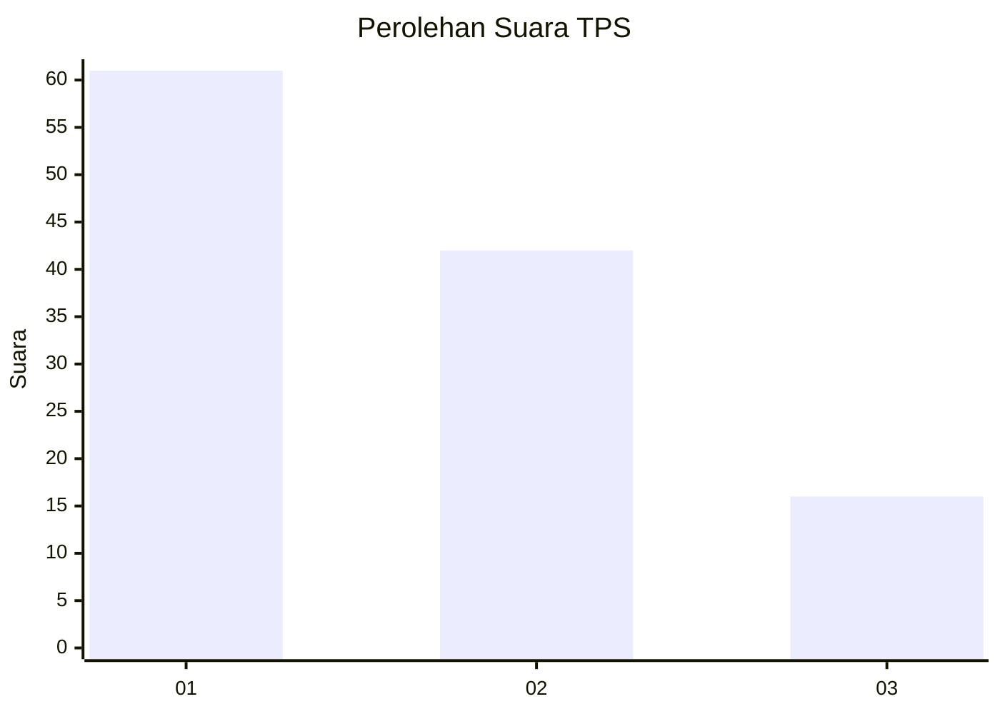
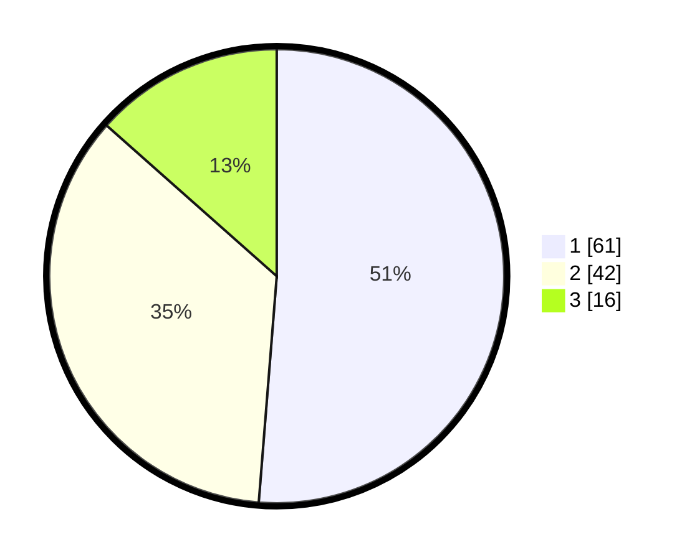

# Hasil

## Grafik

## Tabel

| No. | Nama Paslon    | Suara | Suara (raw) | Persentase |
|:--- |:-------------- | -----:| -----------:| ----------:|
| 1   | ANIES MUHAIMIN | 61    | [61][p-1]   | 51,26      |
| 2   | PRABOWO GIBRAN | 42    | [42][p-2]   | 35,29      |
| 3   | GANJAR MAHFUD  | 16    | [16][p-3]   | 13,45      |

[p-1]: https://github.com/gigit-pemilu/pemilu-2024-12-sumatera-utara/blob/main/pilpres/hitung-suara/sub/12-sumatera-utara/sub/07-deli-serdang/sub/23-sunggal/sub/2004-paya-geli/sub/027-tps/sub/paslon-1.txt
[p-2]: https://github.com/gigit-pemilu/pemilu-2024-12-sumatera-utara/blob/main/pilpres/hitung-suara/sub/12-sumatera-utara/sub/07-deli-serdang/sub/23-sunggal/sub/2004-paya-geli/sub/027-tps/sub/paslon-2.txt
[p-3]: https://github.com/gigit-pemilu/pemilu-2024-12-sumatera-utara/blob/main/pilpres/hitung-suara/sub/12-sumatera-utara/sub/07-deli-serdang/sub/23-sunggal/sub/2004-paya-geli/sub/027-tps/sub/paslon-3.txt

## Foto C Plano

https://sirekap-obj-formc.kpu.go.id/287b/pemilu/ppwp/12/07/23/20/04/1207232004027-20240215-010952--9d7abede-0650-4477-9ebe-11668927135d.jpg

https://sirekap-obj-formc.kpu.go.id/287b/pemilu/ppwp/12/07/23/20/04/1207232004027-20240215-011024--61ccf676-8f24-4957-9f6c-8e605a677725.jpg

https://sirekap-obj-formc.kpu.go.id/287b/pemilu/ppwp/12/07/23/20/04/1207232004027-20240215-011043--40910e60-951e-4582-9aba-8bfa5fc1b7a7.jpg

## Metadata

| Key        | Value               |
| ---------- | ------------------- |
| Time Stamp | 2024-02-25 08:00:00 |

