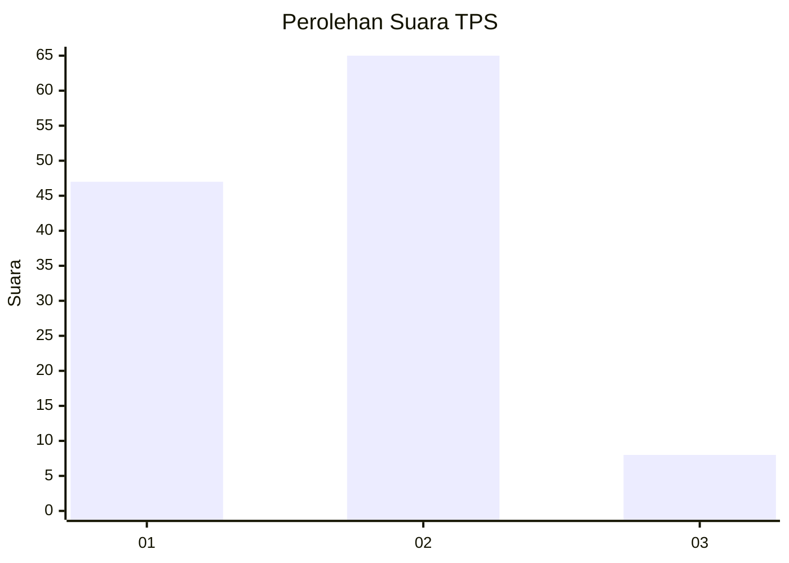
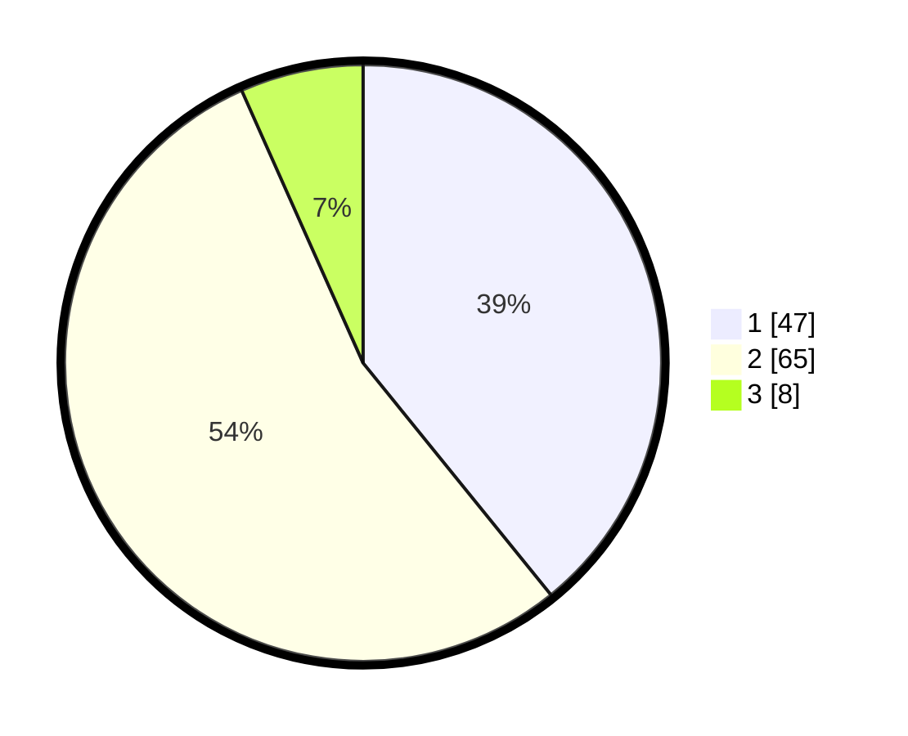

# Hasil

## Grafik

## Tabel

| No. | Nama Paslon    | Suara | Suara (raw) | Persentase |
|:--- |:-------------- | -----:| -----------:| ----------:|
| 1   | ANIES MUHAIMIN | 47    | [47][p-1]   | 39,17      |
| 2   | PRABOWO GIBRAN | 65    | [65][p-2]   | 54,17      |
| 3   | GANJAR MAHFUD  | 8     | [8][p-3]    | 6,67       |

[p-1]: https://github.com/gigit-pemilu/pemilu-2024/blob/main/pilpres/hitung-suara/sub/12-sumatera-utara/sub/07-deli-serdang/sub/23-sunggal/sub/2004-paya-geli/sub/028-tps/sub/paslon-1.txt
[p-2]: https://github.com/gigit-pemilu/pemilu-2024/blob/main/pilpres/hitung-suara/sub/12-sumatera-utara/sub/07-deli-serdang/sub/23-sunggal/sub/2004-paya-geli/sub/028-tps/sub/paslon-2.txt
[p-3]: https://github.com/gigit-pemilu/pemilu-2024/blob/main/pilpres/hitung-suara/sub/12-sumatera-utara/sub/07-deli-serdang/sub/23-sunggal/sub/2004-paya-geli/sub/028-tps/sub/paslon-3.txt

## Foto C Plano

https://sirekap-obj-formc.kpu.go.id/340a/pemilu/ppwp/12/07/23/20/04/1207232004028-20240215-031231--ac39ba82-ef4b-45ba-8eba-35453830789d.jpg

https://sirekap-obj-formc.kpu.go.id/340a/pemilu/ppwp/12/07/23/20/04/1207232004028-20240215-031324--f4aab877-508e-423c-a8de-d06a82aa6a06.jpg

https://sirekap-obj-formc.kpu.go.id/340a/pemilu/ppwp/12/07/23/20/04/1207232004028-20240215-031425--82720216-98f4-4f01-a5d6-86867473c695.jpg

## Metadata

| Key        | Value               |
| ---------- | ------------------- |
| Time Stamp | 2024-02-24 22:31:28 |

