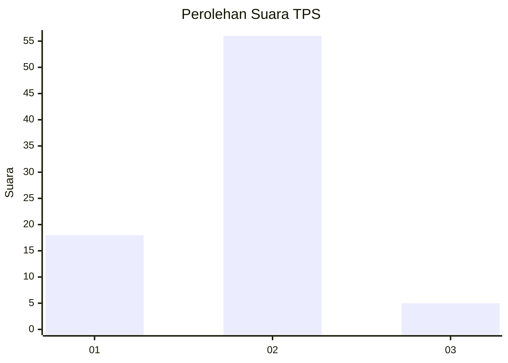
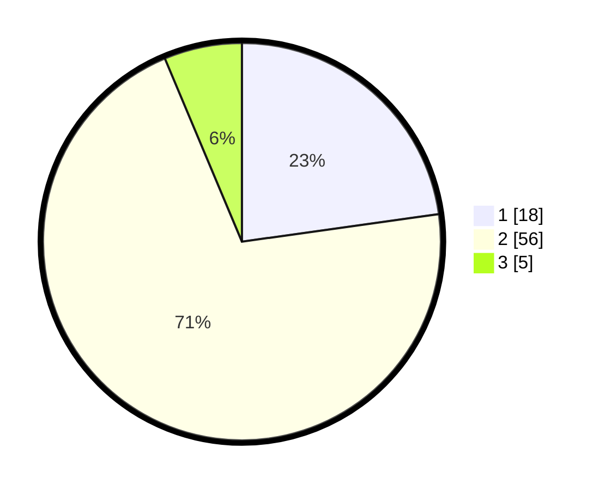

# Hasil

## Grafik

## Tabel

| No. | Nama Paslon    | Suara | Suara (raw) | Persentase |
|:--- |:-------------- | -----:| -----------:| ----------:|
| 1   | ANIES MUHAIMIN | 18    | [18][p-1]   | 22,78      |
| 2   | PRABOWO GIBRAN | 56    | [56][p-2]   | 70,89      |
| 3   | GANJAR MAHFUD  | 5     | [5][p-3]    | 6,33       |

[p-1]: https://github.com/gigit-pemilu/pemilu-2024-12-sumatera-utara/blob/main/pilpres/hitung-suara/sub/12-sumatera-utara/sub/07-deli-serdang/sub/23-sunggal/sub/2004-paya-geli/sub/029-tps/sub/paslon-1.txt
[p-2]: https://github.com/gigit-pemilu/pemilu-2024-12-sumatera-utara/blob/main/pilpres/hitung-suara/sub/12-sumatera-utara/sub/07-deli-serdang/sub/23-sunggal/sub/2004-paya-geli/sub/029-tps/sub/paslon-2.txt
[p-3]: https://github.com/gigit-pemilu/pemilu-2024-12-sumatera-utara/blob/main/pilpres/hitung-suara/sub/12-sumatera-utara/sub/07-deli-serdang/sub/23-sunggal/sub/2004-paya-geli/sub/029-tps/sub/paslon-3.txt

## Foto C Plano

https://sirekap-obj-formc.kpu.go.id/0393/pemilu/ppwp/12/07/23/20/04/1207232004029-20240214-234112--5ea87fab-c01c-4e74-b6b9-7ea9608930dc.jpg

https://sirekap-obj-formc.kpu.go.id/0393/pemilu/ppwp/12/07/23/20/04/1207232004029-20240214-205325--b7d42ebd-a689-4d9b-a8ca-de06a681d989.jpg

https://sirekap-obj-formc.kpu.go.id/0393/pemilu/ppwp/12/07/23/20/04/1207232004029-20240214-205636--3b7bcf24-df91-45b1-90ae-ef0d55243e67.jpg

## Metadata

| Key        | Value               |
| ---------- | ------------------- |
| Time Stamp | 2024-02-25 17:00:00 |

