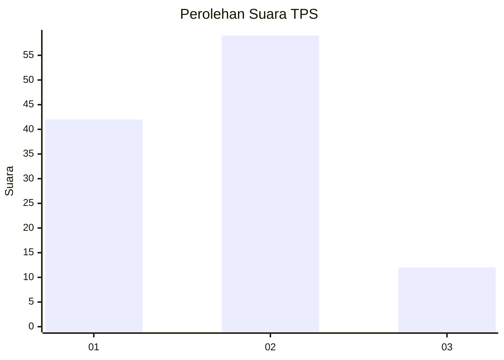
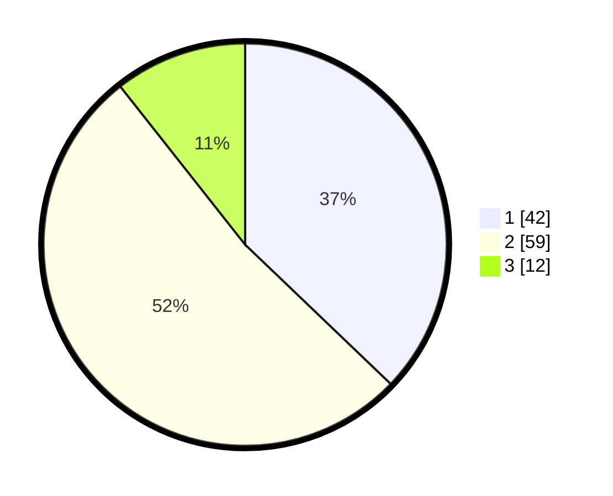

# Hasil

## Grafik

## Tabel

| No. | Nama Paslon    | Suara | Suara (raw) | Persentase |
|:--- |:-------------- | -----:| -----------:| ----------:|
| 1   | ANIES MUHAIMIN | 42    | [42][p-1]   | 37,17      |
| 2   | PRABOWO GIBRAN | 59    | [59][p-2]   | 52,21      |
| 3   | GANJAR MAHFUD  | 12    | [12][p-3]   | 10,62      |

[p-1]: https://github.com/gigit-pemilu/pemilu-2024/blob/main/pilpres/hitung-suara/sub/12-sumatera-utara/sub/07-deli-serdang/sub/23-sunggal/sub/2004-paya-geli/sub/044-tps/sub/paslon-1.txt
[p-2]: https://github.com/gigit-pemilu/pemilu-2024/blob/main/pilpres/hitung-suara/sub/12-sumatera-utara/sub/07-deli-serdang/sub/23-sunggal/sub/2004-paya-geli/sub/044-tps/sub/paslon-2.txt
[p-3]: https://github.com/gigit-pemilu/pemilu-2024/blob/main/pilpres/hitung-suara/sub/12-sumatera-utara/sub/07-deli-serdang/sub/23-sunggal/sub/2004-paya-geli/sub/044-tps/sub/paslon-3.txt

## Foto C Plano

https://sirekap-obj-formc.kpu.go.id/6a73/pemilu/ppwp/12/07/23/20/04/1207232004044-20240215-155715--4c0d24b6-6d2a-4545-8add-66b2e7b60190.jpg

https://sirekap-obj-formc.kpu.go.id/6a73/pemilu/ppwp/12/07/23/20/04/1207232004044-20240215-004410--8fa4fc6e-41a5-428f-9c26-2705454bf7e9.jpg

https://sirekap-obj-formc.kpu.go.id/6a73/pemilu/ppwp/12/07/23/20/04/1207232004044-20240215-004508--f5a2f59c-cdc1-4296-a745-fbdf4dd09732.jpg

## Metadata

| Key        | Value               |
| ---------- | ------------------- |
| Time Stamp | 2024-02-25 18:00:00 |

