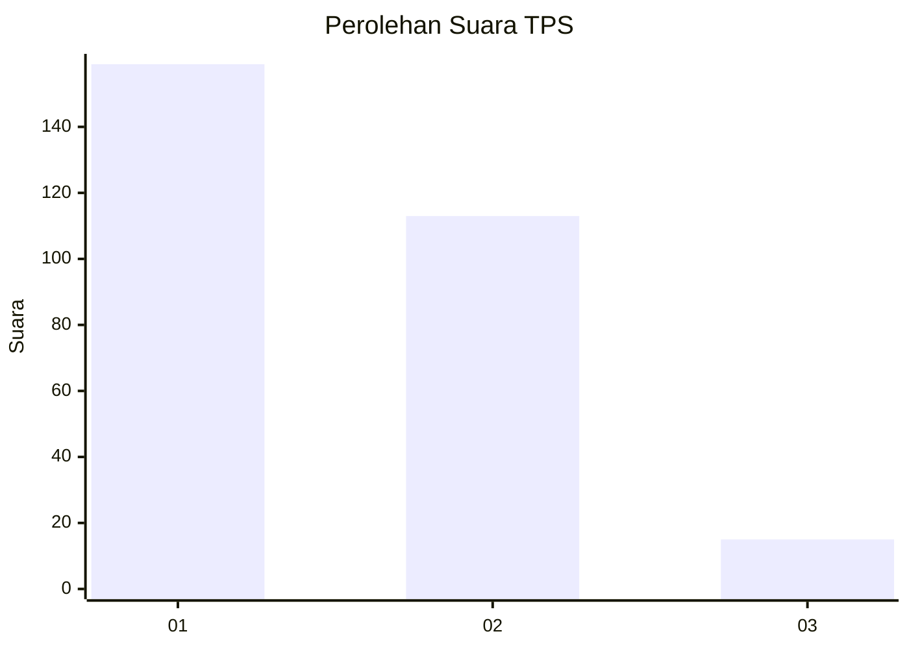
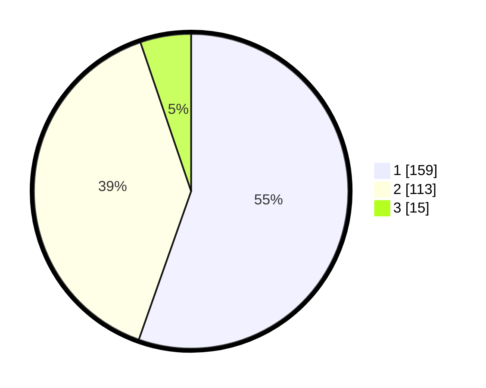

# Hasil

## Grafik

## Tabel

| No. | Nama Paslon    | Suara | Suara (raw) | Persentase |
|:--- |:-------------- | -----:| -----------:| ----------:|
| 1   | ANIES MUHAIMIN | 159   | [159][p-1]  | 55,40      |
| 2   | PRABOWO GIBRAN | 113   | [113][p-2]  | 39,37      |
| 3   | GANJAR MAHFUD  | 15    | [15][p-3]   | 5,23       |

[p-1]: https://github.com/gigit-pemilu/pemilu-2024/blob/main/pilpres/hitung-suara/sub/12-sumatera-utara/sub/07-deli-serdang/sub/23-sunggal/sub/2005-mulio-rejo/sub/048-tps/sub/paslon-1.txt
[p-2]: https://github.com/gigit-pemilu/pemilu-2024/blob/main/pilpres/hitung-suara/sub/12-sumatera-utara/sub/07-deli-serdang/sub/23-sunggal/sub/2005-mulio-rejo/sub/048-tps/sub/paslon-2.txt
[p-3]: https://github.com/gigit-pemilu/pemilu-2024/blob/main/pilpres/hitung-suara/sub/12-sumatera-utara/sub/07-deli-serdang/sub/23-sunggal/sub/2005-mulio-rejo/sub/048-tps/sub/paslon-3.txt

## Foto C Plano

https://sirekap-obj-formc.kpu.go.id/64b1/pemilu/ppwp/12/07/23/20/05/1207232005048-20240215-005657--778a0dca-239c-4e89-8205-e09336887cbb.jpg

https://sirekap-obj-formc.kpu.go.id/64b1/pemilu/ppwp/12/07/23/20/05/1207232005048-20240215-062114--d3242734-e33b-4814-a0d8-620c4d78418d.jpg

https://sirekap-obj-formc.kpu.go.id/64b1/pemilu/ppwp/12/07/23/20/05/1207232005048-20240215-005930--fbbec732-4a9e-4988-a4d6-813bfd173f5e.jpg

## Metadata

| Key        | Value               |
| ---------- | ------------------- |
| Time Stamp | 2024-02-26 19:00:00 |

