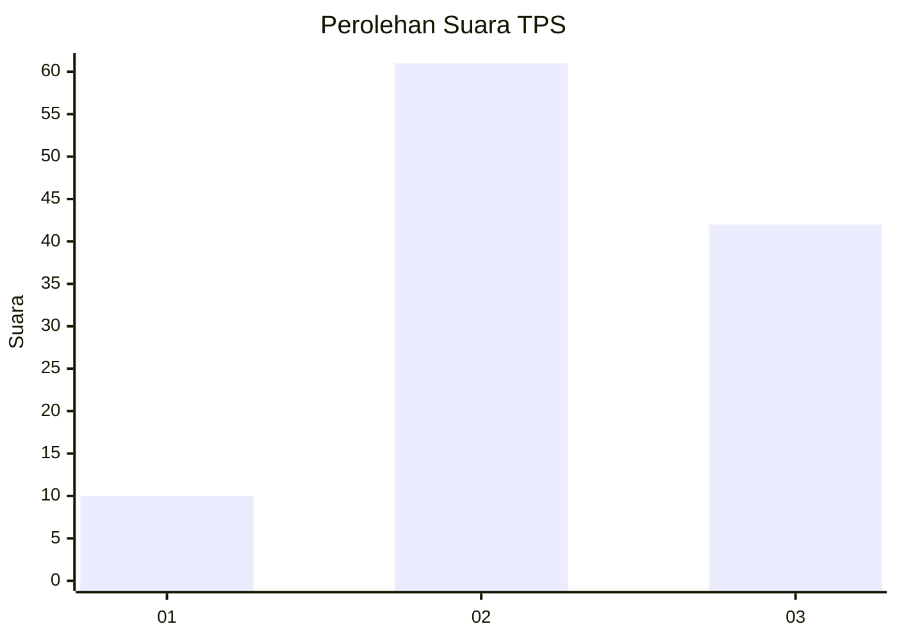
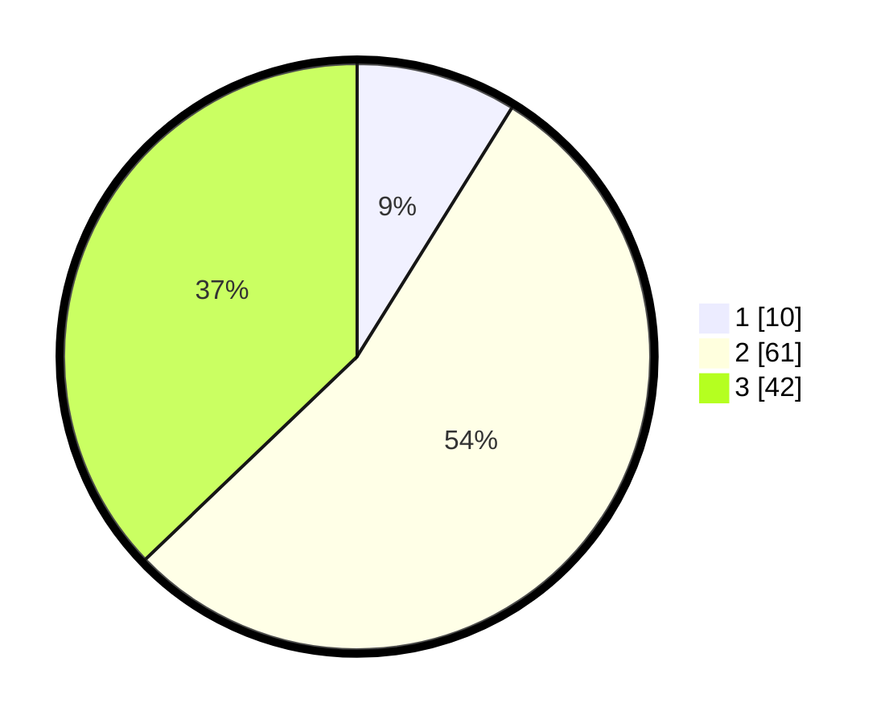

# Hasil

## Grafik

## Tabel

| No. | Nama Paslon    | Suara | Suara (raw) | Persentase |
|:--- |:-------------- | -----:| -----------:| ----------:|
| 1   | ANIES MUHAIMIN | 10    | [10][p-1]   | 8,85       |
| 2   | PRABOWO GIBRAN | 61    | [61][p-2]   | 53,98      |
| 3   | GANJAR MAHFUD  | 42    | [42][p-3]   | 37,17      |

[p-1]: https://github.com/gigit-pemilu/pemilu-2024-12-sumatera-utara/blob/main/pilpres/hitung-suara/sub/12-sumatera-utara/sub/07-deli-serdang/sub/23-sunggal/sub/2005-mulio-rejo/sub/077-tps/sub/paslon-1.txt
[p-2]: https://github.com/gigit-pemilu/pemilu-2024-12-sumatera-utara/blob/main/pilpres/hitung-suara/sub/12-sumatera-utara/sub/07-deli-serdang/sub/23-sunggal/sub/2005-mulio-rejo/sub/077-tps/sub/paslon-2.txt
[p-3]: https://github.com/gigit-pemilu/pemilu-2024-12-sumatera-utara/blob/main/pilpres/hitung-suara/sub/12-sumatera-utara/sub/07-deli-serdang/sub/23-sunggal/sub/2005-mulio-rejo/sub/077-tps/sub/paslon-3.txt

## Foto C Plano

https://sirekap-obj-formc.kpu.go.id/50ec/pemilu/ppwp/12/07/23/20/05/1207232005077-20240214-223739--75cda72d-531d-4b2c-8583-192b1f42062f.jpg

https://sirekap-obj-formc.kpu.go.id/50ec/pemilu/ppwp/12/07/23/20/05/1207232005077-20240214-222729--7edcd862-7b4d-4353-b716-37ab2fca006c.jpg

https://sirekap-obj-formc.kpu.go.id/50ec/pemilu/ppwp/12/07/23/20/05/1207232005077-20240214-222954--49f00f75-3636-43f6-8083-84be0698cb3c.jpg

## Metadata

| Key        | Value               |
| ---------- | ------------------- |
| Time Stamp | 2024-02-24 22:31:28 |

