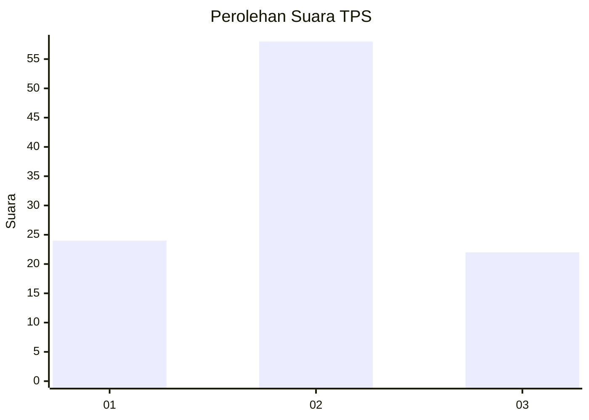
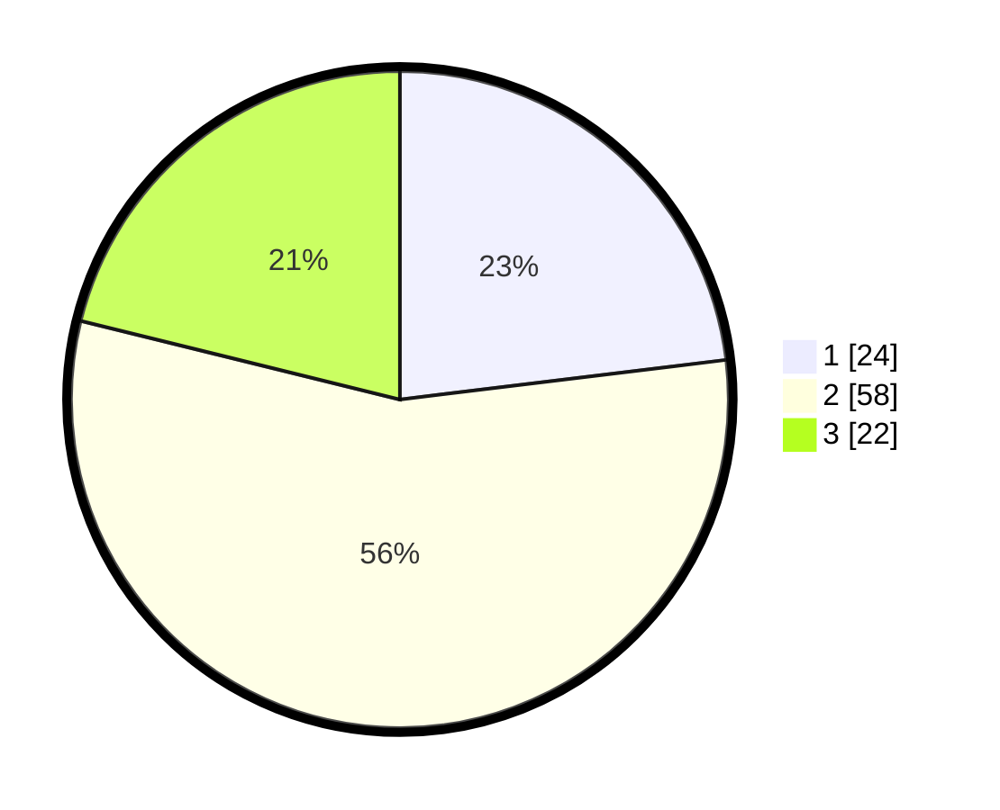

# Hasil

## Grafik

## Tabel

| No. | Nama Paslon    | Suara | Suara (raw) | Persentase |
|:--- |:-------------- | -----:| -----------:| ----------:|
| 1   | ANIES MUHAIMIN | 24    | [24][p-1]   | 23,08      |
| 2   | PRABOWO GIBRAN | 58    | [58][p-2]   | 55,77      |
| 3   | GANJAR MAHFUD  | 22    | [22][p-3]   | 21,15      |

[p-1]: https://github.com/gigit-pemilu/pemilu-2024-12-sumatera-utara/blob/main/pilpres/hitung-suara/sub/12-sumatera-utara/sub/07-deli-serdang/sub/23-sunggal/sub/2006-purwodadi/sub/008-tps/sub/paslon-1.txt
[p-2]: https://github.com/gigit-pemilu/pemilu-2024-12-sumatera-utara/blob/main/pilpres/hitung-suara/sub/12-sumatera-utara/sub/07-deli-serdang/sub/23-sunggal/sub/2006-purwodadi/sub/008-tps/sub/paslon-2.txt
[p-3]: https://github.com/gigit-pemilu/pemilu-2024-12-sumatera-utara/blob/main/pilpres/hitung-suara/sub/12-sumatera-utara/sub/07-deli-serdang/sub/23-sunggal/sub/2006-purwodadi/sub/008-tps/sub/paslon-3.txt

## Foto C Plano

https://sirekap-obj-formc.kpu.go.id/67bd/pemilu/ppwp/12/07/23/20/06/1207232006008-20240214-210939--3f901697-b8f2-4d03-9217-aaaf583c74fe.jpg

https://sirekap-obj-formc.kpu.go.id/67bd/pemilu/ppwp/12/07/23/20/06/1207232006008-20240215-002915--a0f24043-f463-4333-acb9-b49d8b57eee7.jpg

https://sirekap-obj-formc.kpu.go.id/67bd/pemilu/ppwp/12/07/23/20/06/1207232006008-20240214-211237--c9bc12ca-fb48-4dc7-ab5b-aa90f0d53003.jpg

## Metadata

| Key        | Value               |
| ---------- | ------------------- |
| Time Stamp | 2024-02-24 22:31:28 |

