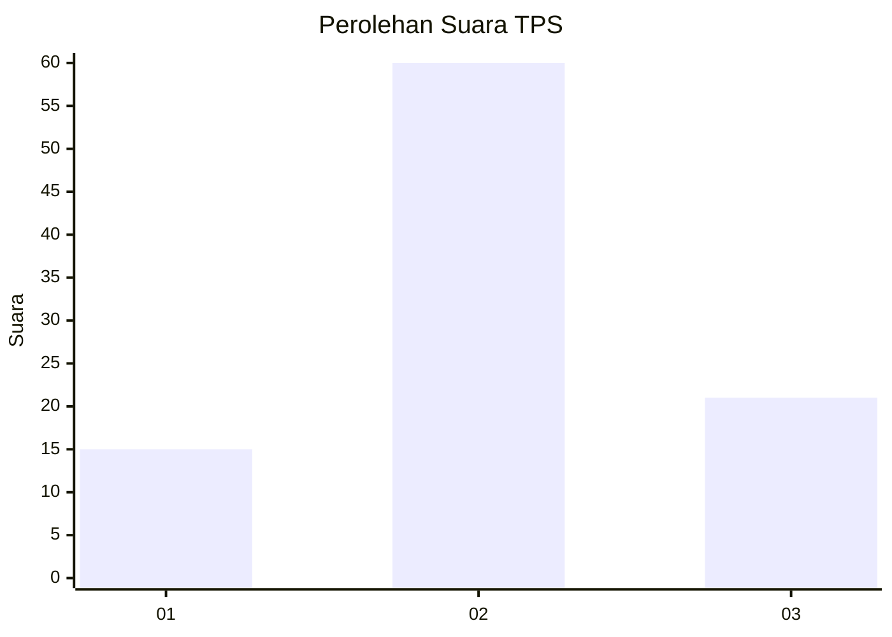
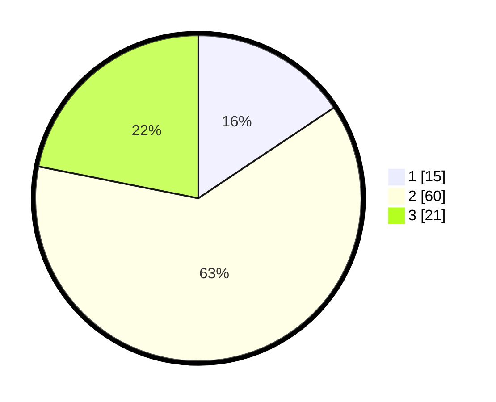

# Hasil

## Grafik

## Tabel

| No. | Nama Paslon    | Suara | Suara (raw) | Persentase |
|:--- |:-------------- | -----:| -----------:| ----------:|
| 1   | ANIES MUHAIMIN | 15    | [15][p-1]   | 15,63      |
| 2   | PRABOWO GIBRAN | 60    | [60][p-2]   | 62,50      |
| 3   | GANJAR MAHFUD  | 21    | [21][p-3]   | 21,88      |

[p-1]: https://github.com/gigit-pemilu/pemilu-2024/blob/main/pilpres/hitung-suara/sub/12-sumatera-utara/sub/07-deli-serdang/sub/23-sunggal/sub/2007-sumber-melati-diski/sub/030-tps/sub/paslon-1.txt
[p-2]: https://github.com/gigit-pemilu/pemilu-2024/blob/main/pilpres/hitung-suara/sub/12-sumatera-utara/sub/07-deli-serdang/sub/23-sunggal/sub/2007-sumber-melati-diski/sub/030-tps/sub/paslon-2.txt
[p-3]: https://github.com/gigit-pemilu/pemilu-2024/blob/main/pilpres/hitung-suara/sub/12-sumatera-utara/sub/07-deli-serdang/sub/23-sunggal/sub/2007-sumber-melati-diski/sub/030-tps/sub/paslon-3.txt

## Foto C Plano

https://sirekap-obj-formc.kpu.go.id/677c/pemilu/ppwp/12/07/23/20/07/1207232007030-20240214-215920--100ed796-0a59-48a0-bcd4-9853de7b5c9f.jpg

https://sirekap-obj-formc.kpu.go.id/677c/pemilu/ppwp/12/07/23/20/07/1207232007030-20240214-221122--055cb177-cf88-4050-8db8-937abd3db936.jpg

https://sirekap-obj-formc.kpu.go.id/677c/pemilu/ppwp/12/07/23/20/07/1207232007030-20240214-221318--699584b7-d9b6-4c83-b79d-f687e39523da.jpg

## Metadata

| Key        | Value               |
| ---------- | ------------------- |
| Time Stamp | 2024-02-15 12:00:28 |

