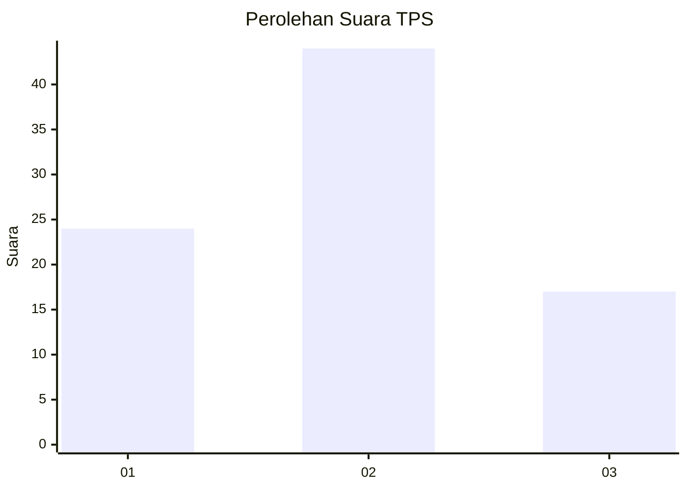
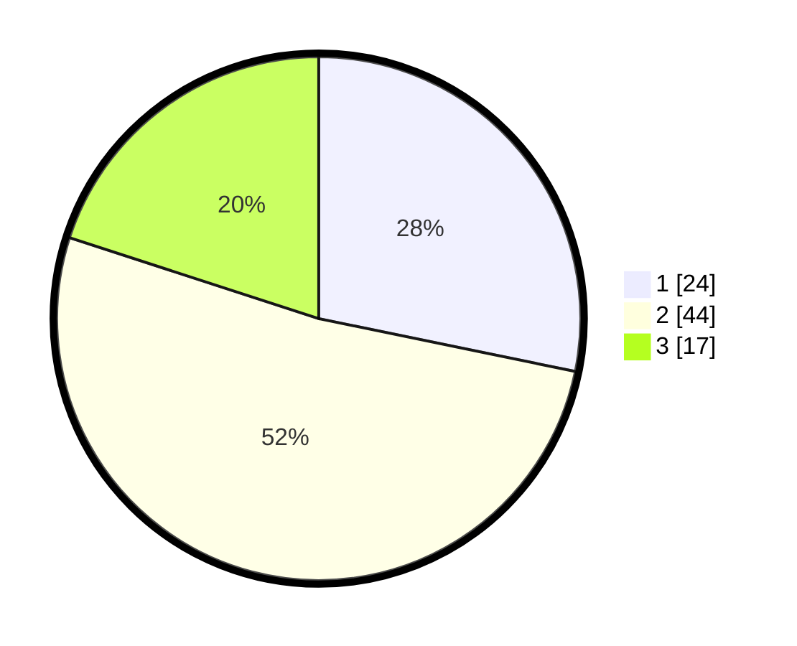

# Hasil

## Grafik

## Tabel

| No. | Nama Paslon    | Suara | Suara (raw) | Persentase |
|:--- |:-------------- | -----:| -----------:| ----------:|
| 1   | ANIES MUHAIMIN | 24    | [24][p-1]   | 28,24      |
| 2   | PRABOWO GIBRAN | 44    | [44][p-2]   | 51,76      |
| 3   | GANJAR MAHFUD  | 17    | [17][p-3]   | 20,00      |

[p-1]: https://github.com/gigit-pemilu/pemilu-2024-12-sumatera-utara/blob/main/pilpres/hitung-suara/sub/12-sumatera-utara/sub/07-deli-serdang/sub/23-sunggal/sub/2007-sumber-melati-diski/sub/031-tps/sub/paslon-1.txt
[p-2]: https://github.com/gigit-pemilu/pemilu-2024-12-sumatera-utara/blob/main/pilpres/hitung-suara/sub/12-sumatera-utara/sub/07-deli-serdang/sub/23-sunggal/sub/2007-sumber-melati-diski/sub/031-tps/sub/paslon-2.txt
[p-3]: https://github.com/gigit-pemilu/pemilu-2024-12-sumatera-utara/blob/main/pilpres/hitung-suara/sub/12-sumatera-utara/sub/07-deli-serdang/sub/23-sunggal/sub/2007-sumber-melati-diski/sub/031-tps/sub/paslon-3.txt

## Foto C Plano

https://sirekap-obj-formc.kpu.go.id/f9dd/pemilu/ppwp/12/07/23/20/07/1207232007031-20240215-035627--1cb2683c-4617-40d3-82c6-177402e1b9e6.jpg

https://sirekap-obj-formc.kpu.go.id/f9dd/pemilu/ppwp/12/07/23/20/07/1207232007031-20240215-041830--966631ee-594b-4e27-917a-eee160680b02.jpg

https://sirekap-obj-formc.kpu.go.id/f9dd/pemilu/ppwp/12/07/23/20/07/1207232007031-20240215-041925--ea5810dc-a9f6-4979-a899-2e7e480dc8cc.jpg

## Metadata

| Key        | Value               |
| ---------- | ------------------- |
| Time Stamp | 2024-02-25 16:00:00 |

