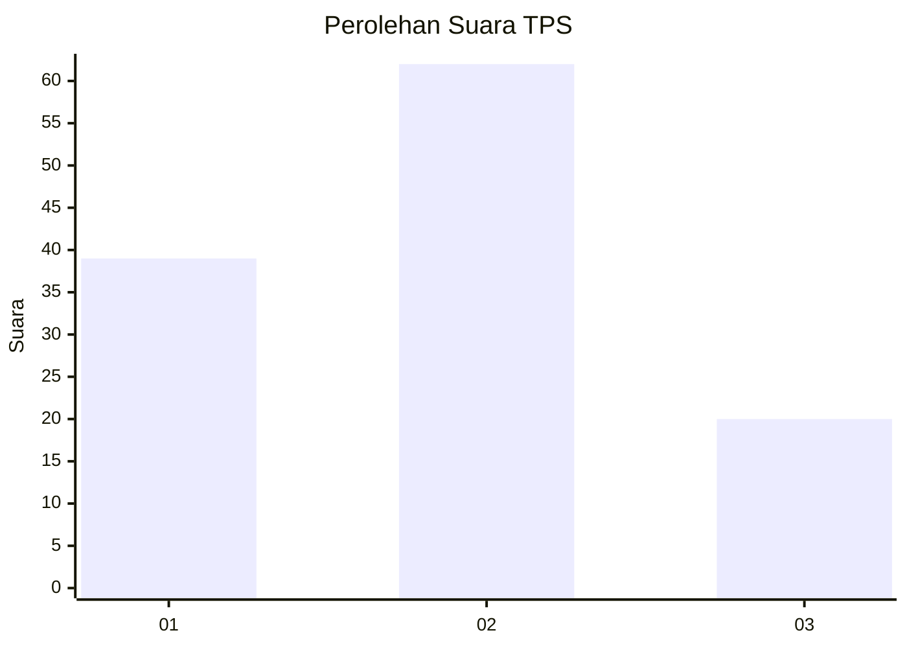
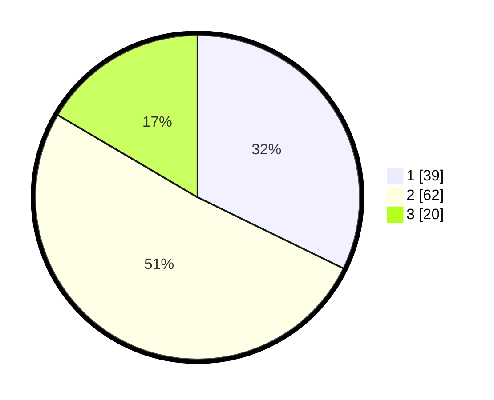

# Hasil

## Grafik

## Tabel

| No. | Nama Paslon    | Suara | Suara (raw) | Persentase |
|:--- |:-------------- | -----:| -----------:| ----------:|
| 1   | ANIES MUHAIMIN | 39    | [39][p-1]   | 32,23      |
| 2   | PRABOWO GIBRAN | 62    | [62][p-2]   | 51,24      |
| 3   | GANJAR MAHFUD  | 20    | [20][p-3]   | 16,53      |

[p-1]: https://github.com/gigit-pemilu/pemilu-2024/blob/main/pilpres/hitung-suara/sub/12-sumatera-utara/sub/07-deli-serdang/sub/23-sunggal/sub/2007-sumber-melati-diski/sub/032-tps/sub/paslon-1.txt
[p-2]: https://github.com/gigit-pemilu/pemilu-2024/blob/main/pilpres/hitung-suara/sub/12-sumatera-utara/sub/07-deli-serdang/sub/23-sunggal/sub/2007-sumber-melati-diski/sub/032-tps/sub/paslon-2.txt
[p-3]: https://github.com/gigit-pemilu/pemilu-2024/blob/main/pilpres/hitung-suara/sub/12-sumatera-utara/sub/07-deli-serdang/sub/23-sunggal/sub/2007-sumber-melati-diski/sub/032-tps/sub/paslon-3.txt

## Foto C Plano

https://sirekap-obj-formc.kpu.go.id/6cb4/pemilu/ppwp/12/07/23/20/07/1207232007032-20240214-225949--b9fed794-bfee-43cc-aa55-f45101d59c1b.jpg

https://sirekap-obj-formc.kpu.go.id/6cb4/pemilu/ppwp/12/07/23/20/07/1207232007032-20240214-225727--08405d61-68e6-4623-b72c-9e36142b71bc.jpg

https://sirekap-obj-formc.kpu.go.id/6cb4/pemilu/ppwp/12/07/23/20/07/1207232007032-20240214-225934--a1ac3f9a-f16b-42b6-a3a8-a2c329cae423.jpg

## Metadata

| Key        | Value               |
| ---------- | ------------------- |
| Time Stamp | 2024-02-25 15:00:00 |

