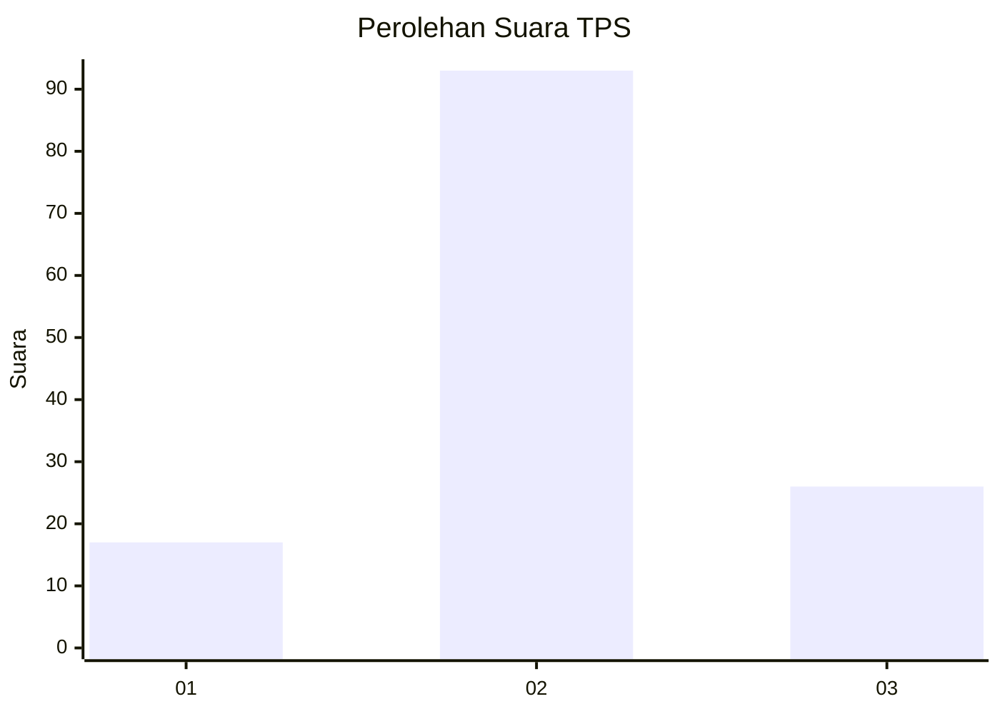
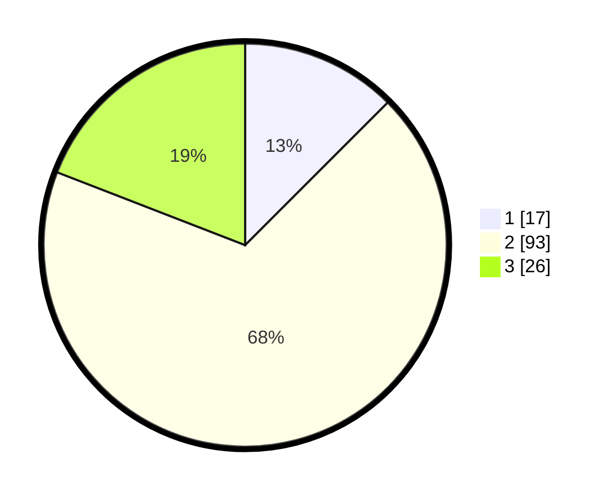

# Hasil

## Grafik

## Tabel

| No. | Nama Paslon    | Suara | Suara (raw) | Persentase |
|:--- |:-------------- | -----:| -----------:| ----------:|
| 1   | ANIES MUHAIMIN | 17    | [17][p-1]   | 12,50      |
| 2   | PRABOWO GIBRAN | 93    | [93][p-2]   | 68,38      |
| 3   | GANJAR MAHFUD  | 26    | [26][p-3]   | 19,12      |

[p-1]: https://github.com/gigit-pemilu/pemilu-2024/blob/main/pilpres/hitung-suara/sub/12-sumatera-utara/sub/07-deli-serdang/sub/23-sunggal/sub/2008-tanjung-gusta/sub/004-tps/sub/paslon-1.txt
[p-2]: https://github.com/gigit-pemilu/pemilu-2024/blob/main/pilpres/hitung-suara/sub/12-sumatera-utara/sub/07-deli-serdang/sub/23-sunggal/sub/2008-tanjung-gusta/sub/004-tps/sub/paslon-2.txt
[p-3]: https://github.com/gigit-pemilu/pemilu-2024/blob/main/pilpres/hitung-suara/sub/12-sumatera-utara/sub/07-deli-serdang/sub/23-sunggal/sub/2008-tanjung-gusta/sub/004-tps/sub/paslon-3.txt

## Foto C Plano

https://sirekap-obj-formc.kpu.go.id/a986/pemilu/ppwp/12/07/23/20/08/1207232008004-20240214-223224--4974c3fe-fab1-478b-a77d-790a196361f4.jpg

https://sirekap-obj-formc.kpu.go.id/a986/pemilu/ppwp/12/07/23/20/08/1207232008004-20240214-223713--65782c79-d884-45c7-be79-d6e251571eb0.jpg

https://sirekap-obj-formc.kpu.go.id/a986/pemilu/ppwp/12/07/23/20/08/1207232008004-20240214-223720--5e2d4585-d817-4dd5-9cf3-c883d3cfa853.jpg

## Metadata

| Key        | Value               |
| ---------- | ------------------- |
| Time Stamp | 2024-02-25 12:00:00 |

