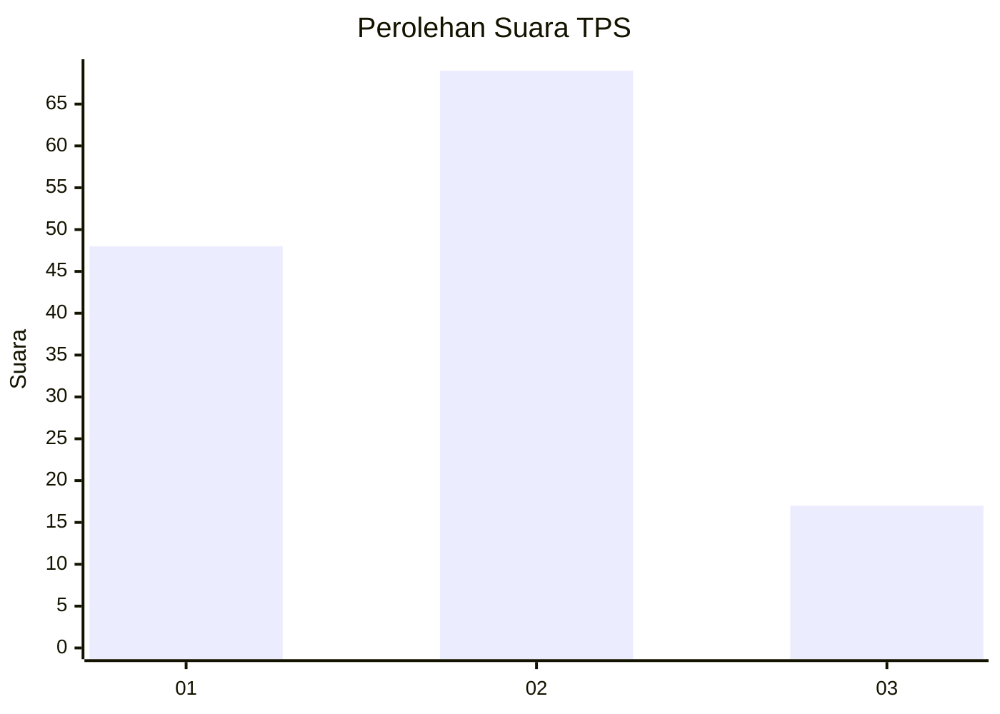
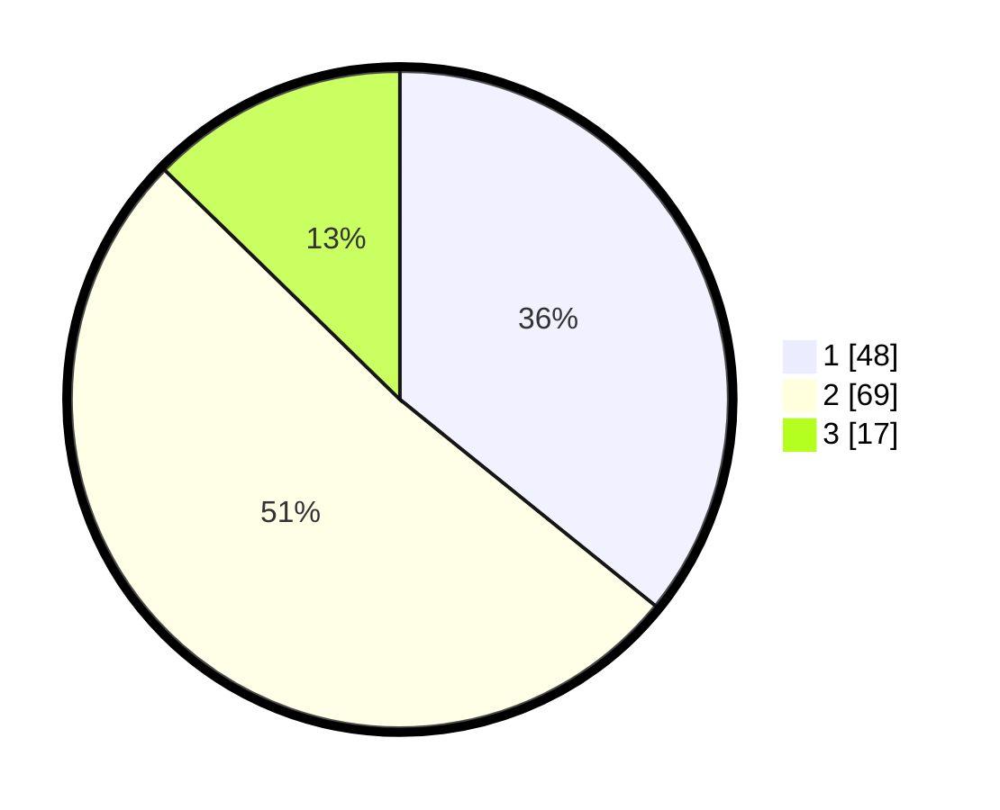

# Hasil

## Grafik

## Tabel

| No. | Nama Paslon    | Suara | Suara (raw) | Persentase |
|:--- |:-------------- | -----:| -----------:| ----------:|
| 1   | ANIES MUHAIMIN | 48    | [48][p-1]   | 35,82      |
| 2   | PRABOWO GIBRAN | 69    | [69][p-2]   | 51,49      |
| 3   | GANJAR MAHFUD  | 17    | [17][p-3]   | 12,69      |

[p-1]: https://github.com/gigit-pemilu/pemilu-2024-12-sumatera-utara/blob/main/pilpres/hitung-suara/sub/12-sumatera-utara/sub/07-deli-serdang/sub/23-sunggal/sub/2008-tanjung-gusta/sub/007-tps/sub/paslon-1.txt
[p-2]: https://github.com/gigit-pemilu/pemilu-2024-12-sumatera-utara/blob/main/pilpres/hitung-suara/sub/12-sumatera-utara/sub/07-deli-serdang/sub/23-sunggal/sub/2008-tanjung-gusta/sub/007-tps/sub/paslon-2.txt
[p-3]: https://github.com/gigit-pemilu/pemilu-2024-12-sumatera-utara/blob/main/pilpres/hitung-suara/sub/12-sumatera-utara/sub/07-deli-serdang/sub/23-sunggal/sub/2008-tanjung-gusta/sub/007-tps/sub/paslon-3.txt

## Foto C Plano

https://sirekap-obj-formc.kpu.go.id/5083/pemilu/ppwp/12/07/23/20/08/1207232008007-20240214-160106--0220f824-2566-4de6-b901-c312648f3a55.jpg

https://sirekap-obj-formc.kpu.go.id/5083/pemilu/ppwp/12/07/23/20/08/1207232008007-20240214-155842--474eaab1-4392-423d-b83d-697334cfcdca.jpg

https://sirekap-obj-formc.kpu.go.id/5083/pemilu/ppwp/12/07/23/20/08/1207232008007-20240214-160122--2dab46fe-62b3-4d8e-84df-08aed1778ccd.jpg

## Metadata

| Key        | Value               |
| ---------- | ------------------- |
| Time Stamp | 2024-02-24 22:31:28 |

