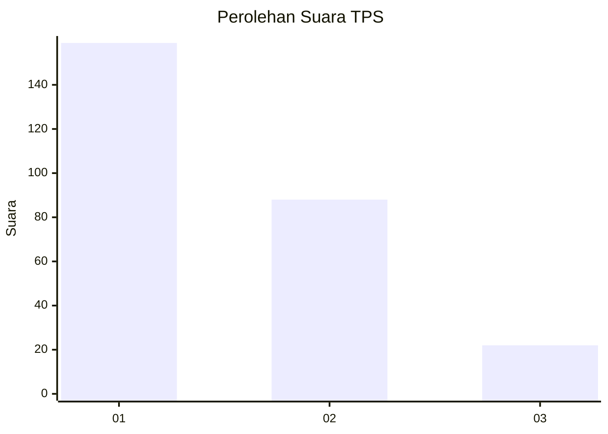
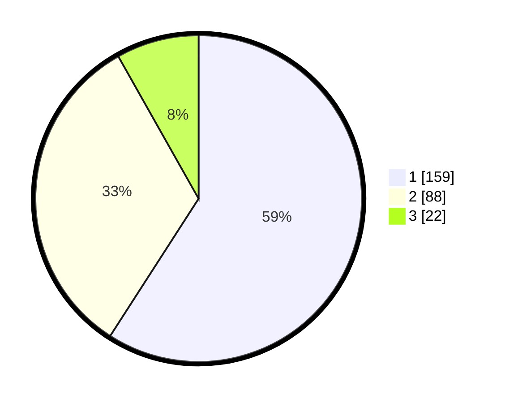

# Hasil

## Grafik

## Tabel

| No. | Nama Paslon    | Suara | Suara (raw) | Persentase |
|:--- |:-------------- | -----:| -----------:| ----------:|
| 1   | ANIES MUHAIMIN | 159   | [159][p-1]  | 59,11      |
| 2   | PRABOWO GIBRAN | 88    | [88][p-2]   | 32,71      |
| 3   | GANJAR MAHFUD  | 22    | [22][p-3]   | 8,18       |

[p-1]: https://github.com/gigit-pemilu/pemilu-2024-12-sumatera-utara/blob/main/pilpres/hitung-suara/sub/12-sumatera-utara/sub/07-deli-serdang/sub/23-sunggal/sub/2008-tanjung-gusta/sub/026-tps/sub/paslon-1.txt
[p-2]: https://github.com/gigit-pemilu/pemilu-2024-12-sumatera-utara/blob/main/pilpres/hitung-suara/sub/12-sumatera-utara/sub/07-deli-serdang/sub/23-sunggal/sub/2008-tanjung-gusta/sub/026-tps/sub/paslon-2.txt
[p-3]: https://github.com/gigit-pemilu/pemilu-2024-12-sumatera-utara/blob/main/pilpres/hitung-suara/sub/12-sumatera-utara/sub/07-deli-serdang/sub/23-sunggal/sub/2008-tanjung-gusta/sub/026-tps/sub/paslon-3.txt

## Foto C Plano

https://sirekap-obj-formc.kpu.go.id/14fc/pemilu/ppwp/12/07/23/20/08/1207232008026-20240215-005248--a4dfc512-3567-4c24-9707-4412b3fb3ab9.jpg

https://sirekap-obj-formc.kpu.go.id/14fc/pemilu/ppwp/12/07/23/20/08/1207232008026-20240215-005328--f153d8cb-63e3-49fa-8ce8-3dbd21ae52ad.jpg

https://sirekap-obj-formc.kpu.go.id/14fc/pemilu/ppwp/12/07/23/20/08/1207232008026-20240215-005401--72e47de9-eb71-4b4c-8a0b-ba70f3359a4d.jpg

## Metadata

| Key        | Value               |
| ---------- | ------------------- |
| Time Stamp | 2024-02-25 12:00:00 |

