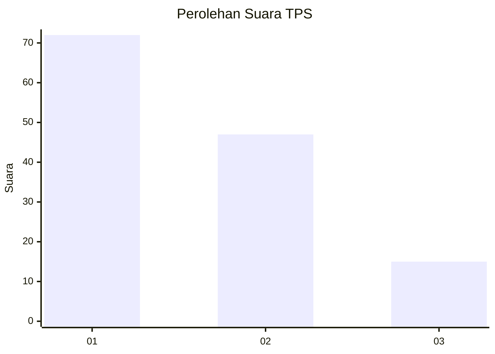
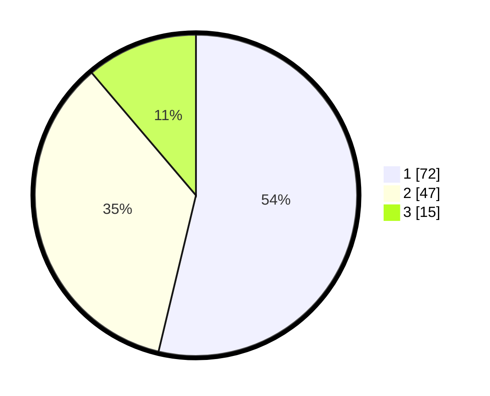

# Hasil

## Grafik

## Tabel

| No. | Nama Paslon    | Suara | Suara (raw) | Persentase |
|:--- |:-------------- | -----:| -----------:| ----------:|
| 1   | ANIES MUHAIMIN | 72    | [72][p-1]   | 53,73      |
| 2   | PRABOWO GIBRAN | 47    | [47][p-2]   | 35,07      |
| 3   | GANJAR MAHFUD  | 15    | [15][p-3]   | 11,19      |

[p-1]: https://github.com/gigit-pemilu/pemilu-2024/blob/main/pilpres/hitung-suara/sub/12-sumatera-utara/sub/07-deli-serdang/sub/23-sunggal/sub/2010-medan-krio/sub/001-tps/sub/paslon-1.txt
[p-2]: https://github.com/gigit-pemilu/pemilu-2024/blob/main/pilpres/hitung-suara/sub/12-sumatera-utara/sub/07-deli-serdang/sub/23-sunggal/sub/2010-medan-krio/sub/001-tps/sub/paslon-2.txt
[p-3]: https://github.com/gigit-pemilu/pemilu-2024/blob/main/pilpres/hitung-suara/sub/12-sumatera-utara/sub/07-deli-serdang/sub/23-sunggal/sub/2010-medan-krio/sub/001-tps/sub/paslon-3.txt

## Foto C Plano

https://sirekap-obj-formc.kpu.go.id/1a8d/pemilu/ppwp/12/07/23/20/10/1207232010001-20240215-011409--ecef8593-8653-47ab-88d2-fc2bdcaf93ab.jpg

https://sirekap-obj-formc.kpu.go.id/1a8d/pemilu/ppwp/12/07/23/20/10/1207232010001-20240215-011531--8b2dd865-d746-49b0-98f5-58af5c710a9f.jpg

https://sirekap-obj-formc.kpu.go.id/1a8d/pemilu/ppwp/12/07/23/20/10/1207232010001-20240215-012155--2ed5a669-0e6e-436c-b037-fc480ff698a5.jpg

## Metadata

| Key        | Value               |
| ---------- | ------------------- |
| Time Stamp | 2024-02-16 16:25:10 |

## DATA PEMILIH TETAP

Jumlah pemilih dalam DPT: **414**.
 * L: **220**.
 * P: **12**.

## DATA PENGGUNA HAK PILIH

Jumlah pengguna hak pilih dalam DPT: **777**.
 * L: **552**.
 * P: **20**.

Jumlah pengguna hak pilih dalam DPTb: **50**.
 * L: **0**.
 * P: **55**.

Jumlah pengguna hak pilih dalam DPK: **509**.
 * L: **5**.
 * P: **4**.

Jumlah pengguna hak pilih: **183**.
 * L: **82**.
 * P: **111**.

## JUMLAH SUARA SAH DAN TIDAK SAH

JUMLAH SELURUH SUARA SAH: **180**.

JUMLAH SUARA TIDAK SAH: **3**.

JUMLAH SELURUH SUARA SAH DAN SUARA TIDAK SAH: **183**.

