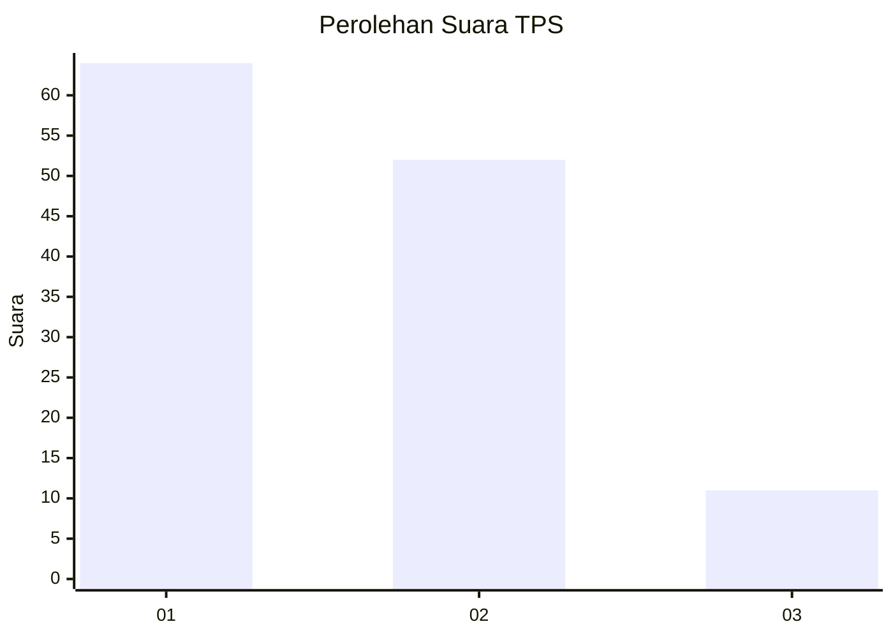
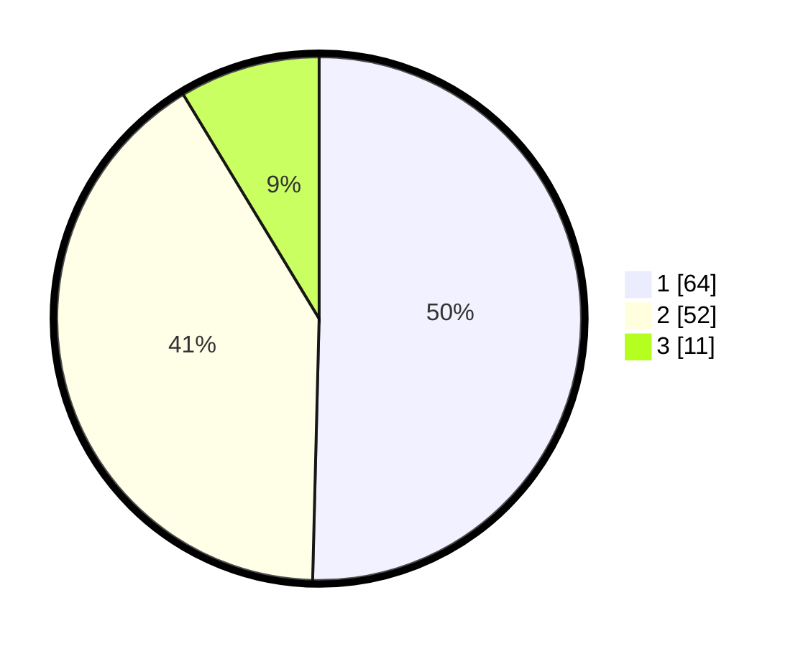

# Hasil

## Grafik

## Tabel

| No. | Nama Paslon    | Suara | Suara (raw) | Persentase |
|:--- |:-------------- | -----:| -----------:| ----------:|
| 1   | ANIES MUHAIMIN | 64    | [64][p-1]   | 50,39      |
| 2   | PRABOWO GIBRAN | 52    | [52][p-2]   | 40,94      |
| 3   | GANJAR MAHFUD  | 11    | [11][p-3]   | 8,66       |

[p-1]: https://github.com/gigit-pemilu/pemilu-2024-12-sumatera-utara/blob/main/pilpres/hitung-suara/sub/12-sumatera-utara/sub/07-deli-serdang/sub/23-sunggal/sub/2010-medan-krio/sub/005-tps/sub/paslon-1.txt
[p-2]: https://github.com/gigit-pemilu/pemilu-2024-12-sumatera-utara/blob/main/pilpres/hitung-suara/sub/12-sumatera-utara/sub/07-deli-serdang/sub/23-sunggal/sub/2010-medan-krio/sub/005-tps/sub/paslon-2.txt
[p-3]: https://github.com/gigit-pemilu/pemilu-2024-12-sumatera-utara/blob/main/pilpres/hitung-suara/sub/12-sumatera-utara/sub/07-deli-serdang/sub/23-sunggal/sub/2010-medan-krio/sub/005-tps/sub/paslon-3.txt

## Foto C Plano

https://sirekap-obj-formc.kpu.go.id/31fb/pemilu/ppwp/12/07/23/20/10/1207232010005-20240214-140925--f2564f8e-dd2b-4e35-87c2-60b0fde57c13.jpg

https://sirekap-obj-formc.kpu.go.id/31fb/pemilu/ppwp/12/07/23/20/10/1207232010005-20240214-140932--c2e0ff83-2f43-4792-a2e8-ab3942f07d08.jpg

https://sirekap-obj-formc.kpu.go.id/31fb/pemilu/ppwp/12/07/23/20/10/1207232010005-20240214-141649--5c91219b-b816-4e7f-97ab-5cb88b973c25.jpg

## Metadata

| Key        | Value               |
| ---------- | ------------------- |
| Time Stamp | 2024-02-15 15:00:29 |

