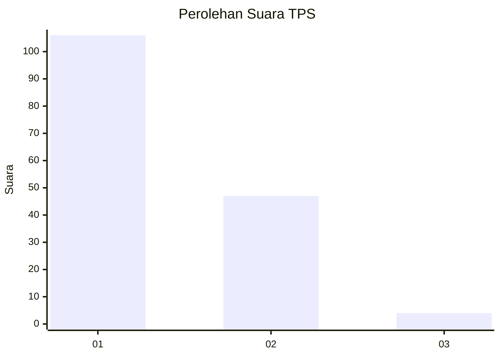
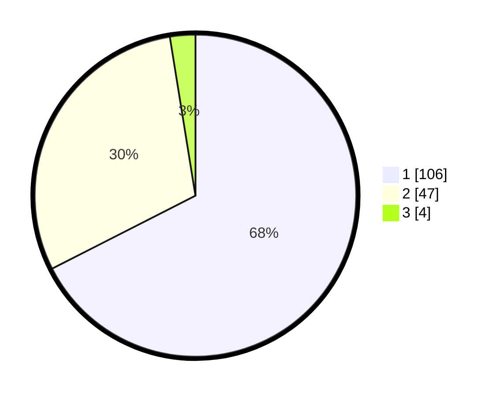

# Hasil

## Grafik

## Tabel

| No. | Nama Paslon    | Suara | Suara (raw) | Persentase |
|:--- |:-------------- | -----:| -----------:| ----------:|
| 1   | ANIES MUHAIMIN | 106   | [106][p-1]  | 67,52      |
| 2   | PRABOWO GIBRAN | 47    | [47][p-2]   | 29,94      |
| 3   | GANJAR MAHFUD  | 4     | [4][p-3]    | 2,55       |

[p-1]: https://github.com/gigit-pemilu/pemilu-2024/blob/main/pilpres/hitung-suara/sub/12-sumatera-utara/sub/07-deli-serdang/sub/24-hamparan-perak/sub/2001-hamparan-perak/sub/011-tps/sub/paslon-1.txt
[p-2]: https://github.com/gigit-pemilu/pemilu-2024/blob/main/pilpres/hitung-suara/sub/12-sumatera-utara/sub/07-deli-serdang/sub/24-hamparan-perak/sub/2001-hamparan-perak/sub/011-tps/sub/paslon-2.txt
[p-3]: https://github.com/gigit-pemilu/pemilu-2024/blob/main/pilpres/hitung-suara/sub/12-sumatera-utara/sub/07-deli-serdang/sub/24-hamparan-perak/sub/2001-hamparan-perak/sub/011-tps/sub/paslon-3.txt

## Foto C Plano

https://sirekap-obj-formc.kpu.go.id/d12b/pemilu/ppwp/12/07/24/20/01/1207242001011-20240214-203758--66b74711-c6aa-43c5-a88f-8a7fb641a1c4.jpg

https://sirekap-obj-formc.kpu.go.id/d12b/pemilu/ppwp/12/07/24/20/01/1207242001011-20240214-204249--7f94d7da-9b91-4689-aecb-0462259498f7.jpg

https://sirekap-obj-formc.kpu.go.id/d12b/pemilu/ppwp/12/07/24/20/01/1207242001011-20240214-204427--51e0916b-aa07-46b9-9562-e3bdf970c54a.jpg

## Metadata

| Key        | Value               |
| ---------- | ------------------- |
| Time Stamp | 2024-02-25 17:00:00 |

