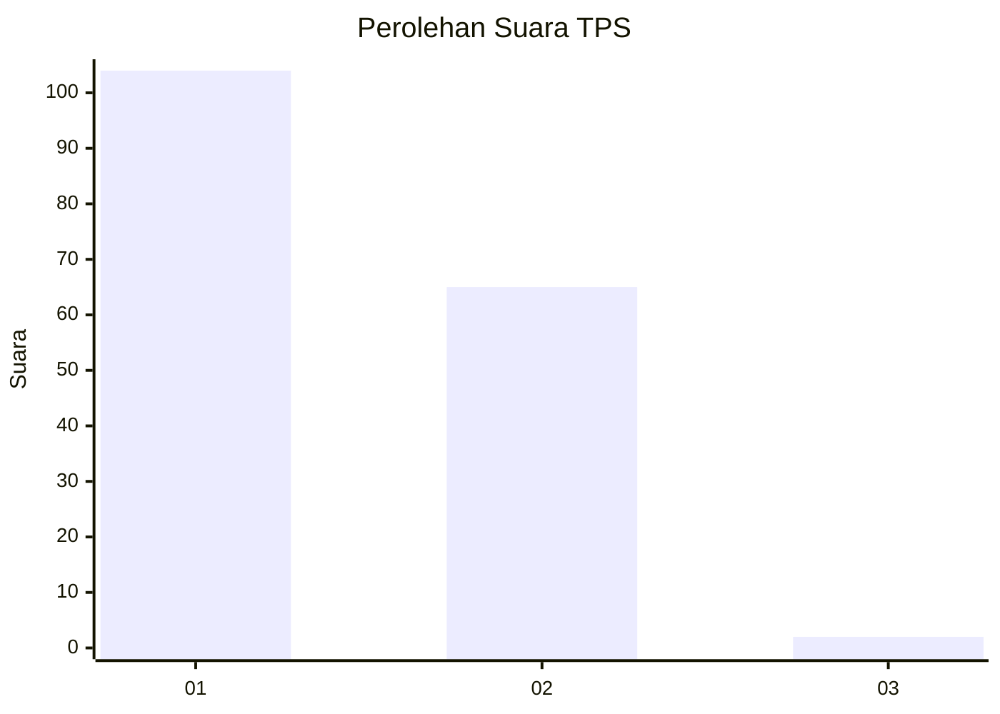
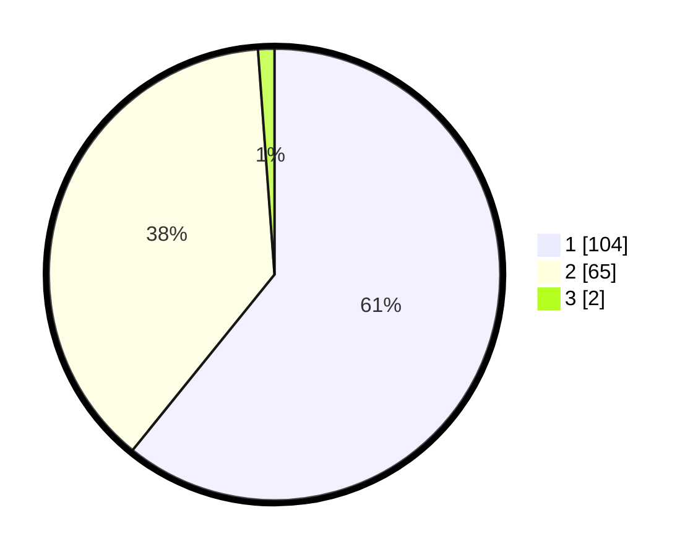

# Hasil

## Grafik

## Tabel

| No. | Nama Paslon    | Suara | Suara (raw) | Persentase |
|:--- |:-------------- | -----:| -----------:| ----------:|
| 1   | ANIES MUHAIMIN | 104   | [104][p-1]  | 60,82      |
| 2   | PRABOWO GIBRAN | 65    | [65][p-2]   | 38,01      |
| 3   | GANJAR MAHFUD  | 2     | [2][p-3]    | 1,17       |

[p-1]: https://github.com/gigit-pemilu/pemilu-2024-12-sumatera-utara/blob/main/pilpres/hitung-suara/sub/12-sumatera-utara/sub/07-deli-serdang/sub/24-hamparan-perak/sub/2001-hamparan-perak/sub/015-tps/sub/paslon-1.txt
[p-2]: https://github.com/gigit-pemilu/pemilu-2024-12-sumatera-utara/blob/main/pilpres/hitung-suara/sub/12-sumatera-utara/sub/07-deli-serdang/sub/24-hamparan-perak/sub/2001-hamparan-perak/sub/015-tps/sub/paslon-2.txt
[p-3]: https://github.com/gigit-pemilu/pemilu-2024-12-sumatera-utara/blob/main/pilpres/hitung-suara/sub/12-sumatera-utara/sub/07-deli-serdang/sub/24-hamparan-perak/sub/2001-hamparan-perak/sub/015-tps/sub/paslon-3.txt

## Foto C Plano

https://sirekap-obj-formc.kpu.go.id/edaf/pemilu/ppwp/12/07/24/20/01/1207242001015-20240215-043526--2840eb39-9755-44ac-a04f-67f38d0d0f89.jpg

https://sirekap-obj-formc.kpu.go.id/edaf/pemilu/ppwp/12/07/24/20/01/1207242001015-20240215-043633--708e2f84-f76f-4875-a28d-2ce6b331be31.jpg

https://sirekap-obj-formc.kpu.go.id/edaf/pemilu/ppwp/12/07/24/20/01/1207242001015-20240215-043722--4bf00d43-d5c5-4050-ae30-c2453cf856e8.jpg

## Metadata

| Key        | Value               |
| ---------- | ------------------- |
| Time Stamp | 2024-02-16 23:00:00 |

