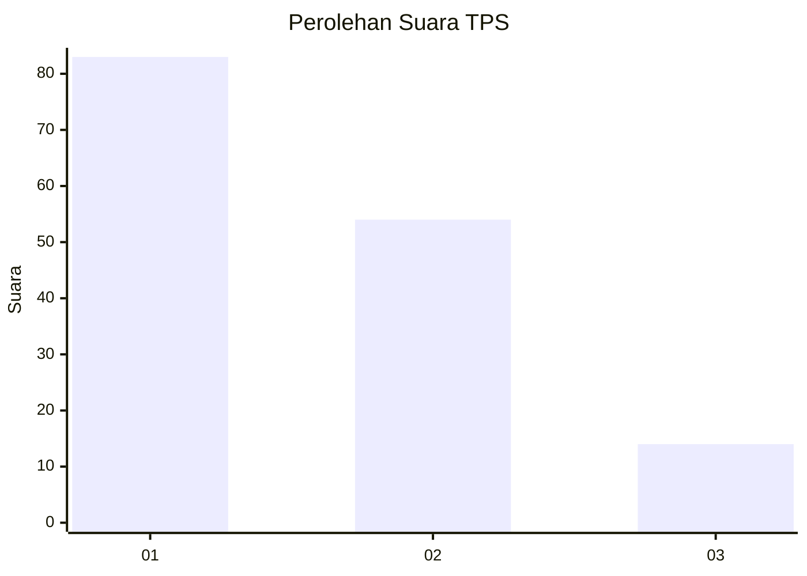
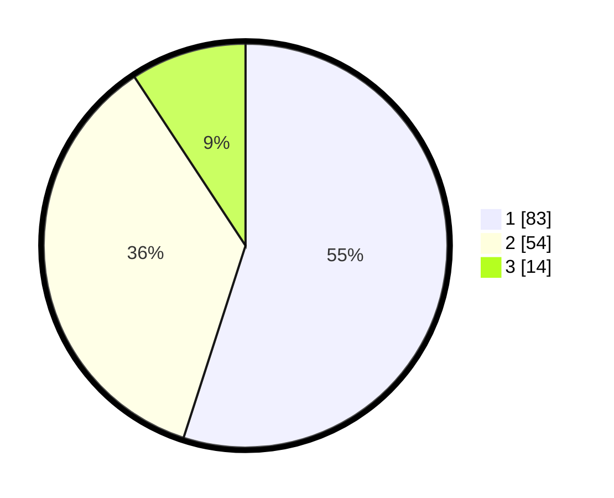

# Hasil

## Grafik

## Tabel

| No. | Nama Paslon    | Suara | Suara (raw) | Persentase |
|:--- |:-------------- | -----:| -----------:| ----------:|
| 1   | ANIES MUHAIMIN | 83    | [83][p-1]   | 54,97      |
| 2   | PRABOWO GIBRAN | 54    | [54][p-2]   | 35,76      |
| 3   | GANJAR MAHFUD  | 14    | [14][p-3]   | 9,27       |

[p-1]: https://github.com/gigit-pemilu/pemilu-2024/blob/main/pilpres/hitung-suara/sub/12-sumatera-utara/sub/07-deli-serdang/sub/24-hamparan-perak/sub/2001-hamparan-perak/sub/023-tps/sub/paslon-1.txt
[p-2]: https://github.com/gigit-pemilu/pemilu-2024/blob/main/pilpres/hitung-suara/sub/12-sumatera-utara/sub/07-deli-serdang/sub/24-hamparan-perak/sub/2001-hamparan-perak/sub/023-tps/sub/paslon-2.txt
[p-3]: https://github.com/gigit-pemilu/pemilu-2024/blob/main/pilpres/hitung-suara/sub/12-sumatera-utara/sub/07-deli-serdang/sub/24-hamparan-perak/sub/2001-hamparan-perak/sub/023-tps/sub/paslon-3.txt

## Foto C Plano

https://sirekap-obj-formc.kpu.go.id/cf22/pemilu/ppwp/12/07/24/20/01/1207242001023-20240214-231812--bd6accf5-c626-477f-b66c-09f564b357fb.jpg

https://sirekap-obj-formc.kpu.go.id/cf22/pemilu/ppwp/12/07/24/20/01/1207242001023-20240214-231947--94b159f5-6e9e-4fbc-b932-8876a5f303a2.jpg

https://sirekap-obj-formc.kpu.go.id/cf22/pemilu/ppwp/12/07/24/20/01/1207242001023-20240214-233829--462654b5-1bc6-4055-bdb2-d015edd97844.jpg

## Metadata

| Key        | Value               |
| ---------- | ------------------- |
| Time Stamp | 2024-02-25 21:00:00 |

