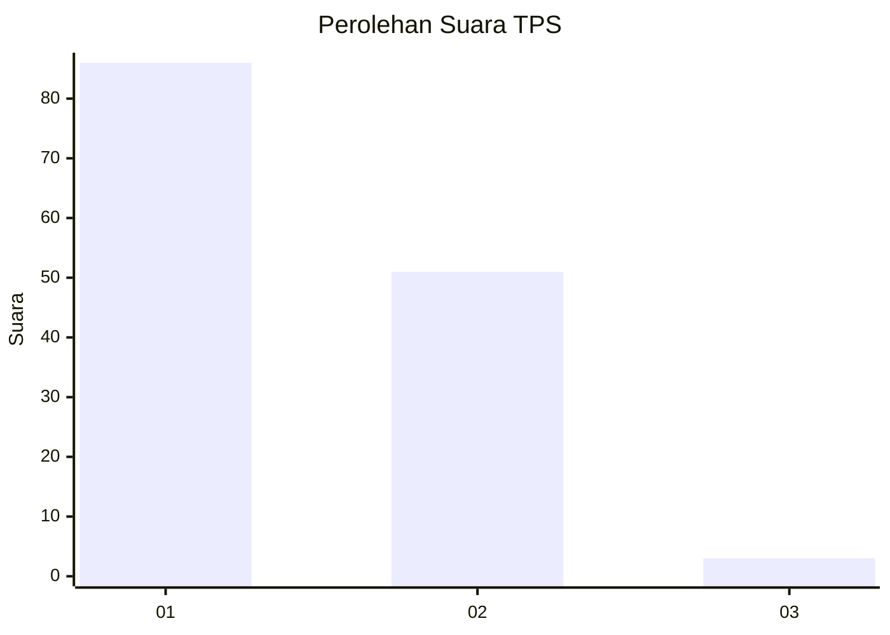
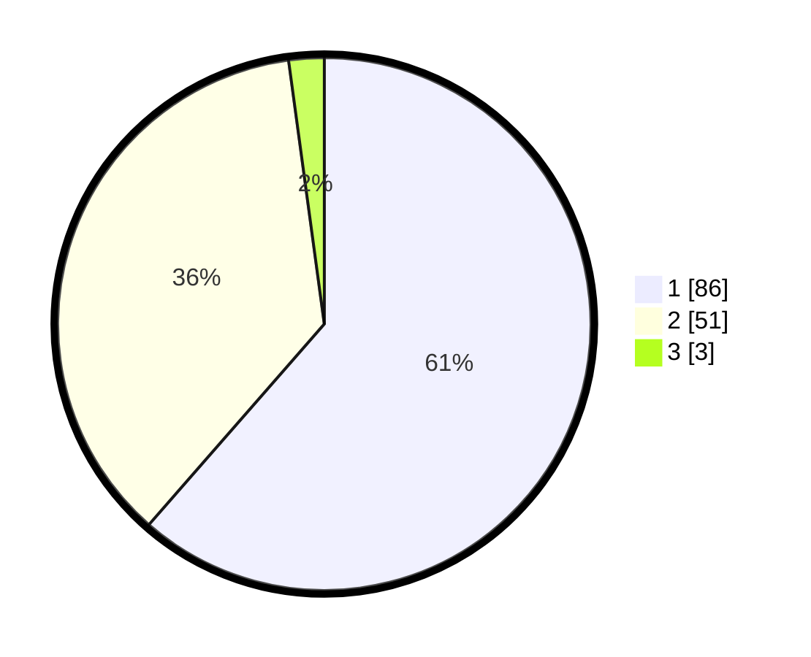

# Hasil

## Grafik

## Tabel

| No. | Nama Paslon    | Suara | Suara (raw) | Persentase |
|:--- |:-------------- | -----:| -----------:| ----------:|
| 1   | ANIES MUHAIMIN | 86    | [86][p-1]   | 61,43      |
| 2   | PRABOWO GIBRAN | 51    | [51][p-2]   | 36,43      |
| 3   | GANJAR MAHFUD  | 3     | [3][p-3]    | 2,14       |

[p-1]: https://github.com/gigit-pemilu/pemilu-2024/blob/main/pilpres/hitung-suara/sub/12-sumatera-utara/sub/07-deli-serdang/sub/24-hamparan-perak/sub/2001-hamparan-perak/sub/039-tps/sub/paslon-1.txt
[p-2]: https://github.com/gigit-pemilu/pemilu-2024/blob/main/pilpres/hitung-suara/sub/12-sumatera-utara/sub/07-deli-serdang/sub/24-hamparan-perak/sub/2001-hamparan-perak/sub/039-tps/sub/paslon-2.txt
[p-3]: https://github.com/gigit-pemilu/pemilu-2024/blob/main/pilpres/hitung-suara/sub/12-sumatera-utara/sub/07-deli-serdang/sub/24-hamparan-perak/sub/2001-hamparan-perak/sub/039-tps/sub/paslon-3.txt

## Foto C Plano

https://sirekap-obj-formc.kpu.go.id/9560/pemilu/ppwp/12/07/24/20/01/1207242001039-20240215-084850--2decbb26-1c7d-4dc6-b405-33e310db9e27.jpg

https://sirekap-obj-formc.kpu.go.id/9560/pemilu/ppwp/12/07/24/20/01/1207242001039-20240215-085220--183c4ce1-fc54-4764-8406-0afcb2b84388.jpg

https://sirekap-obj-formc.kpu.go.id/9560/pemilu/ppwp/12/07/24/20/01/1207242001039-20240215-085308--e74e567a-c3ce-4b5c-a333-3b15ea31d583.jpg

## Metadata

| Key        | Value               |
| ---------- | ------------------- |
| Time Stamp | 2024-02-25 12:00:00 |

