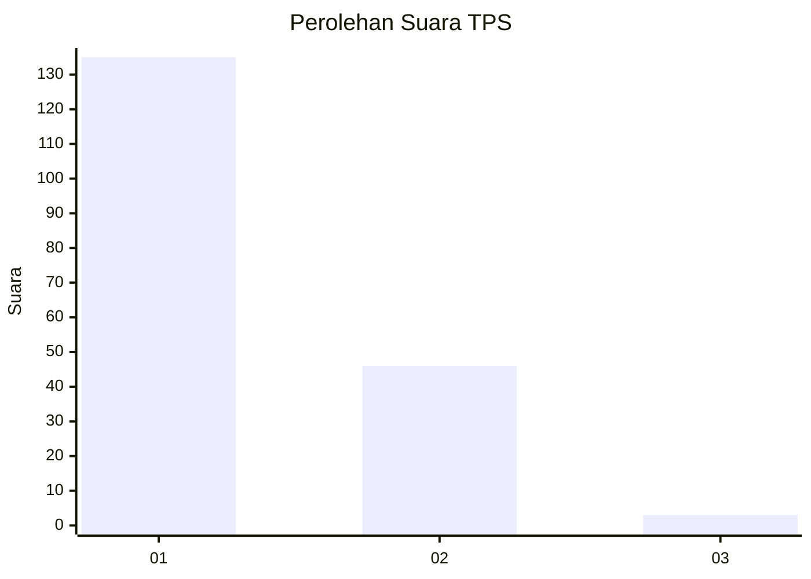
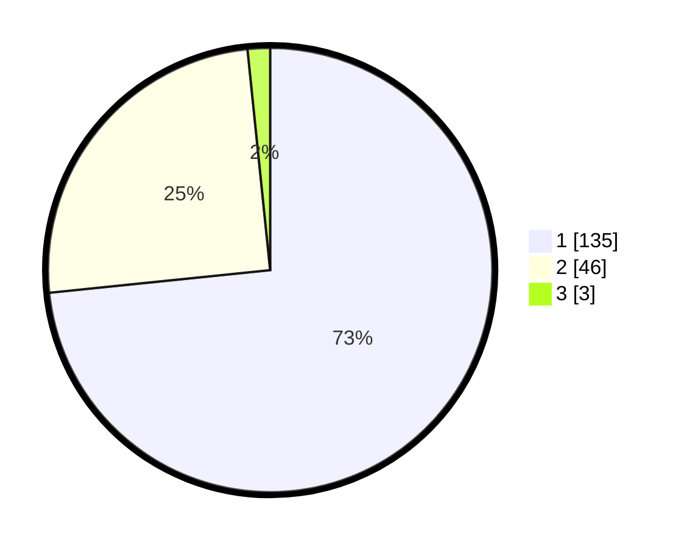

# Hasil

## Grafik

## Tabel

| No. | Nama Paslon    | Suara | Suara (raw) | Persentase |
|:--- |:-------------- | -----:| -----------:| ----------:|
| 1   | ANIES MUHAIMIN | 135   | [135][p-1]  | 73,37      |
| 2   | PRABOWO GIBRAN | 46    | [46][p-2]   | 25,00      |
| 3   | GANJAR MAHFUD  | 3     | [3][p-3]    | 1,63       |

[p-1]: https://github.com/gigit-pemilu/pemilu-2024/blob/main/pilpres/hitung-suara/sub/12-sumatera-utara/sub/07-deli-serdang/sub/24-hamparan-perak/sub/2001-hamparan-perak/sub/040-tps/sub/paslon-1.txt
[p-2]: https://github.com/gigit-pemilu/pemilu-2024/blob/main/pilpres/hitung-suara/sub/12-sumatera-utara/sub/07-deli-serdang/sub/24-hamparan-perak/sub/2001-hamparan-perak/sub/040-tps/sub/paslon-2.txt
[p-3]: https://github.com/gigit-pemilu/pemilu-2024/blob/main/pilpres/hitung-suara/sub/12-sumatera-utara/sub/07-deli-serdang/sub/24-hamparan-perak/sub/2001-hamparan-perak/sub/040-tps/sub/paslon-3.txt

## Foto C Plano

https://sirekap-obj-formc.kpu.go.id/88c3/pemilu/ppwp/12/07/24/20/01/1207242001040-20240215-032543--df2bc52b-7104-4324-bb5b-96ade0fd7c5c.jpg

https://sirekap-obj-formc.kpu.go.id/88c3/pemilu/ppwp/12/07/24/20/01/1207242001040-20240215-032611--1a0b1280-8e8d-45e7-ae0e-4e493079db70.jpg

https://sirekap-obj-formc.kpu.go.id/88c3/pemilu/ppwp/12/07/24/20/01/1207242001040-20240215-032703--101bdd56-9aaf-4bb8-b0ac-8259113cf13c.jpg

## Metadata

| Key        | Value               |
| ---------- | ------------------- |
| Time Stamp | 2024-02-25 17:00:00 |

