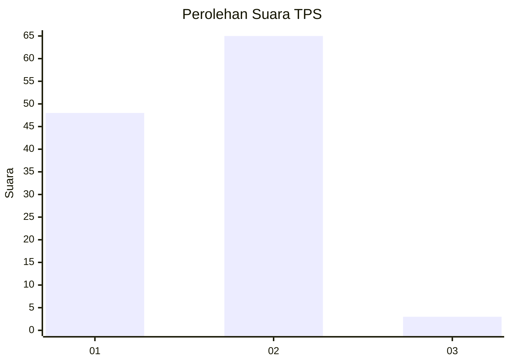
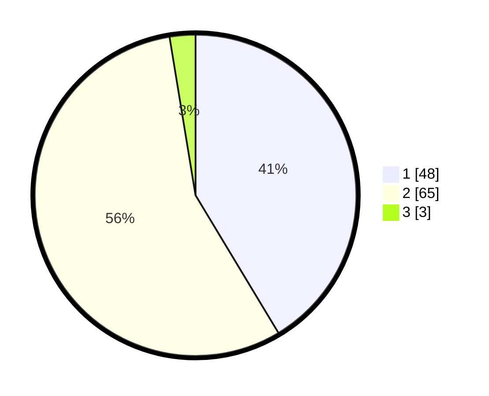

# Hasil

## Grafik

## Tabel

| No. | Nama Paslon    | Suara | Suara (raw) | Persentase |
|:--- |:-------------- | -----:| -----------:| ----------:|
| 1   | ANIES MUHAIMIN | 48    | [48][p-1]   | 41,38      |
| 2   | PRABOWO GIBRAN | 65    | [65][p-2]   | 56,03      |
| 3   | GANJAR MAHFUD  | 3     | [3][p-3]    | 2,59       |

[p-1]: https://github.com/gigit-pemilu/pemilu-2024/blob/main/pilpres/hitung-suara/sub/12-sumatera-utara/sub/07-deli-serdang/sub/24-hamparan-perak/sub/2003-klumpang-kebun/sub/028-tps/sub/paslon-1.txt
[p-2]: https://github.com/gigit-pemilu/pemilu-2024/blob/main/pilpres/hitung-suara/sub/12-sumatera-utara/sub/07-deli-serdang/sub/24-hamparan-perak/sub/2003-klumpang-kebun/sub/028-tps/sub/paslon-2.txt
[p-3]: https://github.com/gigit-pemilu/pemilu-2024/blob/main/pilpres/hitung-suara/sub/12-sumatera-utara/sub/07-deli-serdang/sub/24-hamparan-perak/sub/2003-klumpang-kebun/sub/028-tps/sub/paslon-3.txt

## Foto C Plano

https://sirekap-obj-formc.kpu.go.id/9029/pemilu/ppwp/12/07/24/20/03/1207242003028-20240215-150125--82c67d83-e5a7-404a-87a8-2706bf26f14e.jpg

https://sirekap-obj-formc.kpu.go.id/9029/pemilu/ppwp/12/07/24/20/03/1207242003028-20240215-150513--4d602c56-5673-43d5-be6d-e635a0924454.jpg

https://sirekap-obj-formc.kpu.go.id/9029/pemilu/ppwp/12/07/24/20/03/1207242003028-20240215-150910--8715dc45-e11c-465f-ba14-118fa870c659.jpg

## Metadata

| Key        | Value               |
| ---------- | ------------------- |
| Time Stamp | 2024-02-25 20:00:00 |

