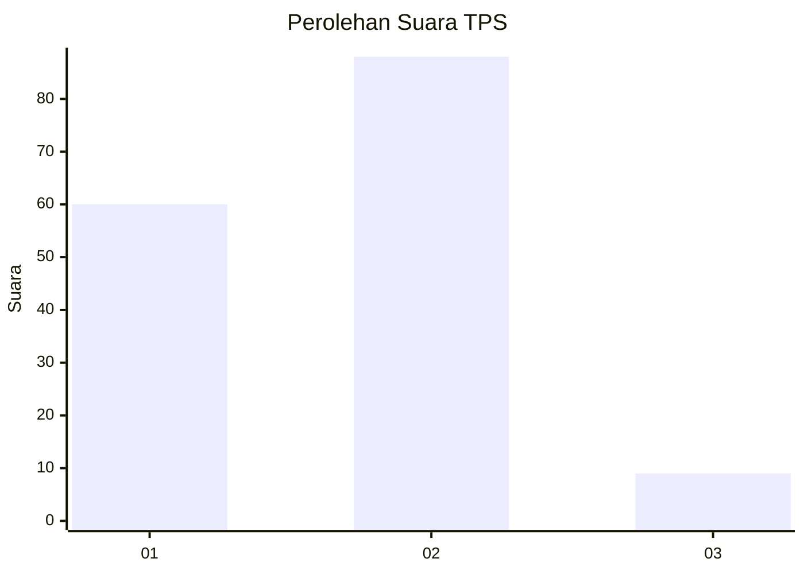
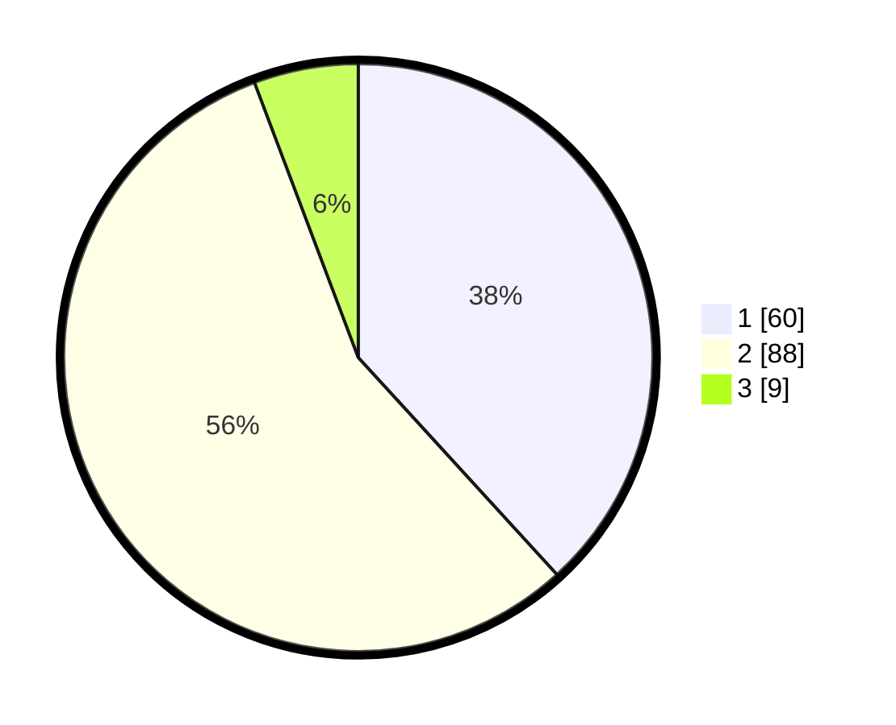

# Hasil

## Grafik

## Tabel

| No. | Nama Paslon    | Suara | Suara (raw) | Persentase |
|:--- |:-------------- | -----:| -----------:| ----------:|
| 1   | ANIES MUHAIMIN | 60    | [60][p-1]   | 38,22      |
| 2   | PRABOWO GIBRAN | 88    | [88][p-2]   | 56,05      |
| 3   | GANJAR MAHFUD  | 9     | [9][p-3]    | 5,73       |

[p-1]: https://github.com/gigit-pemilu/pemilu-2024/blob/main/pilpres/hitung-suara/sub/12-sumatera-utara/sub/07-deli-serdang/sub/24-hamparan-perak/sub/2004-klumpang-kampung/sub/020-tps/sub/paslon-1.txt
[p-2]: https://github.com/gigit-pemilu/pemilu-2024/blob/main/pilpres/hitung-suara/sub/12-sumatera-utara/sub/07-deli-serdang/sub/24-hamparan-perak/sub/2004-klumpang-kampung/sub/020-tps/sub/paslon-2.txt
[p-3]: https://github.com/gigit-pemilu/pemilu-2024/blob/main/pilpres/hitung-suara/sub/12-sumatera-utara/sub/07-deli-serdang/sub/24-hamparan-perak/sub/2004-klumpang-kampung/sub/020-tps/sub/paslon-3.txt

## Foto C Plano

https://sirekap-obj-formc.kpu.go.id/c3ee/pemilu/ppwp/12/07/24/20/04/1207242004020-20240215-124253--13e4ae0d-97f9-478c-b3cd-497febf43971.jpg

https://sirekap-obj-formc.kpu.go.id/c3ee/pemilu/ppwp/12/07/24/20/04/1207242004020-20240215-124300--c3e614ce-8bc1-46a1-8e9c-9c03f1ceed64.jpg

https://sirekap-obj-formc.kpu.go.id/c3ee/pemilu/ppwp/12/07/24/20/04/1207242004020-20240215-124307--ea191183-bd01-4733-9b2d-52a8ae8573fa.jpg

## Metadata

| Key        | Value               |
| ---------- | ------------------- |
| Time Stamp | 2024-02-25 15:00:00 |

