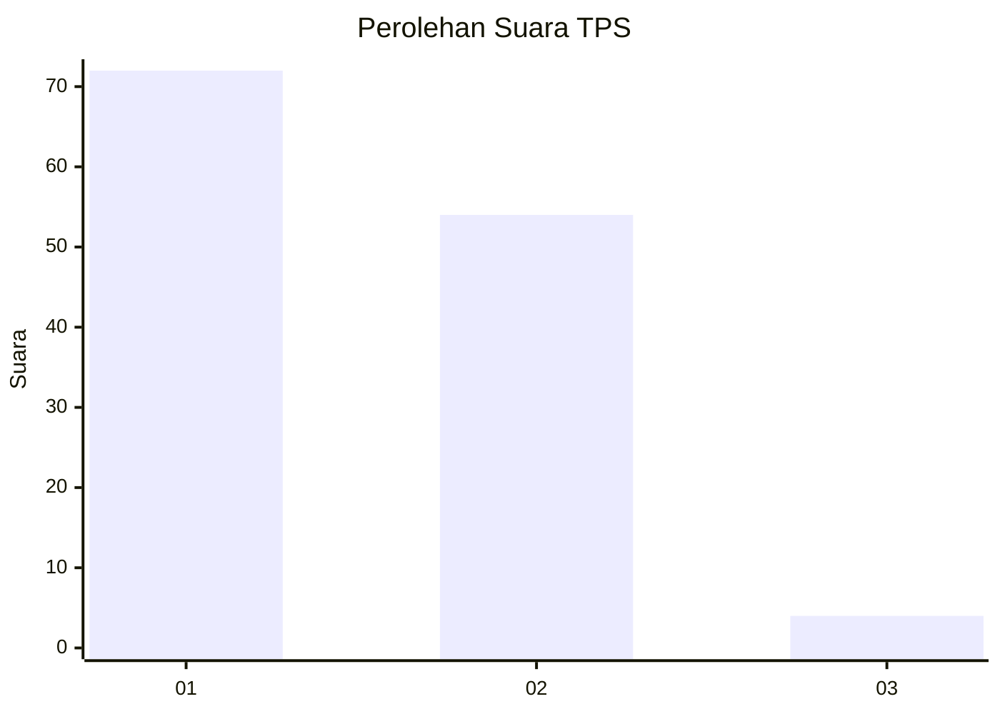
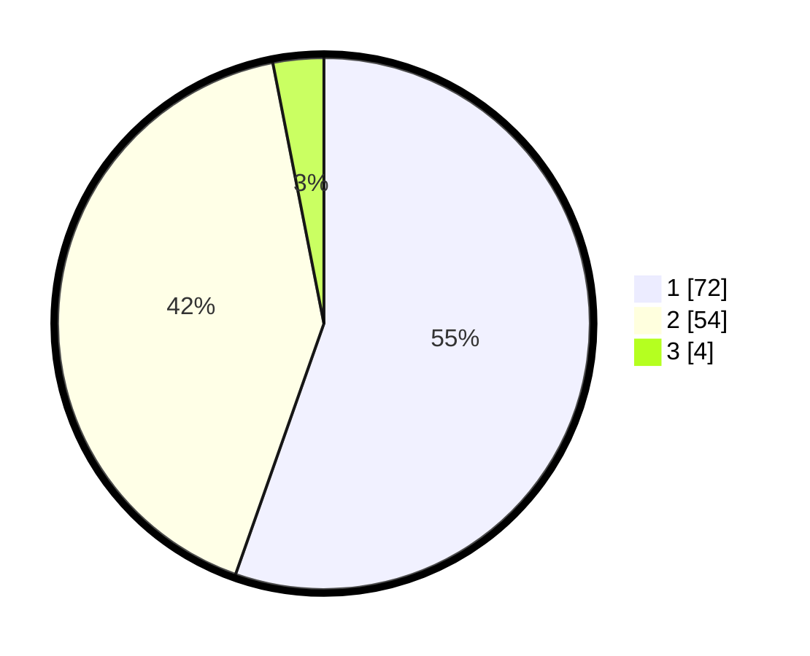

# Hasil

## Grafik

## Tabel

| No. | Nama Paslon    | Suara | Suara (raw) | Persentase |
|:--- |:-------------- | -----:| -----------:| ----------:|
| 1   | ANIES MUHAIMIN | 72    | [72][p-1]   | 55,38      |
| 2   | PRABOWO GIBRAN | 54    | [54][p-2]   | 41,54      |
| 3   | GANJAR MAHFUD  | 4     | [4][p-3]    | 3,08       |

[p-1]: https://github.com/gigit-pemilu/pemilu-2024-12-sumatera-utara/blob/main/pilpres/hitung-suara/sub/12-sumatera-utara/sub/07-deli-serdang/sub/24-hamparan-perak/sub/2005-klambir-lima-kampung/sub/008-tps/sub/paslon-1.txt
[p-2]: https://github.com/gigit-pemilu/pemilu-2024-12-sumatera-utara/blob/main/pilpres/hitung-suara/sub/12-sumatera-utara/sub/07-deli-serdang/sub/24-hamparan-perak/sub/2005-klambir-lima-kampung/sub/008-tps/sub/paslon-2.txt
[p-3]: https://github.com/gigit-pemilu/pemilu-2024-12-sumatera-utara/blob/main/pilpres/hitung-suara/sub/12-sumatera-utara/sub/07-deli-serdang/sub/24-hamparan-perak/sub/2005-klambir-lima-kampung/sub/008-tps/sub/paslon-3.txt

## Foto C Plano

https://sirekap-obj-formc.kpu.go.id/ae24/pemilu/ppwp/12/07/24/20/05/1207242005008-20240215-044057--f4f1f42d-1c6f-4db0-8bf0-2037109c4b46.jpg

https://sirekap-obj-formc.kpu.go.id/ae24/pemilu/ppwp/12/07/24/20/05/1207242005008-20240215-044135--fc8f19bb-9821-405f-9b7b-a9d176a9ce31.jpg

https://sirekap-obj-formc.kpu.go.id/ae24/pemilu/ppwp/12/07/24/20/05/1207242005008-20240215-044155--625afc8f-6394-42ad-a9e0-c1bc1e439ed2.jpg

## Metadata

| Key        | Value               |
| ---------- | ------------------- |
| Time Stamp | 2024-02-25 18:00:00 |

