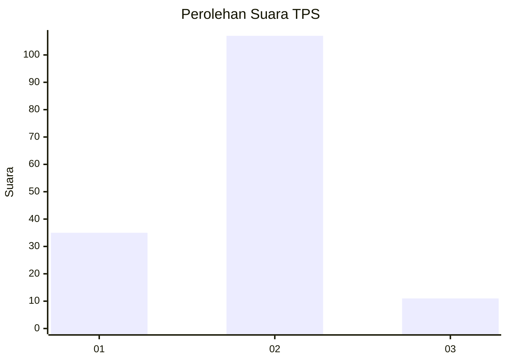
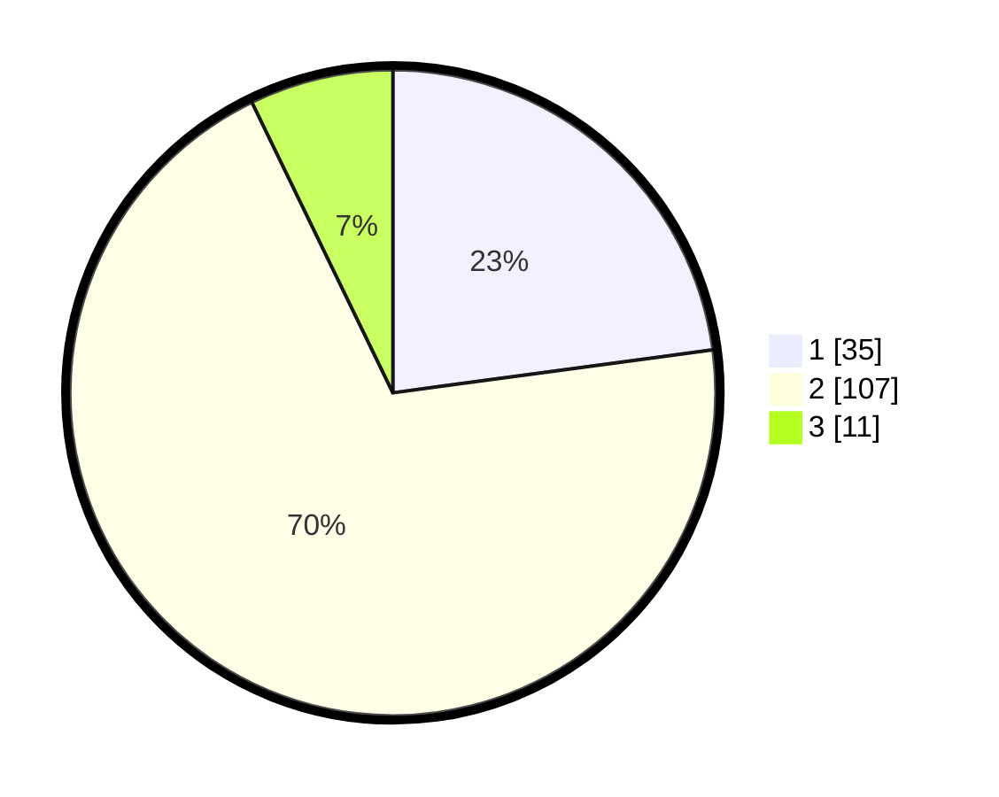

# Hasil

## Grafik

## Tabel

| No. | Nama Paslon    | Suara | Suara (raw) | Persentase |
|:--- |:-------------- | -----:| -----------:| ----------:|
| 1   | ANIES MUHAIMIN | 35    | [35][p-1]   | 22,88      |
| 2   | PRABOWO GIBRAN | 107   | [107][p-2]  | 69,93      |
| 3   | GANJAR MAHFUD  | 11    | [11][p-3]   | 7,19       |

[p-1]: https://github.com/gigit-pemilu/pemilu-2024/blob/main/pilpres/hitung-suara/sub/12-sumatera-utara/sub/07-deli-serdang/sub/24-hamparan-perak/sub/2006-tandam-hulu-ii/sub/009-tps/sub/paslon-1.txt
[p-2]: https://github.com/gigit-pemilu/pemilu-2024/blob/main/pilpres/hitung-suara/sub/12-sumatera-utara/sub/07-deli-serdang/sub/24-hamparan-perak/sub/2006-tandam-hulu-ii/sub/009-tps/sub/paslon-2.txt
[p-3]: https://github.com/gigit-pemilu/pemilu-2024/blob/main/pilpres/hitung-suara/sub/12-sumatera-utara/sub/07-deli-serdang/sub/24-hamparan-perak/sub/2006-tandam-hulu-ii/sub/009-tps/sub/paslon-3.txt

## Foto C Plano

https://sirekap-obj-formc.kpu.go.id/821f/pemilu/ppwp/12/07/24/20/06/1207242006009-20240214-233630--1f1a7a89-4c07-419f-b6d0-083362d93dc9.jpg

https://sirekap-obj-formc.kpu.go.id/821f/pemilu/ppwp/12/07/24/20/06/1207242006009-20240214-233708--5e8f7d61-c9e5-477b-bcc7-6a7ea4f2fc1c.jpg

https://sirekap-obj-formc.kpu.go.id/821f/pemilu/ppwp/12/07/24/20/06/1207242006009-20240214-233825--30b50d3e-072c-44c0-9a1f-21aa35827225.jpg

## Metadata

| Key        | Value               |
| ---------- | ------------------- |
| Time Stamp | 2024-02-25 22:00:00 |

