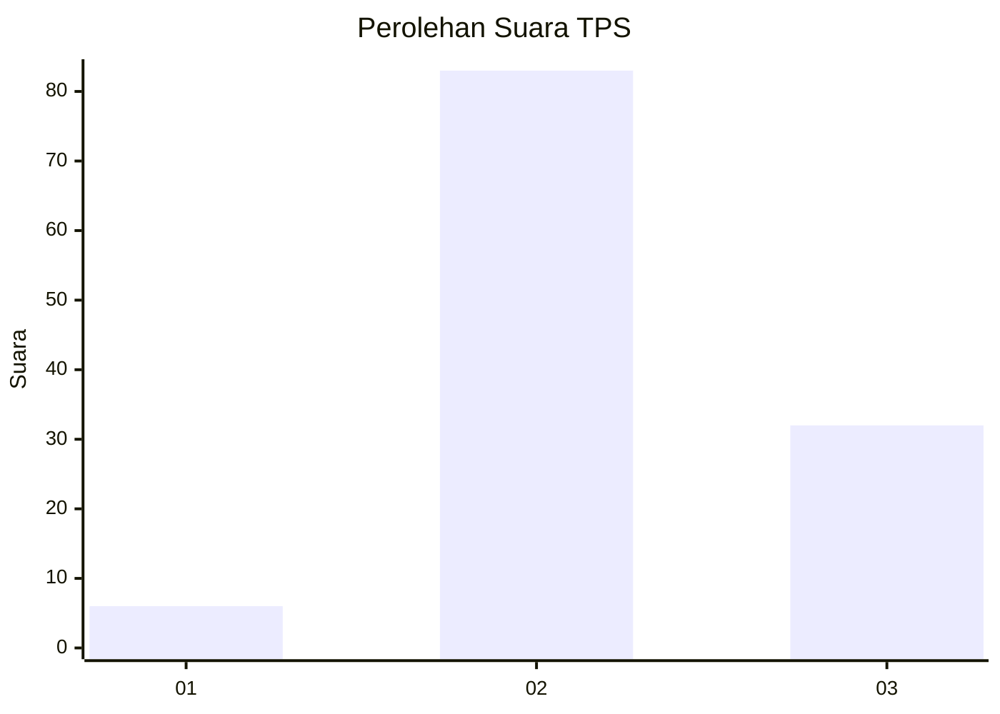
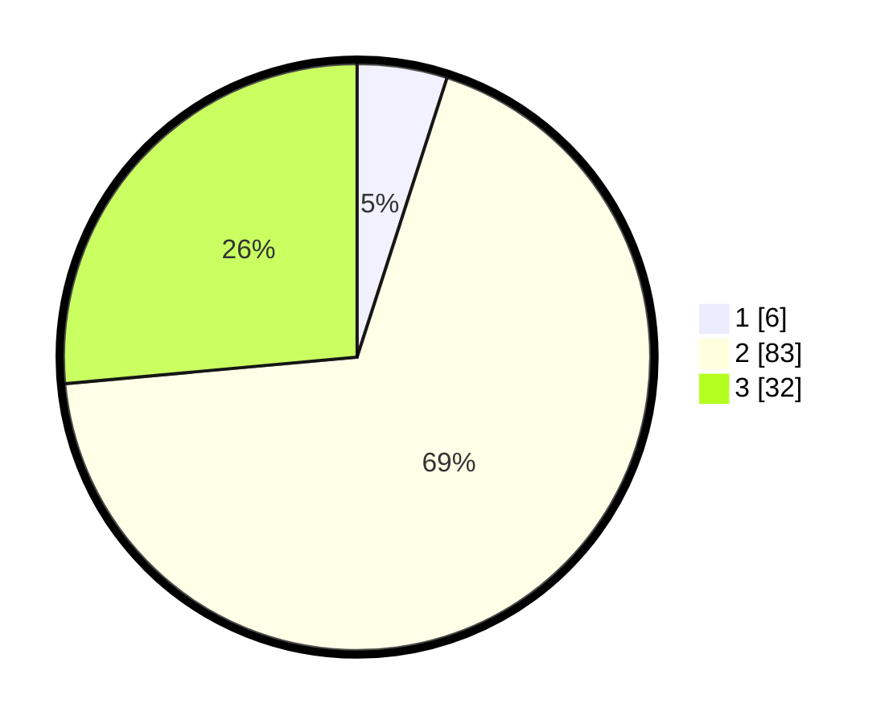

# Hasil

## Grafik

## Tabel

| No. | Nama Paslon    | Suara | Suara (raw) | Persentase |
|:--- |:-------------- | -----:| -----------:| ----------:|
| 1   | ANIES MUHAIMIN | 6     | [6][p-1]    | 4,96       |
| 2   | PRABOWO GIBRAN | 83    | [83][p-2]   | 68,60      |
| 3   | GANJAR MAHFUD  | 32    | [32][p-3]   | 26,45      |

[p-1]: https://github.com/gigit-pemilu/pemilu-2024-12-sumatera-utara/blob/main/pilpres/hitung-suara/sub/12-sumatera-utara/sub/07-deli-serdang/sub/24-hamparan-perak/sub/2006-tandam-hulu-ii/sub/022-tps/sub/paslon-1.txt
[p-2]: https://github.com/gigit-pemilu/pemilu-2024-12-sumatera-utara/blob/main/pilpres/hitung-suara/sub/12-sumatera-utara/sub/07-deli-serdang/sub/24-hamparan-perak/sub/2006-tandam-hulu-ii/sub/022-tps/sub/paslon-2.txt
[p-3]: https://github.com/gigit-pemilu/pemilu-2024-12-sumatera-utara/blob/main/pilpres/hitung-suara/sub/12-sumatera-utara/sub/07-deli-serdang/sub/24-hamparan-perak/sub/2006-tandam-hulu-ii/sub/022-tps/sub/paslon-3.txt

## Foto C Plano

https://sirekap-obj-formc.kpu.go.id/7166/pemilu/ppwp/12/07/24/20/06/1207242006022-20240215-004758--1c647736-9748-46cd-9dca-f6e7370a662f.jpg

https://sirekap-obj-formc.kpu.go.id/7166/pemilu/ppwp/12/07/24/20/06/1207242006022-20240214-221300--f3cc1510-fcb5-4214-aced-ef4907d94d46.jpg

https://sirekap-obj-formc.kpu.go.id/7166/pemilu/ppwp/12/07/24/20/06/1207242006022-20240214-221349--29272ccf-c8bf-436e-943d-7a6598822eb2.jpg

## Metadata

| Key        | Value               |
| ---------- | ------------------- |
| Time Stamp | 2024-02-25 23:00:00 |

