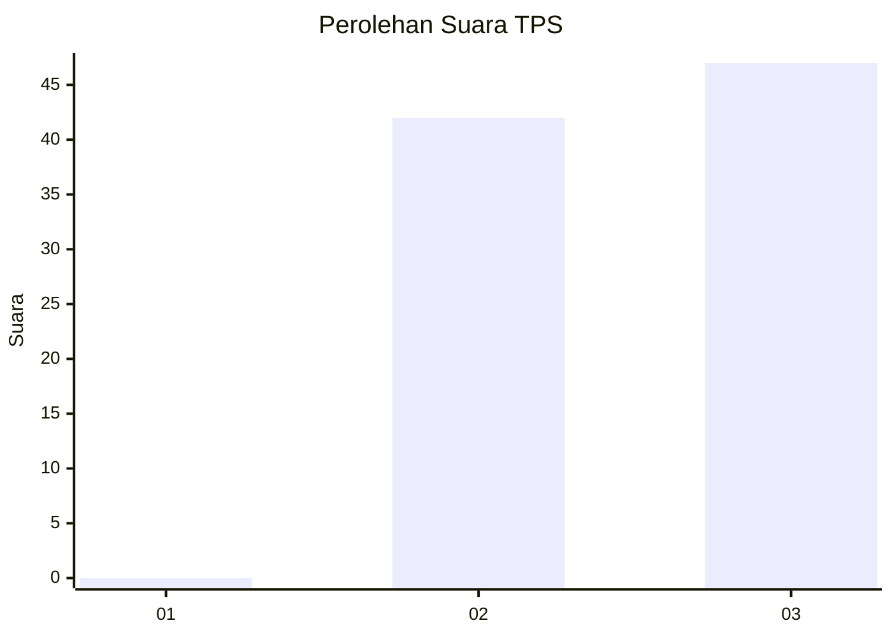
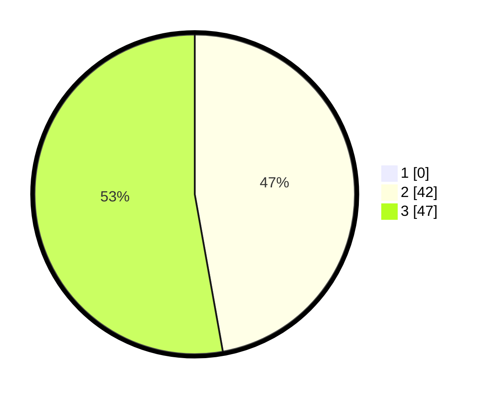

# Hasil

## Grafik

## Tabel

| No. | Nama Paslon    | Suara | Suara (raw) | Persentase |
|:--- |:-------------- | -----:| -----------:| ----------:|
| 1   | ANIES MUHAIMIN | 0     | [0][p-1]    | 0,00       |
| 2   | PRABOWO GIBRAN | 42    | [42][p-2]   | 47,19      |
| 3   | GANJAR MAHFUD  | 47    | [47][p-3]   | 52,81      |

[p-1]: https://github.com/gigit-pemilu/pemilu-2024/blob/main/pilpres/hitung-suara/sub/12-sumatera-utara/sub/07-deli-serdang/sub/24-hamparan-perak/sub/2006-tandam-hulu-ii/sub/023-tps/sub/paslon-1.txt
[p-2]: https://github.com/gigit-pemilu/pemilu-2024/blob/main/pilpres/hitung-suara/sub/12-sumatera-utara/sub/07-deli-serdang/sub/24-hamparan-perak/sub/2006-tandam-hulu-ii/sub/023-tps/sub/paslon-2.txt
[p-3]: https://github.com/gigit-pemilu/pemilu-2024/blob/main/pilpres/hitung-suara/sub/12-sumatera-utara/sub/07-deli-serdang/sub/24-hamparan-perak/sub/2006-tandam-hulu-ii/sub/023-tps/sub/paslon-3.txt

## Foto C Plano

https://sirekap-obj-formc.kpu.go.id/7d36/pemilu/ppwp/12/07/24/20/06/1207242006023-20240215-000630--bb4e63a0-2c77-4ca9-a1ee-945da5a16750.jpg

https://sirekap-obj-formc.kpu.go.id/7d36/pemilu/ppwp/12/07/24/20/06/1207242006023-20240215-000750--e929397b-a26f-4404-bf75-237c38b0c463.jpg

https://sirekap-obj-formc.kpu.go.id/7d36/pemilu/ppwp/12/07/24/20/06/1207242006023-20240215-004356--d9b9ee04-e000-4851-a2bd-272b622eff79.jpg

## Metadata

| Key        | Value               |
| ---------- | ------------------- |
| Time Stamp | 2024-02-25 16:00:00 |

