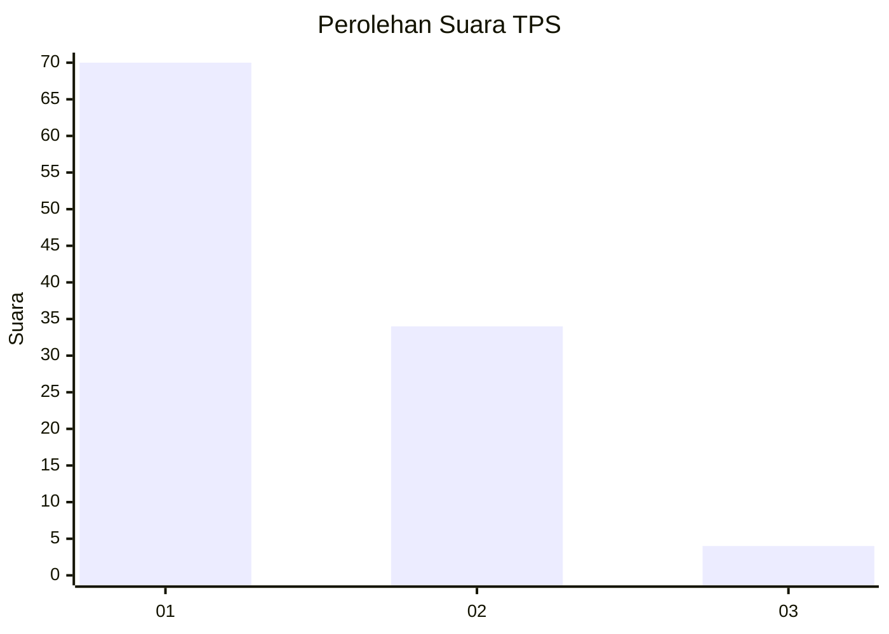
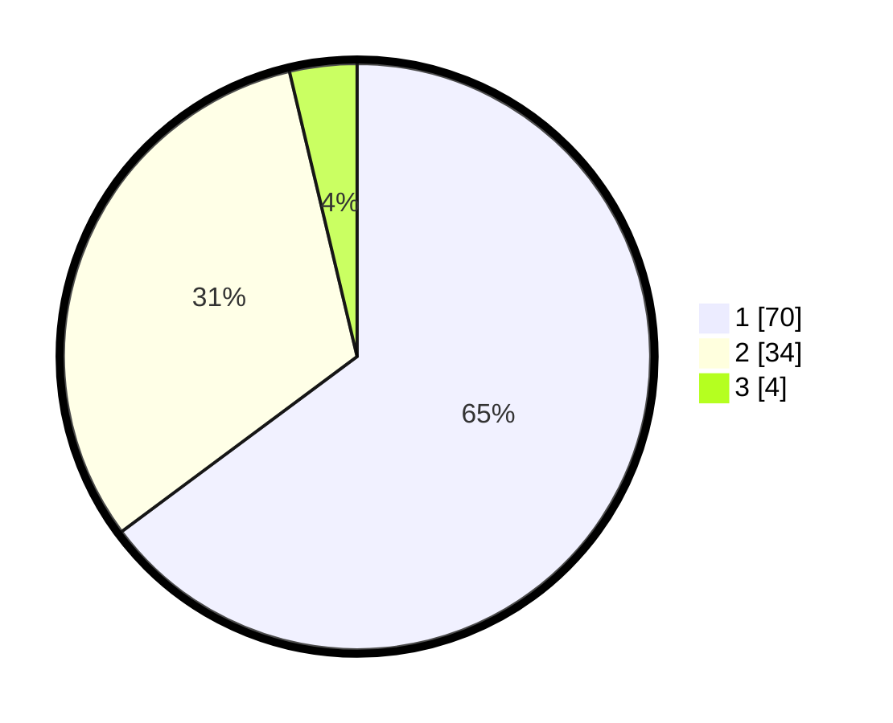

# Hasil

## Grafik

## Tabel

| No. | Nama Paslon    | Suara | Suara (raw) | Persentase |
|:--- |:-------------- | -----:| -----------:| ----------:|
| 1   | ANIES MUHAIMIN | 70    | [70][p-1]   | 64,81      |
| 2   | PRABOWO GIBRAN | 34    | [34][p-2]   | 31,48      |
| 3   | GANJAR MAHFUD  | 4     | [4][p-3]    | 3,70       |

[p-1]: https://github.com/gigit-pemilu/pemilu-2024/blob/main/pilpres/hitung-suara/sub/12-sumatera-utara/sub/07-deli-serdang/sub/24-hamparan-perak/sub/2007-klambir/sub/001-tps/sub/paslon-1.txt
[p-2]: https://github.com/gigit-pemilu/pemilu-2024/blob/main/pilpres/hitung-suara/sub/12-sumatera-utara/sub/07-deli-serdang/sub/24-hamparan-perak/sub/2007-klambir/sub/001-tps/sub/paslon-2.txt
[p-3]: https://github.com/gigit-pemilu/pemilu-2024/blob/main/pilpres/hitung-suara/sub/12-sumatera-utara/sub/07-deli-serdang/sub/24-hamparan-perak/sub/2007-klambir/sub/001-tps/sub/paslon-3.txt

## Foto C Plano

https://sirekap-obj-formc.kpu.go.id/0e88/pemilu/ppwp/12/07/24/20/07/1207242007001-20240215-065400--5e90db8b-88eb-41ac-b6a6-53057fd466dc.jpg

https://sirekap-obj-formc.kpu.go.id/0e88/pemilu/ppwp/12/07/24/20/07/1207242007001-20240215-070033--6e734c42-d01a-441e-a752-e0bc33584ca9.jpg

https://sirekap-obj-formc.kpu.go.id/0e88/pemilu/ppwp/12/07/24/20/07/1207242007001-20240215-065524--e16c2653-6555-4a0c-b4f4-dbd7d1655b3f.jpg

## Metadata

| Key        | Value               |
| ---------- | ------------------- |
| Time Stamp | 2024-02-16 16:25:10 |

