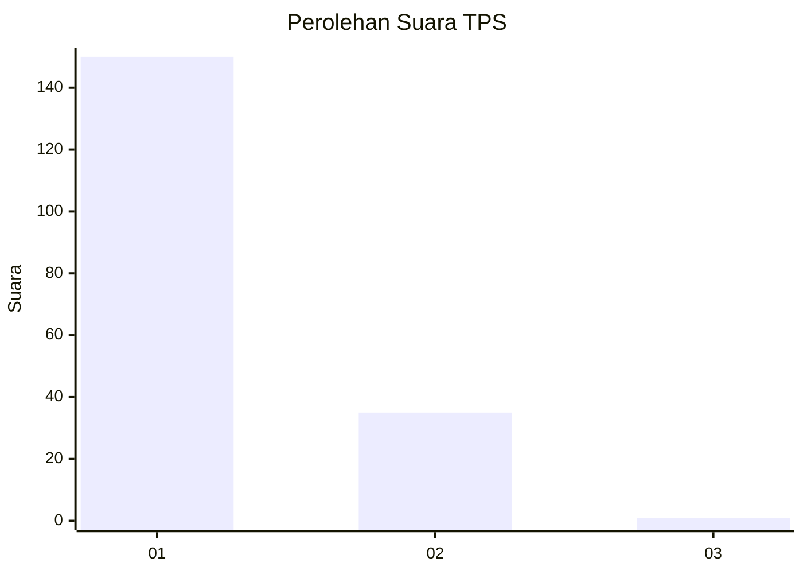
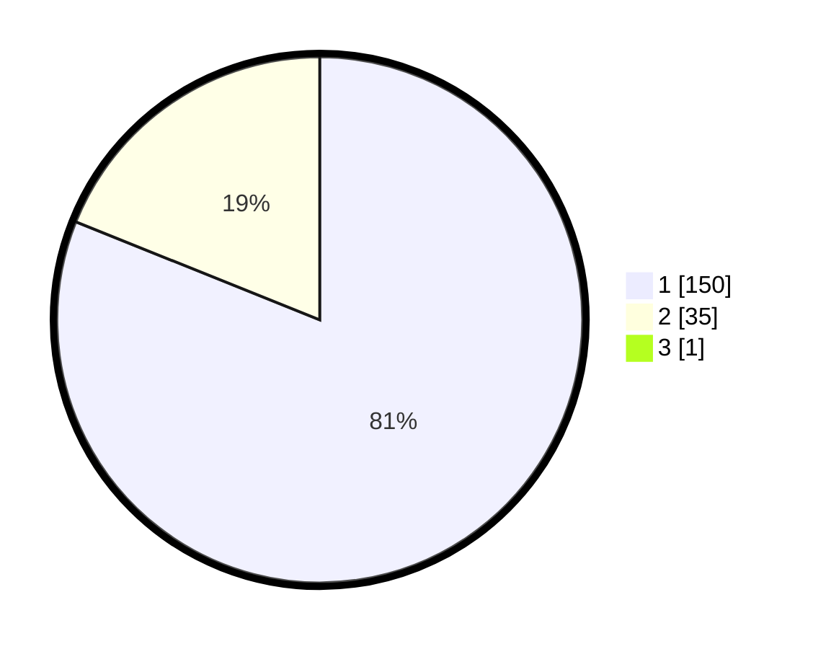

# Hasil

## Grafik

## Tabel

| No. | Nama Paslon    | Suara | Suara (raw) | Persentase |
|:--- |:-------------- | -----:| -----------:| ----------:|
| 1   | ANIES MUHAIMIN | 150   | [150][p-1]  | 80,65      |
| 2   | PRABOWO GIBRAN | 35    | [35][p-2]   | 18,82      |
| 3   | GANJAR MAHFUD  | 1     | [1][p-3]    | 0,54       |

[p-1]: https://github.com/gigit-pemilu/pemilu-2024/blob/main/pilpres/hitung-suara/sub/12-sumatera-utara/sub/07-deli-serdang/sub/24-hamparan-perak/sub/2007-klambir/sub/002-tps/sub/paslon-1.txt
[p-2]: https://github.com/gigit-pemilu/pemilu-2024/blob/main/pilpres/hitung-suara/sub/12-sumatera-utara/sub/07-deli-serdang/sub/24-hamparan-perak/sub/2007-klambir/sub/002-tps/sub/paslon-2.txt
[p-3]: https://github.com/gigit-pemilu/pemilu-2024/blob/main/pilpres/hitung-suara/sub/12-sumatera-utara/sub/07-deli-serdang/sub/24-hamparan-perak/sub/2007-klambir/sub/002-tps/sub/paslon-3.txt

## Foto C Plano

https://sirekap-obj-formc.kpu.go.id/2f96/pemilu/ppwp/12/07/24/20/07/1207242007002-20240215-051108--0ddd6b14-ac7c-4646-8e72-56a400f79072.jpg

https://sirekap-obj-formc.kpu.go.id/2f96/pemilu/ppwp/12/07/24/20/07/1207242007002-20240215-051228--dbc9f47f-9d8e-43f5-b1d7-ed5c066c3c44.jpg

https://sirekap-obj-formc.kpu.go.id/2f96/pemilu/ppwp/12/07/24/20/07/1207242007002-20240215-051321--5c69eeaa-fb36-4ed4-85a3-3d7f8f2bfb7c.jpg

## Metadata

| Key        | Value               |
| ---------- | ------------------- |
| Time Stamp | 2024-02-16 16:25:10 |

