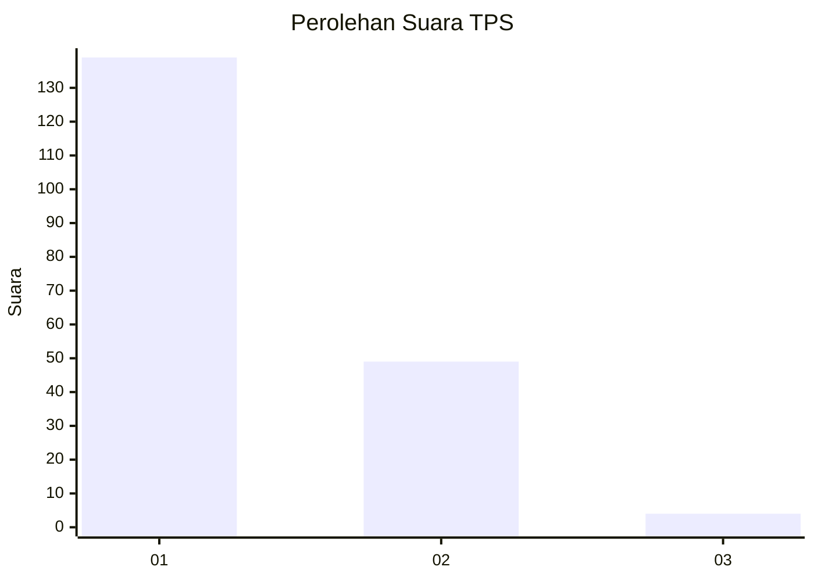
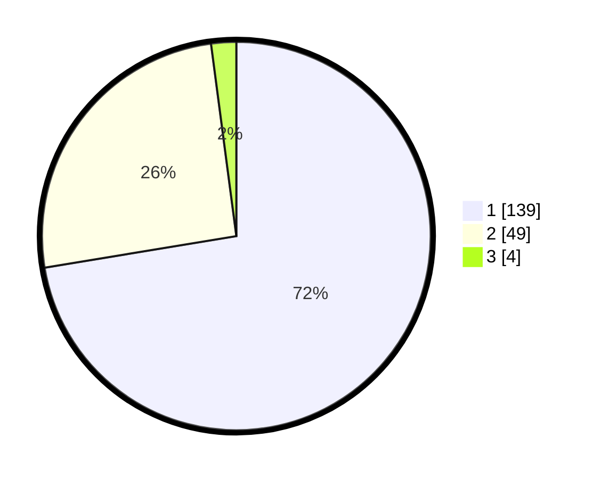

# Hasil

## Grafik

## Tabel

| No. | Nama Paslon    | Suara | Suara (raw) | Persentase |
|:--- |:-------------- | -----:| -----------:| ----------:|
| 1   | ANIES MUHAIMIN | 139   | [139][p-1]  | 72,40      |
| 2   | PRABOWO GIBRAN | 49    | [49][p-2]   | 25,52      |
| 3   | GANJAR MAHFUD  | 4     | [4][p-3]    | 2,08       |

[p-1]: https://github.com/gigit-pemilu/pemilu-2024/blob/main/pilpres/hitung-suara/sub/12-sumatera-utara/sub/07-deli-serdang/sub/24-hamparan-perak/sub/2007-klambir/sub/003-tps/sub/paslon-1.txt
[p-2]: https://github.com/gigit-pemilu/pemilu-2024/blob/main/pilpres/hitung-suara/sub/12-sumatera-utara/sub/07-deli-serdang/sub/24-hamparan-perak/sub/2007-klambir/sub/003-tps/sub/paslon-2.txt
[p-3]: https://github.com/gigit-pemilu/pemilu-2024/blob/main/pilpres/hitung-suara/sub/12-sumatera-utara/sub/07-deli-serdang/sub/24-hamparan-perak/sub/2007-klambir/sub/003-tps/sub/paslon-3.txt

## Foto C Plano

https://sirekap-obj-formc.kpu.go.id/cdf0/pemilu/ppwp/12/07/24/20/07/1207242007003-20240215-024053--40a7e564-0e6a-4ddd-86f3-edb35f597262.jpg

https://sirekap-obj-formc.kpu.go.id/cdf0/pemilu/ppwp/12/07/24/20/07/1207242007003-20240215-024215--f81293e3-c442-41d2-a4af-1d98d7d0f119.jpg

https://sirekap-obj-formc.kpu.go.id/cdf0/pemilu/ppwp/12/07/24/20/07/1207242007003-20240215-024322--b4a01973-d77f-4b66-9946-8849e6e2cbaa.jpg

## Metadata

| Key        | Value               |
| ---------- | ------------------- |
| Time Stamp | 2024-02-24 22:31:28 |

