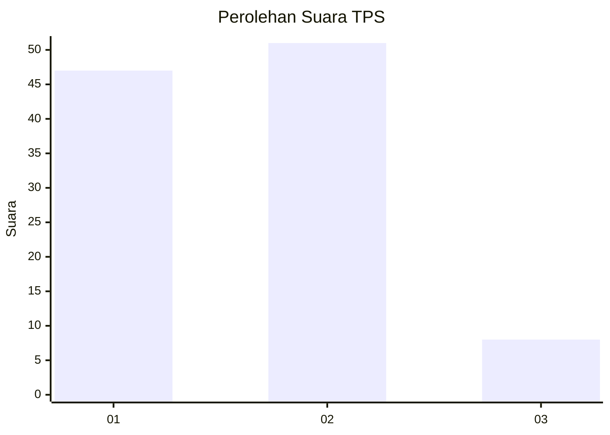
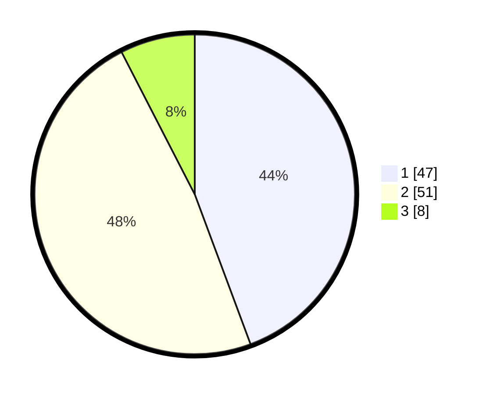

# Hasil

## Grafik

## Tabel

| No. | Nama Paslon    | Suara | Suara (raw) | Persentase |
|:--- |:-------------- | -----:| -----------:| ----------:|
| 1   | ANIES MUHAIMIN | 47    | [47][p-1]   | 44,34      |
| 2   | PRABOWO GIBRAN | 51    | [51][p-2]   | 48,11      |
| 3   | GANJAR MAHFUD  | 8     | [8][p-3]    | 7,55       |

[p-1]: https://github.com/gigit-pemilu/pemilu-2024/blob/main/pilpres/hitung-suara/sub/12-sumatera-utara/sub/07-deli-serdang/sub/24-hamparan-perak/sub/2009-klambir-lima-kebun/sub/045-tps/sub/paslon-1.txt
[p-2]: https://github.com/gigit-pemilu/pemilu-2024/blob/main/pilpres/hitung-suara/sub/12-sumatera-utara/sub/07-deli-serdang/sub/24-hamparan-perak/sub/2009-klambir-lima-kebun/sub/045-tps/sub/paslon-2.txt
[p-3]: https://github.com/gigit-pemilu/pemilu-2024/blob/main/pilpres/hitung-suara/sub/12-sumatera-utara/sub/07-deli-serdang/sub/24-hamparan-perak/sub/2009-klambir-lima-kebun/sub/045-tps/sub/paslon-3.txt

## Foto C Plano

https://sirekap-obj-formc.kpu.go.id/2587/pemilu/ppwp/12/07/24/20/09/1207242009045-20240214-210131--269ea839-dbf2-49e3-9180-7c0da897c846.jpg

https://sirekap-obj-formc.kpu.go.id/2587/pemilu/ppwp/12/07/24/20/09/1207242009045-20240214-210258--65a34196-cc1c-462f-a403-03a43f126d92.jpg

https://sirekap-obj-formc.kpu.go.id/2587/pemilu/ppwp/12/07/24/20/09/1207242009045-20240214-210656--c0637eb6-ddd5-4b99-bcf6-d3ed23f6626a.jpg

## Metadata

| Key        | Value               |
| ---------- | ------------------- |
| Time Stamp | 2024-02-25 11:00:00 |

