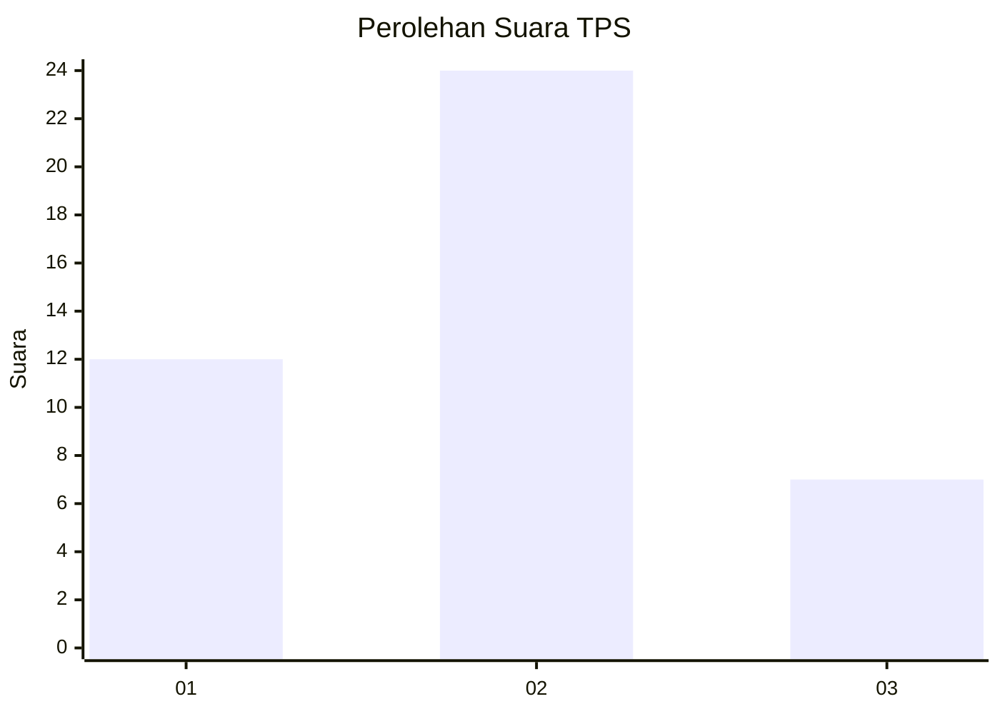
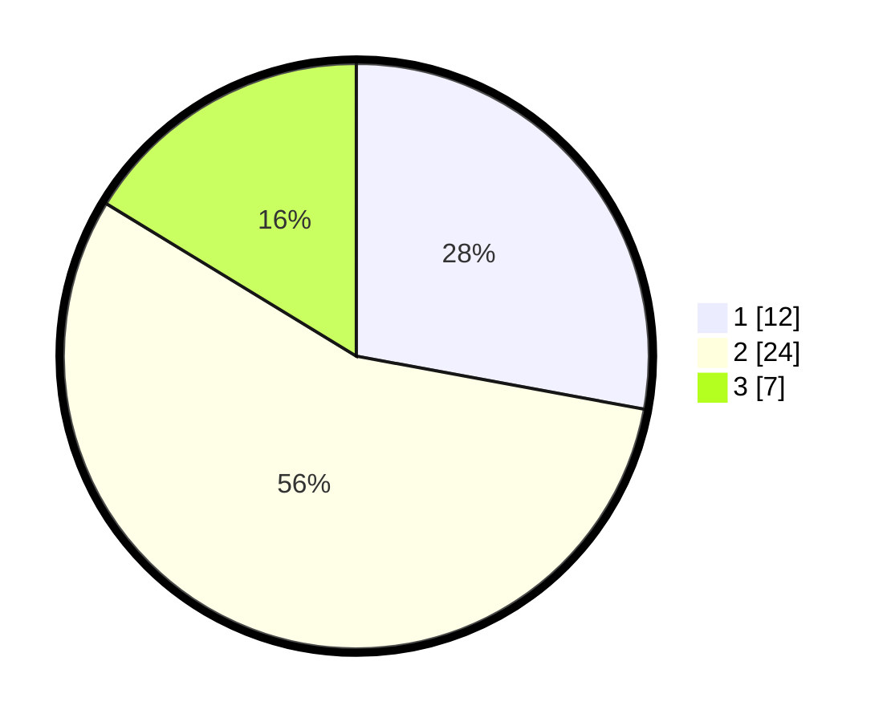

# Hasil

## Grafik

## Tabel

| No. | Nama Paslon    | Suara | Suara (raw) | Persentase |
|:--- |:-------------- | -----:| -----------:| ----------:|
| 1   | ANIES MUHAIMIN | 12    | [12][p-1]   | 27,91      |
| 2   | PRABOWO GIBRAN | 24    | [24][p-2]   | 55,81      |
| 3   | GANJAR MAHFUD  | 7     | [7][p-3]    | 16,28      |

[p-1]: https://github.com/gigit-pemilu/pemilu-2024-12-sumatera-utara/blob/main/pilpres/hitung-suara/sub/12-sumatera-utara/sub/07-deli-serdang/sub/24-hamparan-perak/sub/2009-klambir-lima-kebun/sub/056-tps/sub/paslon-1.txt
[p-2]: https://github.com/gigit-pemilu/pemilu-2024-12-sumatera-utara/blob/main/pilpres/hitung-suara/sub/12-sumatera-utara/sub/07-deli-serdang/sub/24-hamparan-perak/sub/2009-klambir-lima-kebun/sub/056-tps/sub/paslon-2.txt
[p-3]: https://github.com/gigit-pemilu/pemilu-2024-12-sumatera-utara/blob/main/pilpres/hitung-suara/sub/12-sumatera-utara/sub/07-deli-serdang/sub/24-hamparan-perak/sub/2009-klambir-lima-kebun/sub/056-tps/sub/paslon-3.txt

## Foto C Plano

https://sirekap-obj-formc.kpu.go.id/c709/pemilu/ppwp/12/07/24/20/09/1207242009056-20240214-214618--78cc3df2-f0ab-4c19-8ac4-db795774e2f3.jpg

https://sirekap-obj-formc.kpu.go.id/c709/pemilu/ppwp/12/07/24/20/09/1207242009056-20240214-220312--5052a459-22dc-476b-9aac-045d7e5fe58b.jpg

https://sirekap-obj-formc.kpu.go.id/c709/pemilu/ppwp/12/07/24/20/09/1207242009056-20240214-214712--67e4f0e6-3360-4dcc-816e-9335957f9bfe.jpg

## Metadata

| Key        | Value               |
| ---------- | ------------------- |
| Time Stamp | 2024-02-25 21:00:00 |

