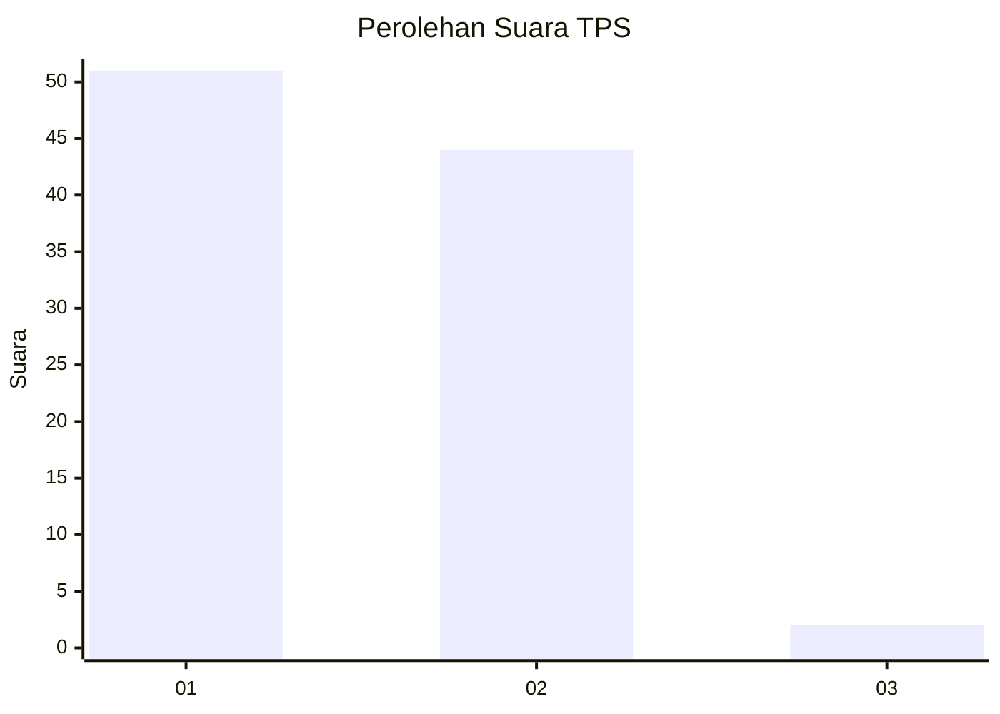
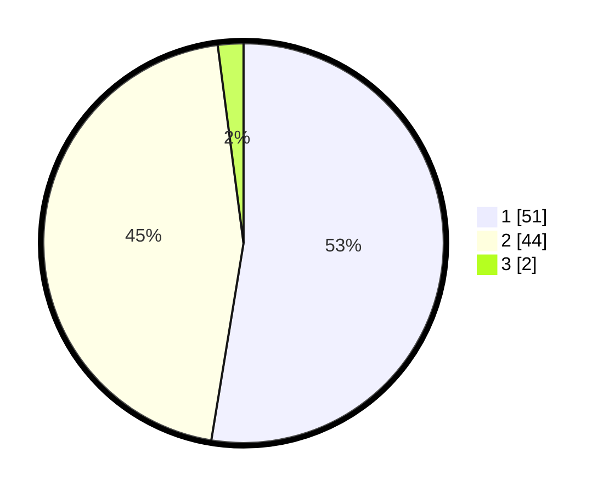

# Hasil

## Grafik

## Tabel

| No. | Nama Paslon    | Suara | Suara (raw) | Persentase |
|:--- |:-------------- | -----:| -----------:| ----------:|
| 1   | ANIES MUHAIMIN | 51    | [51][p-1]   | 52,58      |
| 2   | PRABOWO GIBRAN | 44    | [44][p-2]   | 45,36      |
| 3   | GANJAR MAHFUD  | 2     | [2][p-3]    | 2,06       |

[p-1]: https://github.com/gigit-pemilu/pemilu-2024/blob/main/pilpres/hitung-suara/sub/12-sumatera-utara/sub/07-deli-serdang/sub/24-hamparan-perak/sub/2009-klambir-lima-kebun/sub/063-tps/sub/paslon-1.txt
[p-2]: https://github.com/gigit-pemilu/pemilu-2024/blob/main/pilpres/hitung-suara/sub/12-sumatera-utara/sub/07-deli-serdang/sub/24-hamparan-perak/sub/2009-klambir-lima-kebun/sub/063-tps/sub/paslon-2.txt
[p-3]: https://github.com/gigit-pemilu/pemilu-2024/blob/main/pilpres/hitung-suara/sub/12-sumatera-utara/sub/07-deli-serdang/sub/24-hamparan-perak/sub/2009-klambir-lima-kebun/sub/063-tps/sub/paslon-3.txt

## Foto C Plano

https://sirekap-obj-formc.kpu.go.id/f2f4/pemilu/ppwp/12/07/24/20/09/1207242009063-20240214-224640--213fb614-ca81-4fd1-a22f-89480101aa2f.jpg

https://sirekap-obj-formc.kpu.go.id/f2f4/pemilu/ppwp/12/07/24/20/09/1207242009063-20240214-223340--159b5ec0-b277-46ac-90ab-a78cbc0de0f3.jpg

https://sirekap-obj-formc.kpu.go.id/f2f4/pemilu/ppwp/12/07/24/20/09/1207242009063-20240214-223631--7680bdfa-d587-493f-9bc0-a04a0ff260d5.jpg

## Metadata

| Key        | Value               |
| ---------- | ------------------- |
| Time Stamp | 2024-02-25 11:00:00 |

