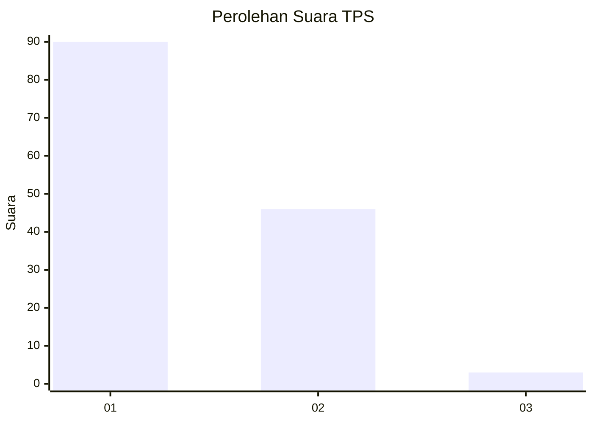
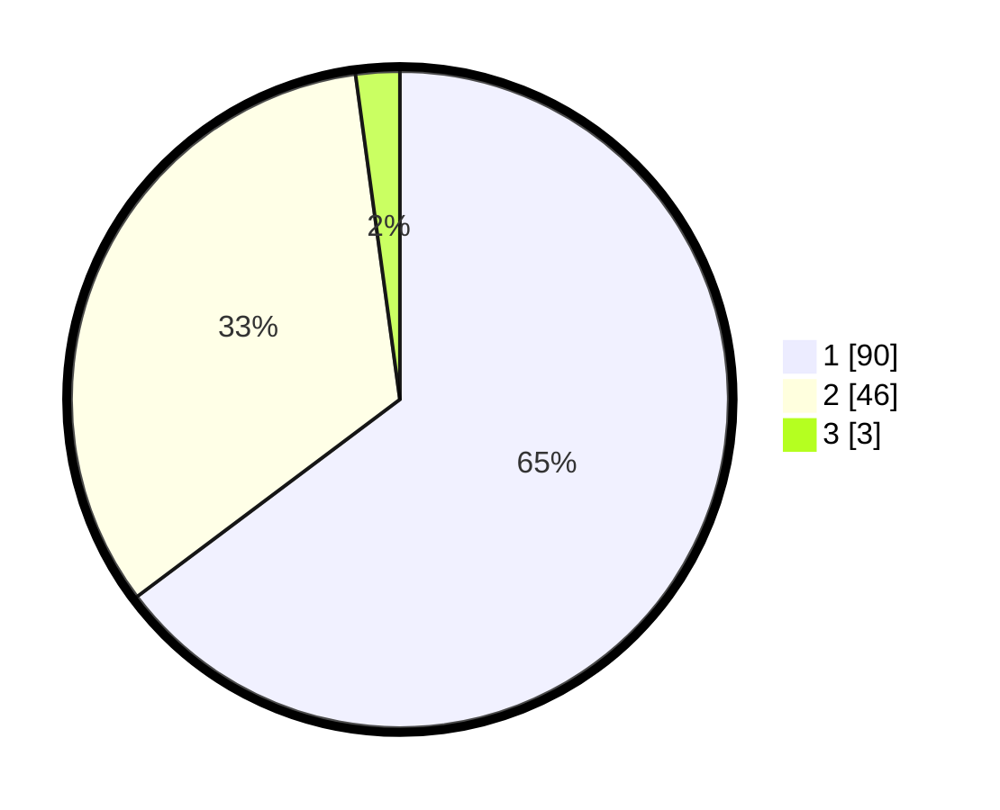

# Hasil

## Grafik

## Tabel

| No. | Nama Paslon    | Suara | Suara (raw) | Persentase |
|:--- |:-------------- | -----:| -----------:| ----------:|
| 1   | ANIES MUHAIMIN | 90    | [90][p-1]   | 64,75      |
| 2   | PRABOWO GIBRAN | 46    | [46][p-2]   | 33,09      |
| 3   | GANJAR MAHFUD  | 3     | [3][p-3]    | 2,16       |

[p-1]: https://github.com/gigit-pemilu/pemilu-2024/blob/main/pilpres/hitung-suara/sub/12-sumatera-utara/sub/07-deli-serdang/sub/24-hamparan-perak/sub/2010-sialang-muda/sub/003-tps/sub/paslon-1.txt
[p-2]: https://github.com/gigit-pemilu/pemilu-2024/blob/main/pilpres/hitung-suara/sub/12-sumatera-utara/sub/07-deli-serdang/sub/24-hamparan-perak/sub/2010-sialang-muda/sub/003-tps/sub/paslon-2.txt
[p-3]: https://github.com/gigit-pemilu/pemilu-2024/blob/main/pilpres/hitung-suara/sub/12-sumatera-utara/sub/07-deli-serdang/sub/24-hamparan-perak/sub/2010-sialang-muda/sub/003-tps/sub/paslon-3.txt

## Foto C Plano

https://sirekap-obj-formc.kpu.go.id/1b64/pemilu/ppwp/12/07/24/20/10/1207242010003-20240215-150723--d008763f-2007-4cab-838f-d5adc36af90f.jpg

https://sirekap-obj-formc.kpu.go.id/1b64/pemilu/ppwp/12/07/24/20/10/1207242010003-20240215-151631--7eb96bf4-7c99-4ac6-b0e8-6b999c6ea9da.jpg

https://sirekap-obj-formc.kpu.go.id/1b64/pemilu/ppwp/12/07/24/20/10/1207242010003-20240215-151848--d00c44e6-3dbe-4b0a-9701-5cacf1496ebb.jpg

## Metadata

| Key        | Value               |
| ---------- | ------------------- |
| Time Stamp | 2024-02-25 15:00:00 |

