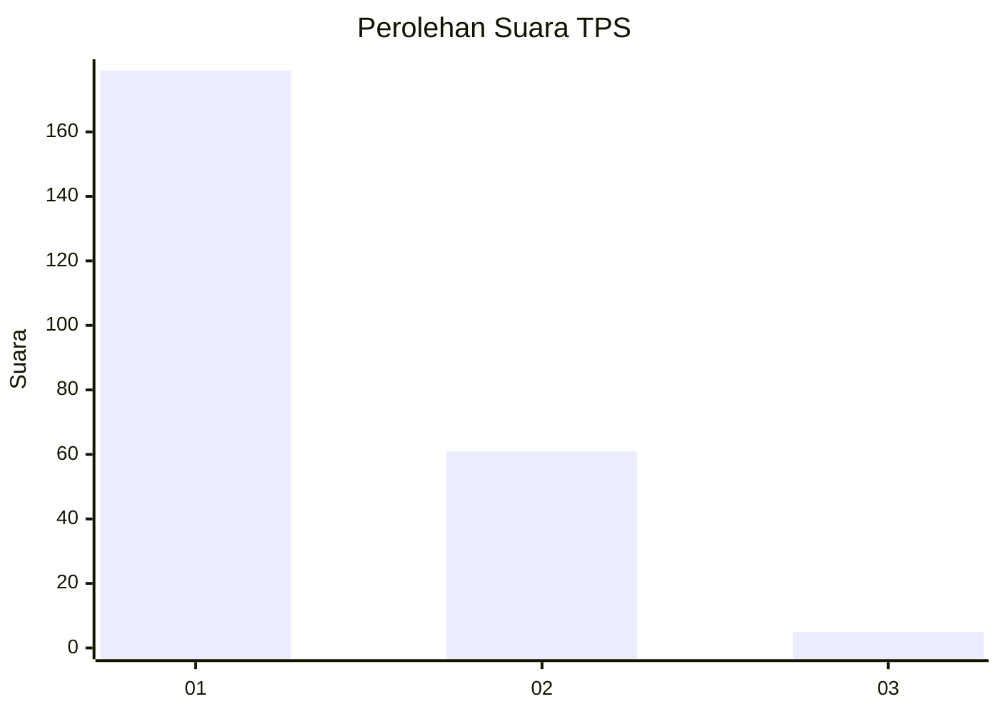
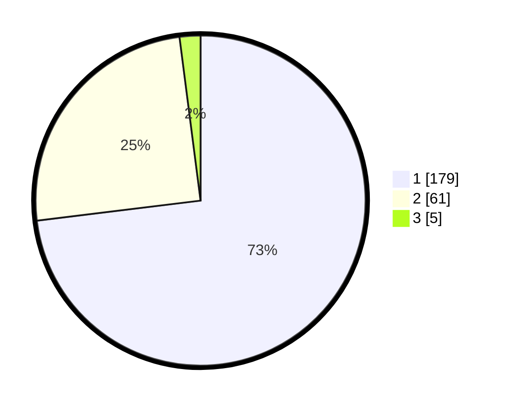

# Hasil

## Grafik

## Tabel

| No. | Nama Paslon    | Suara | Suara (raw) | Persentase |
|:--- |:-------------- | -----:| -----------:| ----------:|
| 1   | ANIES MUHAIMIN | 179   | [179][p-1]  | 73,06      |
| 2   | PRABOWO GIBRAN | 61    | [61][p-2]   | 24,90      |
| 3   | GANJAR MAHFUD  | 5     | [5][p-3]    | 2,04       |

[p-1]: https://github.com/gigit-pemilu/pemilu-2024-12-sumatera-utara/blob/main/pilpres/hitung-suara/sub/12-sumatera-utara/sub/07-deli-serdang/sub/24-hamparan-perak/sub/2010-sialang-muda/sub/006-tps/sub/paslon-1.txt
[p-2]: https://github.com/gigit-pemilu/pemilu-2024-12-sumatera-utara/blob/main/pilpres/hitung-suara/sub/12-sumatera-utara/sub/07-deli-serdang/sub/24-hamparan-perak/sub/2010-sialang-muda/sub/006-tps/sub/paslon-2.txt
[p-3]: https://github.com/gigit-pemilu/pemilu-2024-12-sumatera-utara/blob/main/pilpres/hitung-suara/sub/12-sumatera-utara/sub/07-deli-serdang/sub/24-hamparan-perak/sub/2010-sialang-muda/sub/006-tps/sub/paslon-3.txt

## Foto C Plano

https://sirekap-obj-formc.kpu.go.id/070b/pemilu/ppwp/12/07/24/20/10/1207242010006-20240215-151131--8b2ddf2a-b184-4805-a7b2-1faa008fd2df.jpg

https://sirekap-obj-formc.kpu.go.id/070b/pemilu/ppwp/12/07/24/20/10/1207242010006-20240215-151329--8fe552a6-4186-4d14-add1-c7e48207e614.jpg

https://sirekap-obj-formc.kpu.go.id/070b/pemilu/ppwp/12/07/24/20/10/1207242010006-20240215-152559--520aaafd-dab7-4e55-be98-74b5971a4d91.jpg

## Metadata

| Key        | Value               |
| ---------- | ------------------- |
| Time Stamp | 2024-02-25 15:00:00 |

