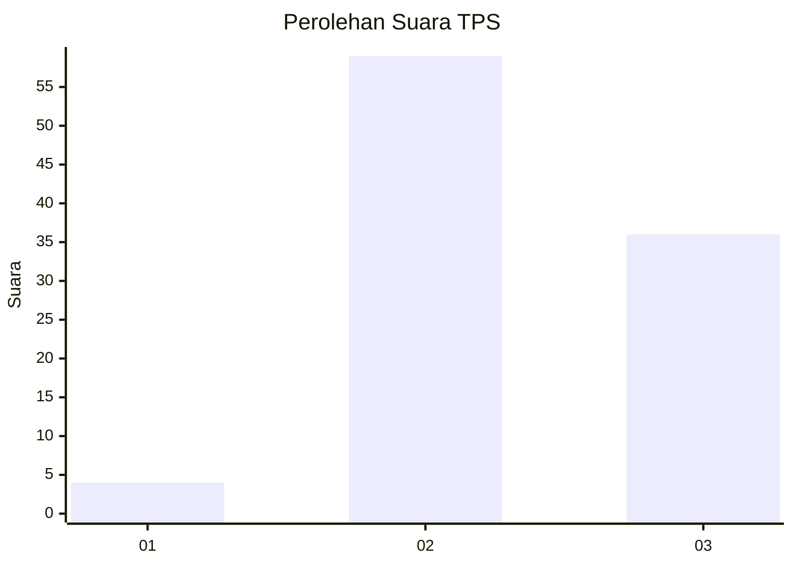
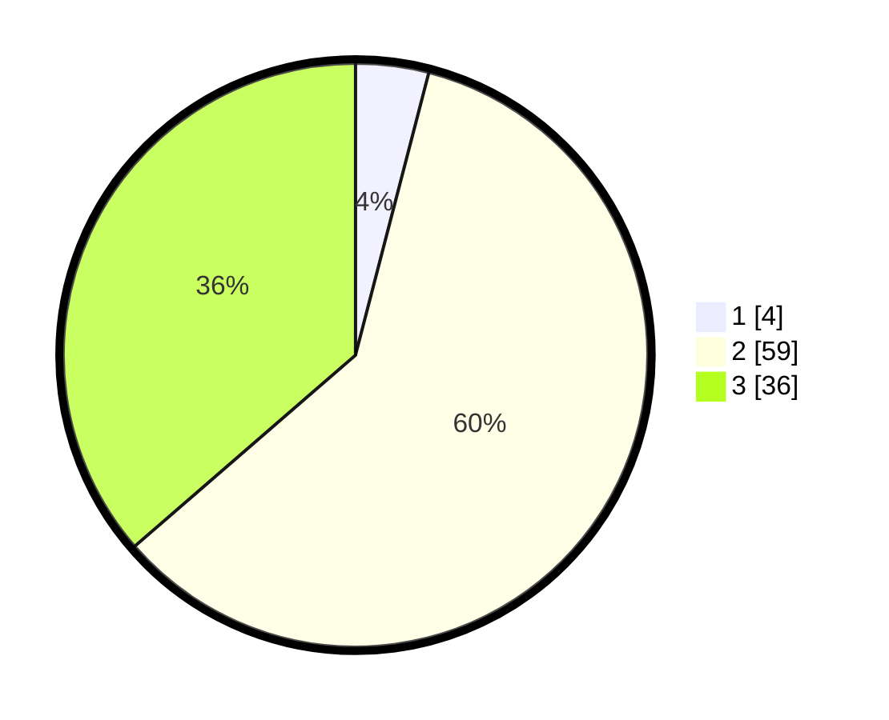

# Hasil

## Grafik

## Tabel

| No. | Nama Paslon    | Suara | Suara (raw) | Persentase |
|:--- |:-------------- | -----:| -----------:| ----------:|
| 1   | ANIES MUHAIMIN | 4     | [4][p-1]    | 4,04       |
| 2   | PRABOWO GIBRAN | 59    | [59][p-2]   | 59,60      |
| 3   | GANJAR MAHFUD  | 36    | [36][p-3]   | 36,36      |

[p-1]: https://github.com/gigit-pemilu/pemilu-2024/blob/main/pilpres/hitung-suara/sub/12-sumatera-utara/sub/07-deli-serdang/sub/24-hamparan-perak/sub/2013-tandem-hilir-i/sub/006-tps/sub/paslon-1.txt
[p-2]: https://github.com/gigit-pemilu/pemilu-2024/blob/main/pilpres/hitung-suara/sub/12-sumatera-utara/sub/07-deli-serdang/sub/24-hamparan-perak/sub/2013-tandem-hilir-i/sub/006-tps/sub/paslon-2.txt
[p-3]: https://github.com/gigit-pemilu/pemilu-2024/blob/main/pilpres/hitung-suara/sub/12-sumatera-utara/sub/07-deli-serdang/sub/24-hamparan-perak/sub/2013-tandem-hilir-i/sub/006-tps/sub/paslon-3.txt

## Foto C Plano

https://sirekap-obj-formc.kpu.go.id/4dce/pemilu/ppwp/12/07/24/20/13/1207242013006-20240222-175037--1c6eebb0-3c72-4ced-81df-1b8ad84633ae.jpg

https://sirekap-obj-formc.kpu.go.id/4dce/pemilu/ppwp/12/07/24/20/13/1207242013006-20240222-175153--1cceda71-115d-4810-879a-fc627281bee7.jpg

https://sirekap-obj-formc.kpu.go.id/4dce/pemilu/ppwp/12/07/24/20/13/1207242013006-20240222-175105--322b3b8a-da59-4462-a2a3-69fc6e3af496.jpg

## Metadata

| Key        | Value               |
| ---------- | ------------------- |
| Time Stamp | 2024-02-25 13:00:00 |

