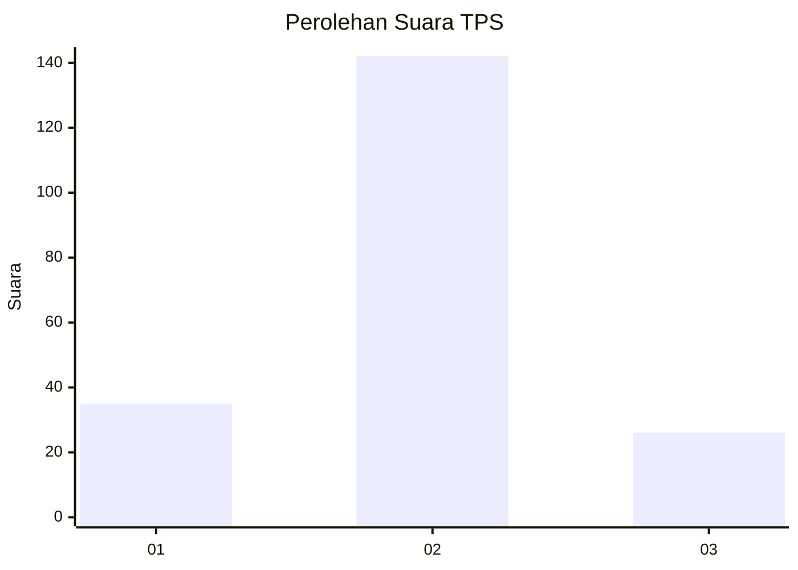
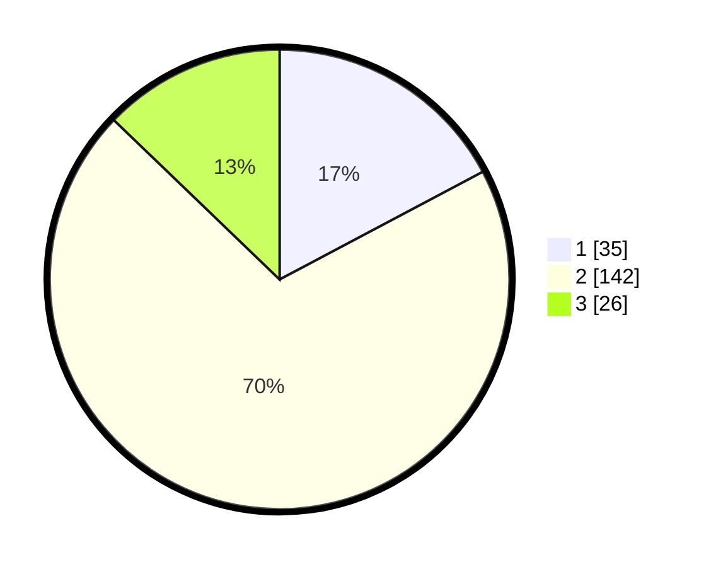

# Hasil

## Grafik

## Tabel

| No. | Nama Paslon    | Suara | Suara (raw) | Persentase |
|:--- |:-------------- | -----:| -----------:| ----------:|
| 1   | ANIES MUHAIMIN | 35    | [35][p-1]   | 17,24      |
| 2   | PRABOWO GIBRAN | 142   | [142][p-2]  | 69,95      |
| 3   | GANJAR MAHFUD  | 26    | [26][p-3]   | 12,81      |

[p-1]: https://github.com/gigit-pemilu/pemilu-2024-12-sumatera-utara/blob/main/pilpres/hitung-suara/sub/12-sumatera-utara/sub/07-deli-serdang/sub/24-hamparan-perak/sub/2014-tandam-hilir-ii/sub/025-tps/sub/paslon-1.txt
[p-2]: https://github.com/gigit-pemilu/pemilu-2024-12-sumatera-utara/blob/main/pilpres/hitung-suara/sub/12-sumatera-utara/sub/07-deli-serdang/sub/24-hamparan-perak/sub/2014-tandam-hilir-ii/sub/025-tps/sub/paslon-2.txt
[p-3]: https://github.com/gigit-pemilu/pemilu-2024-12-sumatera-utara/blob/main/pilpres/hitung-suara/sub/12-sumatera-utara/sub/07-deli-serdang/sub/24-hamparan-perak/sub/2014-tandam-hilir-ii/sub/025-tps/sub/paslon-3.txt

## Foto C Plano

https://sirekap-obj-formc.kpu.go.id/ad7d/pemilu/ppwp/12/07/24/20/14/1207242014025-20240218-124215--f74fee4d-5ae0-423b-8cd5-6ea74c464d99.jpg

https://sirekap-obj-formc.kpu.go.id/ad7d/pemilu/ppwp/12/07/24/20/14/1207242014025-20240214-200014--8a7da14e-5446-4bb6-abe8-708094fc2303.jpg

https://sirekap-obj-formc.kpu.go.id/ad7d/pemilu/ppwp/12/07/24/20/14/1207242014025-20240214-200030--53bf3ce5-ed05-42bf-9708-89866fea8a3c.jpg

## Metadata

| Key        | Value               |
| ---------- | ------------------- |
| Time Stamp | 2024-02-24 22:31:28 |

