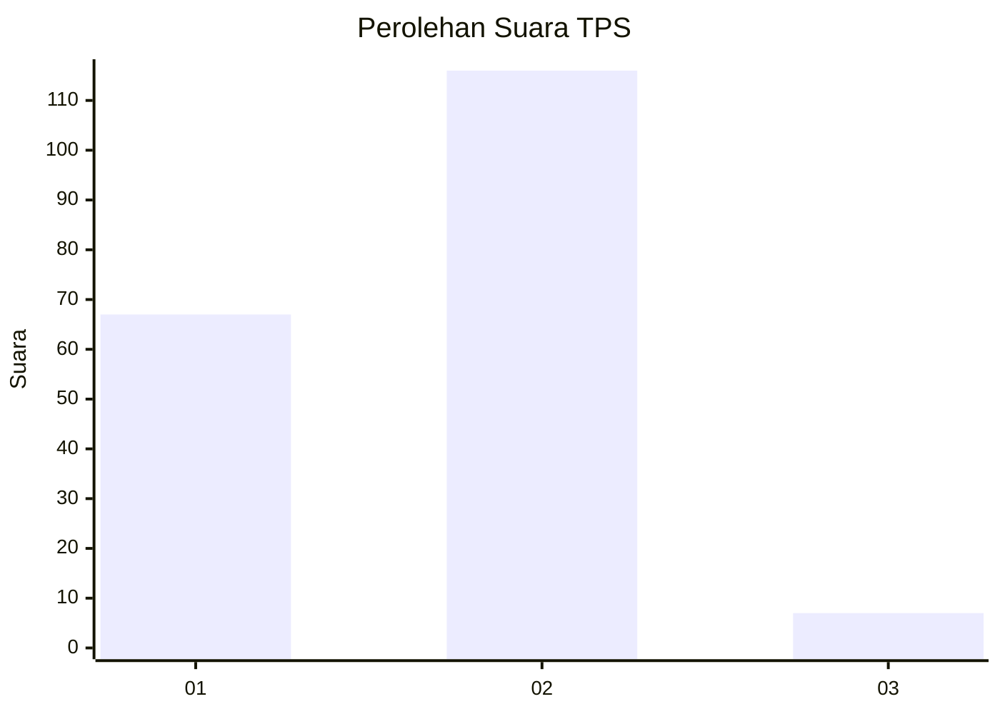
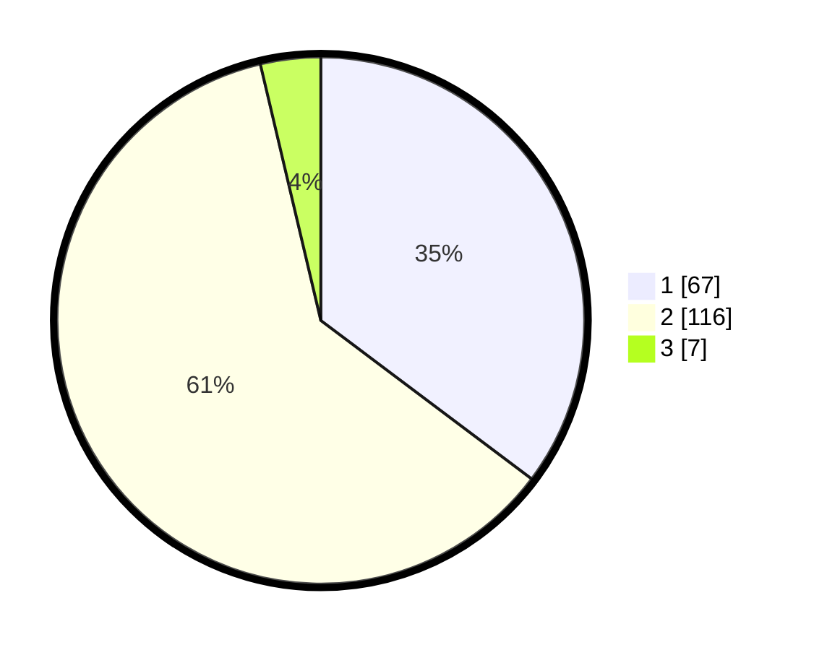

# Hasil

## Grafik

## Tabel

| No. | Nama Paslon    | Suara | Suara (raw) | Persentase |
|:--- |:-------------- | -----:| -----------:| ----------:|
| 1   | ANIES MUHAIMIN | 67    | [67][p-1]   | 35,26      |
| 2   | PRABOWO GIBRAN | 116   | [116][p-2]  | 61,05      |
| 3   | GANJAR MAHFUD  | 7     | [7][p-3]    | 3,68       |

[p-1]: https://github.com/gigit-pemilu/pemilu-2024/blob/main/pilpres/hitung-suara/sub/12-sumatera-utara/sub/07-deli-serdang/sub/24-hamparan-perak/sub/2016-bulu-cina/sub/006-tps/sub/paslon-1.txt
[p-2]: https://github.com/gigit-pemilu/pemilu-2024/blob/main/pilpres/hitung-suara/sub/12-sumatera-utara/sub/07-deli-serdang/sub/24-hamparan-perak/sub/2016-bulu-cina/sub/006-tps/sub/paslon-2.txt
[p-3]: https://github.com/gigit-pemilu/pemilu-2024/blob/main/pilpres/hitung-suara/sub/12-sumatera-utara/sub/07-deli-serdang/sub/24-hamparan-perak/sub/2016-bulu-cina/sub/006-tps/sub/paslon-3.txt

## Foto C Plano

https://sirekap-obj-formc.kpu.go.id/7486/pemilu/ppwp/12/07/24/20/16/1207242016006-20240215-081518--05a2d530-7d9e-496b-868e-44083c5bf800.jpg

https://sirekap-obj-formc.kpu.go.id/7486/pemilu/ppwp/12/07/24/20/16/1207242016006-20240215-011950--5de3cee8-cec7-441d-b4ff-4dc4c6d3ca32.jpg

https://sirekap-obj-formc.kpu.go.id/7486/pemilu/ppwp/12/07/24/20/16/1207242016006-20240215-081805--3de6b06e-ae10-4482-9ab3-0b996dc5f25a.jpg

## Metadata

| Key        | Value               |
| ---------- | ------------------- |
| Time Stamp | 2024-02-15 15:00:29 |

