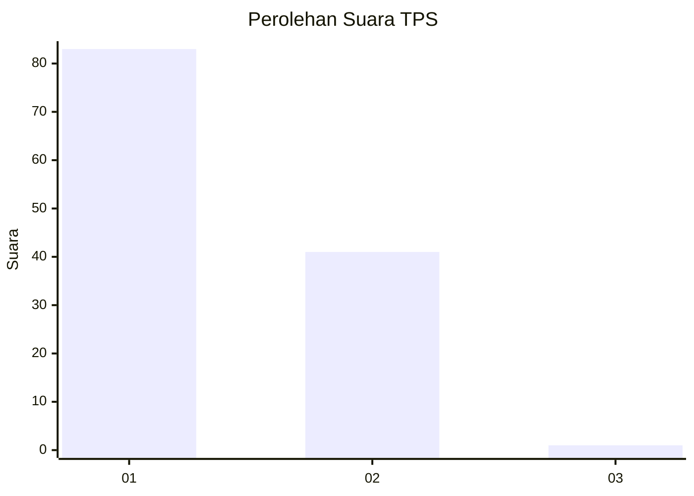
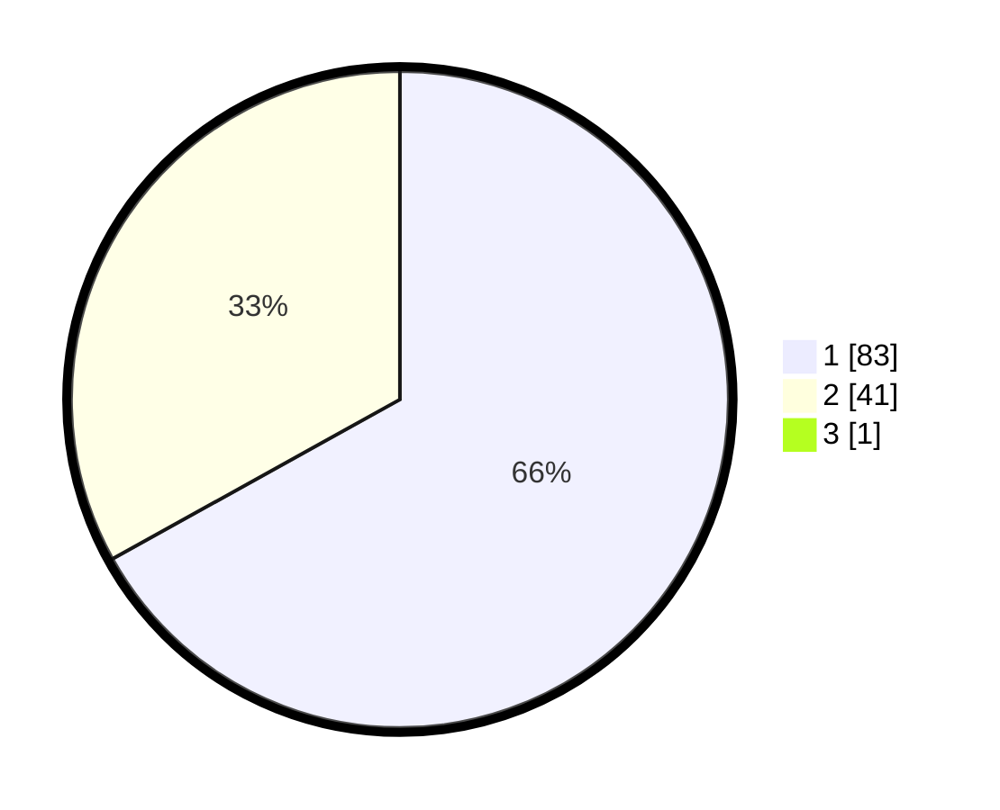

# Hasil

## Grafik

## Tabel

| No. | Nama Paslon    | Suara | Suara (raw) | Persentase |
|:--- |:-------------- | -----:| -----------:| ----------:|
| 1   | ANIES MUHAIMIN | 83    | [83][p-1]   | 66,40      |
| 2   | PRABOWO GIBRAN | 41    | [41][p-2]   | 32,80      |
| 3   | GANJAR MAHFUD  | 1     | [1][p-3]    | 0,80       |

[p-1]: https://github.com/gigit-pemilu/pemilu-2024/blob/main/pilpres/hitung-suara/sub/12-sumatera-utara/sub/07-deli-serdang/sub/24-hamparan-perak/sub/2019-lama/sub/001-tps/sub/paslon-1.txt
[p-2]: https://github.com/gigit-pemilu/pemilu-2024/blob/main/pilpres/hitung-suara/sub/12-sumatera-utara/sub/07-deli-serdang/sub/24-hamparan-perak/sub/2019-lama/sub/001-tps/sub/paslon-2.txt
[p-3]: https://github.com/gigit-pemilu/pemilu-2024/blob/main/pilpres/hitung-suara/sub/12-sumatera-utara/sub/07-deli-serdang/sub/24-hamparan-perak/sub/2019-lama/sub/001-tps/sub/paslon-3.txt

## Foto C Plano

https://sirekap-obj-formc.kpu.go.id/c4b6/pemilu/ppwp/12/07/24/20/19/1207242019001-20240214-222419--1836ecb4-819d-46a1-91bf-6bc97c0224f5.jpg

https://sirekap-obj-formc.kpu.go.id/c4b6/pemilu/ppwp/12/07/24/20/19/1207242019001-20240214-222754--c53e53af-f828-4b07-9aaf-a027d19a7914.jpg

https://sirekap-obj-formc.kpu.go.id/c4b6/pemilu/ppwp/12/07/24/20/19/1207242019001-20240214-223046--3341b596-b201-485c-a046-b8718e3e60ae.jpg

## Metadata

| Key        | Value               |
| ---------- | ------------------- |
| Time Stamp | 2024-02-25 16:00:00 |

