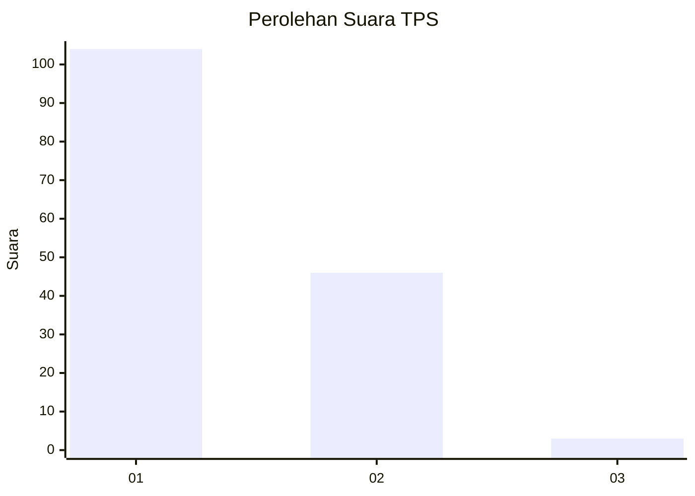
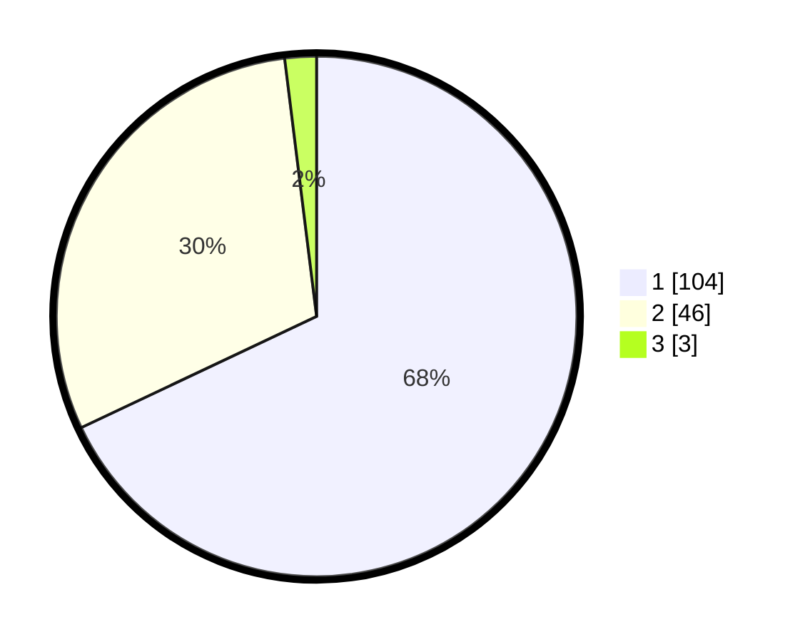

# Hasil

## Grafik

## Tabel

| No. | Nama Paslon    | Suara | Suara (raw) | Persentase |
|:--- |:-------------- | -----:| -----------:| ----------:|
| 1   | ANIES MUHAIMIN | 104   | [104][p-1]  | 67,97      |
| 2   | PRABOWO GIBRAN | 46    | [46][p-2]   | 30,07      |
| 3   | GANJAR MAHFUD  | 3     | [3][p-3]    | 1,96       |

[p-1]: https://github.com/gigit-pemilu/pemilu-2024-12-sumatera-utara/blob/main/pilpres/hitung-suara/sub/12-sumatera-utara/sub/07-deli-serdang/sub/24-hamparan-perak/sub/2019-lama/sub/003-tps/sub/paslon-1.txt
[p-2]: https://github.com/gigit-pemilu/pemilu-2024-12-sumatera-utara/blob/main/pilpres/hitung-suara/sub/12-sumatera-utara/sub/07-deli-serdang/sub/24-hamparan-perak/sub/2019-lama/sub/003-tps/sub/paslon-2.txt
[p-3]: https://github.com/gigit-pemilu/pemilu-2024-12-sumatera-utara/blob/main/pilpres/hitung-suara/sub/12-sumatera-utara/sub/07-deli-serdang/sub/24-hamparan-perak/sub/2019-lama/sub/003-tps/sub/paslon-3.txt

## Foto C Plano

https://sirekap-obj-formc.kpu.go.id/368a/pemilu/ppwp/12/07/24/20/19/1207242019003-20240215-000804--0420ef71-5f67-429d-a8d5-d69c860ab727.jpg

https://sirekap-obj-formc.kpu.go.id/368a/pemilu/ppwp/12/07/24/20/19/1207242019003-20240215-001044--8316eea4-93c9-4261-8589-a07203079590.jpg

https://sirekap-obj-formc.kpu.go.id/368a/pemilu/ppwp/12/07/24/20/19/1207242019003-20240215-001222--8068443b-ad34-4c70-baac-b2fb4c8cdb84.jpg

## Metadata

| Key        | Value               |
| ---------- | ------------------- |
| Time Stamp | 2024-02-24 22:31:28 |

