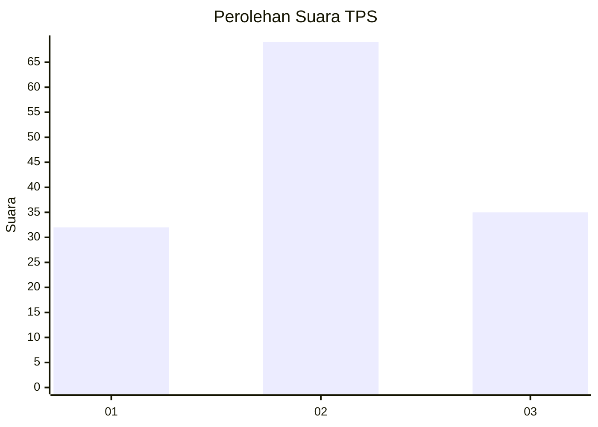
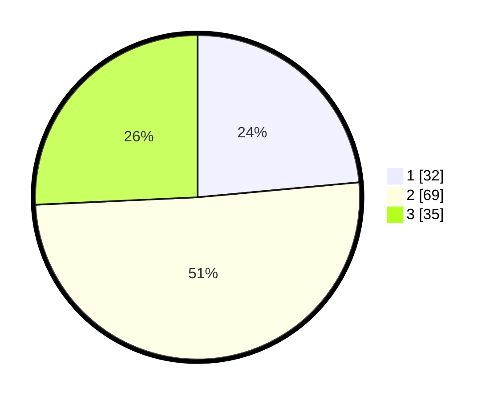

# Hasil

## Grafik

## Tabel

| No. | Nama Paslon    | Suara | Suara (raw) | Persentase |
|:--- |:-------------- | -----:| -----------:| ----------:|
| 1   | ANIES MUHAIMIN | 32    | [32][p-1]   | 23,53      |
| 2   | PRABOWO GIBRAN | 69    | [69][p-2]   | 50,74      |
| 3   | GANJAR MAHFUD  | 35    | [35][p-3]   | 25,74      |

[p-1]: https://github.com/gigit-pemilu/pemilu-2024/blob/main/pilpres/hitung-suara/sub/12-sumatera-utara/sub/07-deli-serdang/sub/25-labuhan-deli/sub/2001-helvetia/sub/006-tps/sub/paslon-1.txt
[p-2]: https://github.com/gigit-pemilu/pemilu-2024/blob/main/pilpres/hitung-suara/sub/12-sumatera-utara/sub/07-deli-serdang/sub/25-labuhan-deli/sub/2001-helvetia/sub/006-tps/sub/paslon-2.txt
[p-3]: https://github.com/gigit-pemilu/pemilu-2024/blob/main/pilpres/hitung-suara/sub/12-sumatera-utara/sub/07-deli-serdang/sub/25-labuhan-deli/sub/2001-helvetia/sub/006-tps/sub/paslon-3.txt

## Foto C Plano

https://sirekap-obj-formc.kpu.go.id/3f01/pemilu/ppwp/12/07/25/20/01/1207252001006-20240215-110621--f7f2d200-827d-4787-b087-c0bbb42c31d5.jpg

https://sirekap-obj-formc.kpu.go.id/3f01/pemilu/ppwp/12/07/25/20/01/1207252001006-20240215-110630--a7e26cf6-723a-4d1a-95e2-f6c7a926c346.jpg

https://sirekap-obj-formc.kpu.go.id/3f01/pemilu/ppwp/12/07/25/20/01/1207252001006-20240215-110637--ee299cbf-84a8-4059-aefe-1c703f7d02d2.jpg

## Metadata

| Key        | Value               |
| ---------- | ------------------- |
| Time Stamp | 2024-02-26 16:00:00 |

