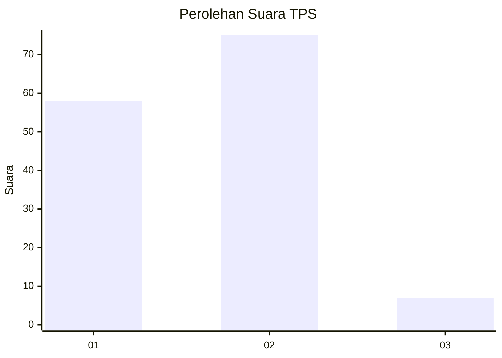
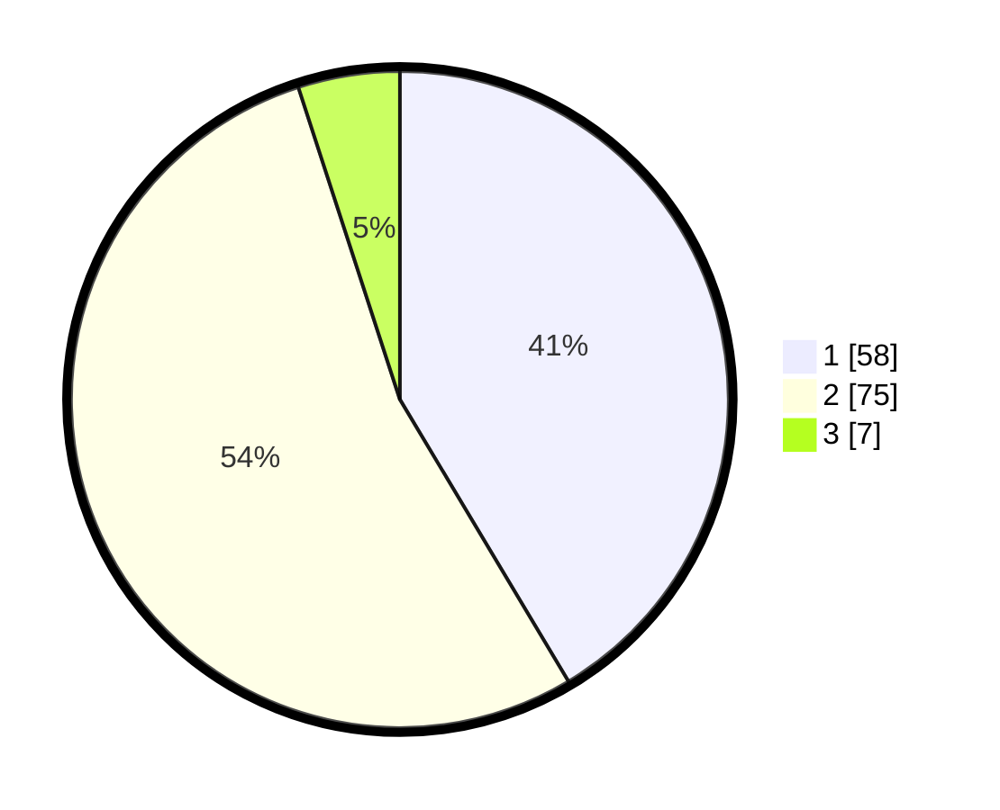

# Hasil

## Grafik

## Tabel

| No. | Nama Paslon    | Suara | Suara (raw) | Persentase |
|:--- |:-------------- | -----:| -----------:| ----------:|
| 1   | ANIES MUHAIMIN | 58    | [58][p-1]   | 41,43      |
| 2   | PRABOWO GIBRAN | 75    | [75][p-2]   | 53,57      |
| 3   | GANJAR MAHFUD  | 7     | [7][p-3]    | 5,00       |

[p-1]: https://github.com/gigit-pemilu/pemilu-2024/blob/main/pilpres/hitung-suara/sub/12-sumatera-utara/sub/07-deli-serdang/sub/25-labuhan-deli/sub/2001-helvetia/sub/036-tps/sub/paslon-1.txt
[p-2]: https://github.com/gigit-pemilu/pemilu-2024/blob/main/pilpres/hitung-suara/sub/12-sumatera-utara/sub/07-deli-serdang/sub/25-labuhan-deli/sub/2001-helvetia/sub/036-tps/sub/paslon-2.txt
[p-3]: https://github.com/gigit-pemilu/pemilu-2024/blob/main/pilpres/hitung-suara/sub/12-sumatera-utara/sub/07-deli-serdang/sub/25-labuhan-deli/sub/2001-helvetia/sub/036-tps/sub/paslon-3.txt

## Foto C Plano

https://sirekap-obj-formc.kpu.go.id/a8b0/pemilu/ppwp/12/07/25/20/01/1207252001036-20240215-030022--6976e9b7-9158-407c-b8d6-60d876180bbd.jpg

https://sirekap-obj-formc.kpu.go.id/a8b0/pemilu/ppwp/12/07/25/20/01/1207252001036-20240215-030034--3dba5a1b-324d-4e64-9358-30dee1a9a137.jpg

https://sirekap-obj-formc.kpu.go.id/a8b0/pemilu/ppwp/12/07/25/20/01/1207252001036-20240215-030043--86064d32-74f9-420f-93b8-1198d0647ed5.jpg

## Metadata

| Key        | Value               |
| ---------- | ------------------- |
| Time Stamp | 2024-02-24 22:31:28 |

